<!-- AUTO-GENERATED — DO NOT EDIT MANUALLY -->
<!-- Regenerate: python analyze_deps.py (from repo root) -->
<!-- Last updated: 2026-05-05 21:22 UTC -->

# Architecture & Dependency Map

> **For LLMs:** Canonical dependency reference for the swingtrader repo.
> `deps-graph.json` has the same data in structured form.
> `deps-graph.html` is an interactive browser graph (file-level + function-level views).

## Summary

| Category | Count |
|----------|------:|
| Python modules scanned | 91 |
| Python functions mapped | 470 |
| TypeScript server actions | 7 |
| DB tables referenced | 31 |
| DB views referenced | 6 |
| DB RPCs referenced | 3 |
| External APIs | 4 |
| Total edges | 1568 |


## Services

Auto-generated from `code/analytics/services/`. Each row aggregates the service's module + function nodes from the graph below. 📄 = service has a README.

| Service | Modules | Funcs (with deps) | DB tables / views | External APIs |
|---------|--------:|------------------:|-------------------|---------------|
| `agent/` 📄 | 7 | 30 | `user_scheduled_screenings`, `user_screening_results` | `FMP_API`, `Ollama_Local` |
| `agent_core/` 📄 | 3 | 9 | — | `Ollama_Local` |
| `bulk_analysis/` 📄 | 6 | 18 | `user_bulk_analysis_jobs`, `user_scan_row_notes`, `user_scan_rows`, `user_ticker_chart_workspace` | `Ollama_Local` |
| `news/` 📄 | 26 | 174 | `company_vectors`, `daily_narratives`, `news_article_embedding_jobs`, `news_article_embeddings`, `news_article_embeddings_gte`, `news_articles`, `news_impact_heads`, `news_impact_vectors`, `scan_rows`, `search_news_embeddings`, `security_identity_map`, `user_narrative_preferences`, `user_portfolio_alerts`, `user_scan_rows`, `user_trades` | `Anthropic_API`, `FMP_API`, `Ollama_Local` |
| `podcast/` 📄 | 12 | 58 | `news_articles`, `podcast_episodes`, `user_scan_rows`, `user_scan_runs` | `Ollama_Local`, `Telegram_API` |
| `rag/` 📄 | 12 | 28 | `company_vectors`, `get_relationship_neighborhood`, `get_relationship_node_news`, `news_article_tickers`, `news_articles`, `news_impact_heads`, `news_impact_vectors`, `news_trends_cluster_daily_v`, `news_trends_dimension_daily_v`, `ticker_relationship_network_resolved_v`, `ticker_sentiment_heads_v`, `user_portfolio_alerts`, `user_scan_row_notes`, `user_scan_rows`, `user_scan_runs`, `user_trades`, `user_trading_strategy` | `Ollama_Local` |
| `screener/` 📄 | 6 | 34 | — | `FMP_API` |

**Non-service Python:** **other/** (2 modules) · **scripts/** (10 modules) · **shared/** (7 modules)

## File-Level DB Dependency Graph

Source files → DB tables and views.

```mermaid
graph LR
  subgraph sg_scripts["scripts/"]
    py_module_code_analytics_scripts_generate_blog_post_py["generate_blog_post.py"]
    py_module_code_analytics_scripts_process_telegram_updates_py["process_telegram_updates.py"]
    py_module_code_analytics_scripts_rescore_401_articles_py["rescore_401_articles.py"]
    py_module_code_analytics_scripts_run_daily_narrative_py["run_daily_narrative.py"]
    py_module_code_analytics_scripts_seed_tickers_py["seed_tickers.py"]
    py_module_code_analytics_scripts_verify_podcast_setup_py["verify_podcast_setup.py"]
    py_module_code_analytics_scripts_watchdog_py["watchdog.py"]
  end
  subgraph sg_services["services/"]
    subgraph sg_services_agent["agent/"]
      py_module_code_analytics_services_agent_cli_py["cli.py"]
      py_module_code_analytics_services_agent_engine_py["engine.py"]
      py_module_code_analytics_services_agent_scheduler_py["scheduler.py"]
    end
    subgraph sg_services_bulk_analysis["bulk_analysis/"]
      py_module_code_analytics_services_bulk_analysis_scheduler_py["scheduler.py"]
      py_module_code_analytics_services_bulk_analysis_worker_py["worker.py"]
    end
    subgraph sg_services_news["news/"]
      subgraph sg_services_news_company["company/"]
        py_module_code_analytics_services_news_company_build_vectors_cli_py["build_vectors_cli.py"]
      end
      subgraph sg_services_news_embeddings["embeddings/"]
        py_module_code_analytics_services_news_embeddings_embeddings_py["embeddings.py"]
        py_module_code_analytics_services_news_embeddings_gte_backfill_py["gte_backfill.py"]
        py_module_code_analytics_services_news_embeddings_semantic_retrieval_py["semantic_retrieval.py"]
      end
      subgraph sg_services_news_narrative["narrative/"]
        py_module_code_analytics_services_news_narrative_narrative_generator_py["narrative_generator.py"]
      end
      subgraph sg_services_news_scoring["scoring/"]
        py_module_code_analytics_services_news_scoring_news_ingester_py["news_ingester.py"]
        py_module_code_analytics_services_news_scoring_score_cli_py["score_cli.py"]
      end
    end
    subgraph sg_services_podcast["podcast/"]
      py_module_code_analytics_services_podcast_data_fetcher_py["data_fetcher.py"]
      py_module_code_analytics_services_podcast_scheduler_hook_py["scheduler_hook.py"]
      py_module_code_analytics_services_podcast_supabase_publisher_py["supabase_publisher.py"]
    end
    subgraph sg_services_rag["rag/"]
      py_module_code_analytics_services_rag_articles_py["articles.py"]
      py_module_code_analytics_services_rag_context_py["context.py"]
      py_module_code_analytics_services_rag_graph_py["graph.py"]
      py_module_code_analytics_services_rag_portfolio_py["portfolio.py"]
      py_module_code_analytics_services_rag_screening_py["screening.py"]
      py_module_code_analytics_services_rag_sentiment_py["sentiment.py"]
    end
  end
  subgraph sg_shared["shared/"]
    py_module_code_analytics_shared_db_py["db.py"]
    py_module_code_analytics_shared_health_py["health.py"]
    py_module_code_analytics_shared_telegram_py["telegram.py"]
  end
  subgraph sg_ui["ui/"]
    subgraph sg_ui_app["app/"]
      subgraph sg_ui_app_actions["actions/"]
        ts_action_code_ui_app_actions_chart_workspace_ts["chart-workspace.ts"]
        ts_action_code_ui_app_actions_relationships_ts["relationships.ts"]
        ts_action_code_ui_app_actions_screenings_agent_ts["screenings-agent.ts"]
        ts_action_code_ui_app_actions_screenings_ts["screenings.ts"]
        ts_action_code_ui_app_actions_trading_strategy_ts["trading-strategy.ts"]
      end
    end
  end
  subgraph DB["Database — swingtrader schema"]
    db_rpc_get_relationship_neighborhood["[RPC] get_relationship_neighborhood"]
    db_rpc_get_relationship_node_news["[RPC] get_relationship_node_news"]
    db_rpc_search_news_embeddings["[RPC] search_news_embeddings"]
    db_table_company_vectors["[TABLE] company_vectors"]
    db_table_daily_narratives["[TABLE] daily_narratives"]
    db_table_job_health["[TABLE] job_health"]
    db_table_job_runs["[TABLE] job_runs"]
    db_table_news_article_embedding_jobs["[TABLE] news_article_embedding_jobs"]
    db_table_news_article_embeddings["[TABLE] news_article_embeddings"]
    db_table_news_article_embeddings_gte["[TABLE] news_article_embeddings_gte"]
    db_table_news_article_tickers["[TABLE] news_article_tickers"]
    db_table_news_articles["[TABLE] news_articles"]
    db_table_news_impact_heads["[TABLE] news_impact_heads"]
    db_table_news_impact_vectors["[TABLE] news_impact_vectors"]
    db_table_news_source_dry_days["[TABLE] news_source_dry_days"]
    db_table_podcast_episodes["[TABLE] podcast_episodes"]
    db_table_scan_rows["[TABLE] scan_rows"]
    db_table_security_identity_map["[TABLE] security_identity_map"]
    db_table_telegram_message_log["[TABLE] telegram_message_log"]
    db_table_telegram_update_requests["[TABLE] telegram_update_requests"]
    db_table_tickers["[TABLE] tickers"]
    db_table_user_bulk_analysis_jobs["[TABLE] user_bulk_analysis_jobs"]
    db_table_user_narrative_preferences["[TABLE] user_narrative_preferences"]
    db_table_user_portfolio_alerts["[TABLE] user_portfolio_alerts"]
    db_table_user_scan_jobs["[TABLE] user_scan_jobs"]
    db_table_user_scan_row_notes["[TABLE] user_scan_row_notes"]
    db_table_user_scan_rows["[TABLE] user_scan_rows"]
    db_table_user_scan_runs["[TABLE] user_scan_runs"]
    db_table_user_scheduled_screenings["[TABLE] user_scheduled_screenings"]
    db_table_user_screening_results["[TABLE] user_screening_results"]
    db_table_user_telegram_connections["[TABLE] user_telegram_connections"]
    db_table_user_ticker_chart_workspace["[TABLE] user_ticker_chart_workspace"]
    db_table_user_trades["[TABLE] user_trades"]
    db_table_user_trading_strategy["[TABLE] user_trading_strategy"]
    db_view_news_trends_article_base_v["[VIEW] news_trends_article_base_v"]
    db_view_news_trends_cluster_daily_v["[VIEW] news_trends_cluster_daily_v"]
    db_view_news_trends_dimension_daily_v["[VIEW] news_trends_dimension_daily_v"]
    db_view_ticker_relationship_edge_traceability_v["[VIEW] ticker_relationship_edge_traceability_v"]
    db_view_ticker_relationship_network_resolved_v["[VIEW] ticker_relationship_network_resolved_v"]
    db_view_ticker_sentiment_heads_v["[VIEW] ticker_sentiment_heads_v"]
  end
  py_module_code_analytics_scripts_generate_blog_post_py -->|"reads"| db_table_news_articles
  py_module_code_analytics_scripts_generate_blog_post_py -->|"reads"| db_table_news_impact_vectors
  py_module_code_analytics_scripts_generate_blog_post_py -->|"reads"| db_table_news_article_tickers
  py_module_code_analytics_scripts_generate_blog_post_py -->|"reads"| db_table_company_vectors
  py_module_code_analytics_scripts_process_telegram_updates_py -->|"reads"| db_table_telegram_update_requests
  py_module_code_analytics_scripts_process_telegram_updates_py -->|"writes"| db_table_telegram_update_requests
  py_module_code_analytics_scripts_process_telegram_updates_py -->|"reads"| db_table_user_narrative_preferences
  py_module_code_analytics_scripts_rescore_401_articles_py -->|"reads"| db_table_news_articles
  py_module_code_analytics_scripts_rescore_401_articles_py -->|"reads"| db_table_news_impact_heads
  py_module_code_analytics_scripts_rescore_401_articles_py -->|"writes"| db_table_news_articles
  py_module_code_analytics_scripts_run_daily_narrative_py -->|"writes"| db_table_telegram_message_log
  py_module_code_analytics_scripts_run_daily_narrative_py -->|"reads"| db_table_user_narrative_preferences
  py_module_code_analytics_scripts_run_daily_narrative_py -->|"reads"| db_table_user_telegram_connections
  py_module_code_analytics_scripts_run_daily_narrative_py -->|"writes"| db_table_daily_narratives
  py_module_code_analytics_scripts_run_daily_narrative_py -->|"reads"| db_table_daily_narratives
  py_module_code_analytics_scripts_seed_tickers_py -->|"upserts"| db_table_tickers
  py_module_code_analytics_scripts_seed_tickers_py -->|"writes"| db_table_tickers
  py_module_code_analytics_scripts_verify_podcast_setup_py -->|"reads"| db_table_podcast_episodes
  py_module_code_analytics_scripts_verify_podcast_setup_py -->|"upserts"| db_table_podcast_episodes
  py_module_code_analytics_scripts_verify_podcast_setup_py -->|"writes"| db_table_podcast_episodes
  py_module_code_analytics_scripts_watchdog_py -->|"reads"| db_table_job_health
  py_module_code_analytics_services_agent_cli_py -->|"reads"| db_table_user_scheduled_screenings
  py_module_code_analytics_services_agent_engine_py -->|"writes"| db_table_user_screening_results
  py_module_code_analytics_services_agent_engine_py -->|"writes"| db_table_user_scheduled_screenings
  py_module_code_analytics_services_agent_scheduler_py -->|"writes"| db_table_user_scheduled_screenings
  py_module_code_analytics_services_agent_scheduler_py -->|"writes"| db_table_user_screening_results
  py_module_code_analytics_services_agent_scheduler_py -->|"reads"| db_table_user_screening_results
  py_module_code_analytics_services_agent_scheduler_py -->|"reads"| db_table_user_scheduled_screenings
  py_module_code_analytics_services_bulk_analysis_scheduler_py -->|"writes"| db_table_user_bulk_analysis_jobs
  py_module_code_analytics_services_bulk_analysis_scheduler_py -->|"reads"| db_table_user_bulk_analysis_jobs
  py_module_code_analytics_services_bulk_analysis_worker_py -->|"reads"| db_table_user_bulk_analysis_jobs
  py_module_code_analytics_services_bulk_analysis_worker_py -->|"reads"| db_table_user_scan_rows
  py_module_code_analytics_services_bulk_analysis_worker_py -->|"writes"| db_table_user_bulk_analysis_jobs
  py_module_code_analytics_services_bulk_analysis_worker_py -->|"reads"| db_table_user_ticker_chart_workspace
  py_module_code_analytics_services_bulk_analysis_worker_py -->|"upserts"| db_table_user_ticker_chart_workspace
  py_module_code_analytics_services_bulk_analysis_worker_py -->|"upserts"| db_table_user_scan_row_notes
  py_module_code_analytics_services_news_company_build_vectors_cli_py -->|"reads"| db_table_company_vectors
  py_module_code_analytics_services_news_company_build_vectors_cli_py -->|"reads"| db_table_user_scan_rows
  py_module_code_analytics_services_news_company_build_vectors_cli_py -->|"reads"| db_table_scan_rows
  py_module_code_analytics_services_news_embeddings_embeddings_py -->|"upserts"| db_table_news_article_embedding_jobs
  py_module_code_analytics_services_news_embeddings_embeddings_py -->|"reads"| db_table_news_articles
  py_module_code_analytics_services_news_embeddings_embeddings_py -->|"reads"| db_table_news_article_embedding_jobs
  py_module_code_analytics_services_news_embeddings_embeddings_py -->|"reads"| db_table_news_article_embeddings
  py_module_code_analytics_services_news_embeddings_embeddings_py -->|"writes"| db_table_news_article_embedding_jobs
  py_module_code_analytics_services_news_embeddings_embeddings_py -->|"writes"| db_table_news_article_embeddings
  py_module_code_analytics_services_news_embeddings_gte_backfill_py -->|"reads"| db_table_news_articles
  py_module_code_analytics_services_news_embeddings_gte_backfill_py -->|"reads"| db_table_news_article_embeddings_gte
  py_module_code_analytics_services_news_embeddings_gte_backfill_py -->|"writes"| db_table_news_article_embeddings_gte
  py_module_code_analytics_services_news_embeddings_semantic_retrieval_py -->|"rpc"| db_rpc_search_news_embeddings
  py_module_code_analytics_services_news_narrative_narrative_generator_py -->|"upserts"| db_table_daily_narratives
  py_module_code_analytics_services_news_narrative_narrative_generator_py -->|"reads"| db_table_security_identity_map
  py_module_code_analytics_services_news_narrative_narrative_generator_py -->|"reads"| db_table_news_impact_heads
  py_module_code_analytics_services_news_narrative_narrative_generator_py -->|"reads"| db_table_news_articles
  py_module_code_analytics_services_news_narrative_narrative_generator_py -->|"reads"| db_table_user_portfolio_alerts
  py_module_code_analytics_services_news_narrative_narrative_generator_py -->|"reads"| db_table_user_scan_rows
  py_module_code_analytics_services_news_narrative_narrative_generator_py -->|"reads"| db_table_user_narrative_preferences
  py_module_code_analytics_services_news_narrative_narrative_generator_py -->|"reads"| db_table_user_trades
  py_module_code_analytics_services_news_scoring_news_ingester_py -->|"reads"| db_table_news_impact_vectors
  py_module_code_analytics_services_news_scoring_news_ingester_py -->|"reads"| db_table_news_articles
  py_module_code_analytics_services_news_scoring_news_ingester_py -->|"writes"| db_table_news_impact_heads
  py_module_code_analytics_services_news_scoring_news_ingester_py -->|"writes"| db_table_news_impact_vectors
  py_module_code_analytics_services_news_scoring_news_ingester_py -->|"writes"| db_table_news_articles
  py_module_code_analytics_services_news_scoring_score_cli_py -->|"reads"| db_table_news_impact_heads
  py_module_code_analytics_services_news_scoring_score_cli_py -->|"reads"| db_table_news_articles
  py_module_code_analytics_services_news_scoring_score_cli_py -->|"reads"| db_table_security_identity_map
  py_module_code_analytics_services_news_scoring_score_cli_py -->|"writes"| db_table_news_articles
  py_module_code_analytics_services_podcast_data_fetcher_py -->|"reads"| db_table_news_articles
  py_module_code_analytics_services_podcast_data_fetcher_py -->|"reads"| db_table_user_scan_runs
  py_module_code_analytics_services_podcast_data_fetcher_py -->|"reads"| db_table_user_scan_rows
  py_module_code_analytics_services_podcast_scheduler_hook_py -->|"writes"| db_table_podcast_episodes
  py_module_code_analytics_services_podcast_supabase_publisher_py -->|"upserts"| db_table_podcast_episodes
  py_module_code_analytics_services_rag_articles_py -->|"reads"| db_table_news_articles
  py_module_code_analytics_services_rag_articles_py -->|"reads"| db_table_news_article_tickers
  py_module_code_analytics_services_rag_articles_py -->|"reads"| db_table_news_impact_vectors
  py_module_code_analytics_services_rag_articles_py -->|"reads"| db_table_news_impact_heads
  py_module_code_analytics_services_rag_articles_py -->|"rpc"| db_rpc_get_relationship_node_news
  py_module_code_analytics_services_rag_context_py -->|"reads"| db_table_user_scan_runs
  py_module_code_analytics_services_rag_context_py -->|"reads"| db_table_user_scan_row_notes
  py_module_code_analytics_services_rag_graph_py -->|"reads"| db_table_company_vectors
  py_module_code_analytics_services_rag_graph_py -->|"reads"| db_view_ticker_relationship_network_resolved_v
  py_module_code_analytics_services_rag_graph_py -->|"rpc"| db_rpc_get_relationship_neighborhood
  py_module_code_analytics_services_rag_portfolio_py -->|"reads"| db_table_user_trades
  py_module_code_analytics_services_rag_portfolio_py -->|"reads"| db_table_user_portfolio_alerts
  py_module_code_analytics_services_rag_portfolio_py -->|"reads"| db_table_user_scan_rows
  py_module_code_analytics_services_rag_portfolio_py -->|"reads"| db_table_user_scan_runs
  py_module_code_analytics_services_rag_portfolio_py -->|"reads"| db_table_user_scan_row_notes
  py_module_code_analytics_services_rag_portfolio_py -->|"reads"| db_table_user_trading_strategy
  py_module_code_analytics_services_rag_screening_py -->|"reads"| db_table_user_scan_rows
  py_module_code_analytics_services_rag_screening_py -->|"reads"| db_table_user_scan_row_notes
  py_module_code_analytics_services_rag_sentiment_py -->|"reads"| db_view_news_trends_cluster_daily_v
  py_module_code_analytics_services_rag_sentiment_py -->|"reads"| db_view_news_trends_dimension_daily_v
  py_module_code_analytics_services_rag_sentiment_py -->|"reads"| db_view_ticker_sentiment_heads_v
  py_module_code_analytics_shared_db_py -->|"upserts"| db_table_news_source_dry_days
  py_module_code_analytics_shared_db_py -->|"reads"| db_table_news_source_dry_days
  py_module_code_analytics_shared_db_py -->|"writes"| db_table_news_source_dry_days
  py_module_code_analytics_shared_db_py -->|"writes"| db_table_user_scan_jobs
  py_module_code_analytics_shared_db_py -->|"reads"| db_table_user_scan_jobs
  py_module_code_analytics_shared_db_py -->|"reads"| db_table_user_scan_runs
  py_module_code_analytics_shared_db_py -->|"writes"| db_table_user_scan_runs
  py_module_code_analytics_shared_db_py -->|"writes"| db_table_user_scan_rows
  py_module_code_analytics_shared_db_py -->|"writes"| db_table_news_article_tickers
  py_module_code_analytics_shared_db_py -->|"reads"| db_table_news_article_tickers
  py_module_code_analytics_shared_db_py -->|"reads"| db_table_news_articles
  py_module_code_analytics_shared_db_py -->|"writes"| db_table_news_articles
  py_module_code_analytics_shared_db_py -->|"upserts"| db_table_company_vectors
  py_module_code_analytics_shared_db_py -->|"reads"| db_table_company_vectors
  py_module_code_analytics_shared_health_py -->|"upserts"| db_table_job_health
  py_module_code_analytics_shared_health_py -->|"writes"| db_table_job_runs
  py_module_code_analytics_shared_health_py -->|"reads"| db_table_job_health
  py_module_code_analytics_shared_health_py -->|"writes"| db_table_job_health
  py_module_code_analytics_shared_telegram_py -->|"reads"| db_table_user_telegram_connections
  py_module_code_analytics_shared_telegram_py -->|"writes"| db_table_telegram_message_log
  ts_action_code_ui_app_actions_chart_workspace_ts -->|"reads"| db_table_user_ticker_chart_workspace
  ts_action_code_ui_app_actions_chart_workspace_ts -->|"upserts"| db_table_user_ticker_chart_workspace
  ts_action_code_ui_app_actions_relationships_ts -->|"reads"| db_view_ticker_relationship_edge_traceability_v
  ts_action_code_ui_app_actions_relationships_ts -->|"reads"| db_table_security_identity_map
  ts_action_code_ui_app_actions_screenings_agent_ts -->|"reads"| db_table_user_scheduled_screenings
  ts_action_code_ui_app_actions_screenings_agent_ts -->|"writes"| db_table_user_scheduled_screenings
  ts_action_code_ui_app_actions_screenings_agent_ts -->|"reads"| db_table_user_screening_results
  ts_action_code_ui_app_actions_screenings_agent_ts -->|"reads"| db_table_user_scan_runs
  ts_action_code_ui_app_actions_screenings_agent_ts -->|"reads"| db_table_user_scan_rows
  ts_action_code_ui_app_actions_screenings_agent_ts -->|"reads"| db_table_user_scan_row_notes
  ts_action_code_ui_app_actions_screenings_ts -->|"reads"| db_table_news_impact_heads
  ts_action_code_ui_app_actions_screenings_ts -->|"reads"| db_view_news_trends_article_base_v
  ts_action_code_ui_app_actions_screenings_ts -->|"reads"| db_view_ticker_sentiment_heads_v
  ts_action_code_ui_app_actions_screenings_ts -->|"upserts"| db_table_user_scan_row_notes
  ts_action_code_ui_app_actions_screenings_ts -->|"writes"| db_table_user_scan_runs
  ts_action_code_ui_app_actions_screenings_ts -->|"reads"| db_table_user_scan_runs
  ts_action_code_ui_app_actions_screenings_ts -->|"reads"| db_table_user_trades
  ts_action_code_ui_app_actions_screenings_ts -->|"reads"| db_table_user_bulk_analysis_jobs
  ts_action_code_ui_app_actions_screenings_ts -->|"writes"| db_table_user_bulk_analysis_jobs
  ts_action_code_ui_app_actions_screenings_ts -->|"writes"| db_table_user_scan_rows
  ts_action_code_ui_app_actions_trading_strategy_ts -->|"reads"| db_table_user_trading_strategy
  ts_action_code_ui_app_actions_trading_strategy_ts -->|"upserts"| db_table_user_trading_strategy
```


## Function-Level DB Dependencies

Individual functions → DB tables and views.
Each subgraph is one Python file; nodes are functions inside it.

```mermaid
graph LR
  subgraph sg_scripts["scripts/"]
    subgraph sg_scripts_generate_blog_post_py["generate_blog_post.py"]
      py_func_code_analytics_scripts_generate_blog_post_py___fetch_company_metadata["_fetch_company_metadata"]
      py_func_code_analytics_scripts_generate_blog_post_py___fetch_recent_articles["_fetch_recent_articles"]
      py_func_code_analytics_scripts_generate_blog_post_py___fetch_tickers_for_articles["_fetch_tickers_for_articles"]
    end
    subgraph sg_scripts_process_telegram_updates_py["process_telegram_updates.py"]
      py_func_code_analytics_scripts_process_telegram_updates_py___claim_pending_requests["_claim_pending_requests"]
      py_func_code_analytics_scripts_process_telegram_updates_py___finish_request["_finish_request"]
      py_func_code_analytics_scripts_process_telegram_updates_py___load_lookback_hours["_load_lookback_hours"]
    end
    subgraph sg_scripts_rescore_401_articles_py["rescore_401_articles.py"]
      py_func_code_analytics_scripts_rescore_401_articles_py__fetch_articles_batch["fetch_articles_batch"]
      py_func_code_analytics_scripts_rescore_401_articles_py__has_non_empty_heads["has_non_empty_heads"]
      py_func_code_analytics_scripts_rescore_401_articles_py__rescore_article["rescore_article"]
    end
    subgraph sg_scripts_run_daily_narrative_py["run_daily_narrative.py"]
      py_func_code_analytics_scripts_run_daily_narrative_py___deliver_if_needed["_deliver_if_needed"]
      py_func_code_analytics_scripts_run_daily_narrative_py___log_telegram_message["_log_telegram_message"]
      py_func_code_analytics_scripts_run_daily_narrative_py___main["_main"]
    end
    subgraph sg_scripts_seed_tickers_py["seed_tickers.py"]
      py_func_code_analytics_scripts_seed_tickers_py__main["main"]
      py_func_code_analytics_scripts_seed_tickers_py__upsert["upsert"]
    end
    subgraph sg_scripts_verify_podcast_setup_py["verify_podcast_setup.py"]
      py_func_code_analytics_scripts_verify_podcast_setup_py__main["main"]
    end
    subgraph sg_scripts_watchdog_py["watchdog.py"]
      py_func_code_analytics_scripts_watchdog_py__check_health["check_health"]
    end
  end
  subgraph sg_services["services/"]
    subgraph sg_services_agent["agent/"]
      subgraph sg_services_agent_cli_py["cli.py"]
        py_func_code_analytics_services_agent_cli_py___get_screening["_get_screening"]
      end
      subgraph sg_services_agent_engine_py["engine.py"]
        py_func_code_analytics_services_agent_engine_py__persist_and_deliver["persist_and_deliver"]
      end
      subgraph sg_services_agent_scheduler_py["scheduler.py"]
        py_func_code_analytics_services_agent_scheduler_py___dispatch_due["_dispatch_due"]
        py_func_code_analytics_services_agent_scheduler_py___queue_due_screenings["_queue_due_screenings"]
        py_func_code_analytics_services_agent_scheduler_py__run_tick["run_tick"]
      end
    end
    subgraph sg_services_bulk_analysis["bulk_analysis/"]
      subgraph sg_services_bulk_analysis_scheduler_py["scheduler.py"]
        py_func_code_analytics_services_bulk_analysis_scheduler_py__run_tick["run_tick"]
      end
      subgraph sg_services_bulk_analysis_worker_py["worker.py"]
        py_func_code_analytics_services_bulk_analysis_worker_py___append_chat_turn["_append_chat_turn"]
        py_func_code_analytics_services_bulk_analysis_worker_py___bump_completed["_bump_completed"]
        py_func_code_analytics_services_bulk_analysis_worker_py___load_job["_load_job"]
        py_func_code_analytics_services_bulk_analysis_worker_py___load_scan_rows["_load_scan_rows"]
        py_func_code_analytics_services_bulk_analysis_worker_py___set_job["_set_job"]
        py_func_code_analytics_services_bulk_analysis_worker_py___upsert_note["_upsert_note"]
      end
    end
    subgraph sg_services_news["news/"]
      subgraph sg_services_news_company["company/"]
        subgraph sg_services_news_company_build_vectors_cli_py["build_vectors_cli.py"]
          py_func_code_analytics_services_news_company_build_vectors_cli_py___fetch_tickers_from_db["_fetch_tickers_from_db"]
          py_func_code_analytics_services_news_company_build_vectors_cli_py___fetch_tickers_from_scan["_fetch_tickers_from_scan"]
          py_func_code_analytics_services_news_company_build_vectors_cli_py___filter_new_only["_filter_new_only"]
          py_func_code_analytics_services_news_company_build_vectors_cli_py___parse_args["_parse_args"]
        end
      end
      subgraph sg_services_news_embeddings["embeddings/"]
        subgraph sg_services_news_embeddings_embeddings_py["embeddings.py"]
          py_func_code_analytics_services_news_embeddings_embeddings_py__cleanup_embedding_orphans["cleanup_embedding_orphans"]
          py_func_code_analytics_services_news_embeddings_embeddings_py__enqueue_article_embedding_job["enqueue_article_embedding_job"]
          py_func_code_analytics_services_news_embeddings_embeddings_py__enqueue_missing_embedding_jobs["enqueue_missing_embedding_jobs"]
          py_func_code_analytics_services_news_embeddings_embeddings_py__process_embedding_jobs["process_embedding_jobs"]
        end
        subgraph sg_services_news_embeddings_gte_backfill_py["gte_backfill.py"]
          py_func_code_analytics_services_news_embeddings_gte_backfill_py__run["run"]
        end
        subgraph sg_services_news_embeddings_semantic_retrieval_py["semantic_retrieval.py"]
          py_func_code_analytics_services_news_embeddings_semantic_retrieval_py__search_news_embeddings["search_news_embeddings"]
        end
      end
      subgraph sg_services_news_narrative["narrative/"]
        subgraph sg_services_news_narrative_narrative_generator_py["narrative_generator.py"]
          py_func_code_analytics_services_news_narrative_narrative_generator_py___fetch_alert_items["_fetch_alert_items"]
          py_func_code_analytics_services_news_narrative_narrative_generator_py___fetch_opted_in_users["_fetch_opted_in_users"]
          py_func_code_analytics_services_news_narrative_narrative_generator_py___fetch_related_news_from_relationship_edges["_fetch_related_news_from_relationship_edges"]
          py_func_code_analytics_services_news_narrative_narrative_generator_py___resolve_canonical_tickers["_resolve_canonical_tickers"]
          py_func_code_analytics_services_news_narrative_narrative_generator_py___save_narrative["_save_narrative"]
        end
      end
      subgraph sg_services_news_scoring["scoring/"]
        subgraph sg_services_news_scoring_news_ingester_py["news_ingester.py"]
          py_func_code_analytics_services_news_scoring_news_ingester_py___article_row_by_url["_article_row_by_url"]
          py_func_code_analytics_services_news_scoring_news_ingester_py___check_existing["_check_existing"]
          py_func_code_analytics_services_news_scoring_news_ingester_py___delete_heads_and_vector["_delete_heads_and_vector"]
          py_func_code_analytics_services_news_scoring_news_ingester_py___impact_for_article_id["_impact_for_article_id"]
          py_func_code_analytics_services_news_scoring_news_ingester_py___persist["_persist"]
        end
        subgraph sg_services_news_scoring_score_cli_py["score_cli.py"]
          py_func_code_analytics_services_news_scoring_score_cli_py___fetch_published_at["_fetch_published_at"]
          py_func_code_analytics_services_news_scoring_score_cli_py___heads_from_db["_heads_from_db"]
          py_func_code_analytics_services_news_scoring_score_cli_py___load_identity_alias_maps["_load_identity_alias_maps"]
          py_func_code_analytics_services_news_scoring_score_cli_py___rescore_fetch_articles_batch["_rescore_fetch_articles_batch"]
          py_func_code_analytics_services_news_scoring_score_cli_py___rescore_fetch_incomplete_ids["_rescore_fetch_incomplete_ids"]
          py_func_code_analytics_services_news_scoring_score_cli_py___rescore_fetch_unscored_ids["_rescore_fetch_unscored_ids"]
          py_func_code_analytics_services_news_scoring_score_cli_py___rescore_has_non_empty_heads["_rescore_has_non_empty_heads"]
          py_func_code_analytics_services_news_scoring_score_cli_py___rescore_one_article["_rescore_one_article"]
        end
      end
    end
    subgraph sg_services_podcast["podcast/"]
      subgraph sg_services_podcast_data_fetcher_py["data_fetcher.py"]
        py_func_code_analytics_services_podcast_data_fetcher_py___fetch_news_24h_stats["_fetch_news_24h_stats"]
        py_func_code_analytics_services_podcast_data_fetcher_py___fetch_regime_and_breadth["_fetch_regime_and_breadth"]
        py_func_code_analytics_services_podcast_data_fetcher_py___fetch_watchlist["_fetch_watchlist"]
      end
      subgraph sg_services_podcast_scheduler_hook_py["scheduler_hook.py"]
        py_func_code_analytics_services_podcast_scheduler_hook_py___log_to_supabase["_log_to_supabase"]
      end
      subgraph sg_services_podcast_supabase_publisher_py["supabase_publisher.py"]
        py_func_code_analytics_services_podcast_supabase_publisher_py___upsert_episode_row["_upsert_episode_row"]
      end
    end
    subgraph sg_services_rag["rag/"]
      subgraph sg_services_rag_articles_py["articles.py"]
        py_func_code_analytics_services_rag_articles_py__fetch_tickers_for_articles["fetch_tickers_for_articles"]
        py_func_code_analytics_services_rag_articles_py__get_ticker_news["get_ticker_news"]
        py_func_code_analytics_services_rag_articles_py__get_top_articles["get_top_articles"]
      end
      subgraph sg_services_rag_context_py["context.py"]
        py_func_code_analytics_services_rag_context_py__get_linked_scan_run_context["get_linked_scan_run_context"]
      end
      subgraph sg_services_rag_graph_py["graph.py"]
        py_func_code_analytics_services_rag_graph_py__fetch_relationship_edges["fetch_relationship_edges"]
        py_func_code_analytics_services_rag_graph_py__get_company_vectors["get_company_vectors"]
        py_func_code_analytics_services_rag_graph_py__get_ticker_relationships["get_ticker_relationships"]
      end
      subgraph sg_services_rag_portfolio_py["portfolio.py"]
        py_func_code_analytics_services_rag_portfolio_py__get_user_alerts["get_user_alerts"]
        py_func_code_analytics_services_rag_portfolio_py__get_user_positions["get_user_positions"]
        py_func_code_analytics_services_rag_portfolio_py__get_user_screening_notes["get_user_screening_notes"]
        py_func_code_analytics_services_rag_portfolio_py__get_user_trading_strategy["get_user_trading_strategy"]
      end
      subgraph sg_services_rag_screening_py["screening.py"]
        py_func_code_analytics_services_rag_screening_py__get_filtered_tickers_from_scan["get_filtered_tickers_from_scan"]
      end
      subgraph sg_services_rag_sentiment_py["sentiment.py"]
        py_func_code_analytics_services_rag_sentiment_py__get_cluster_trends["get_cluster_trends"]
        py_func_code_analytics_services_rag_sentiment_py__get_dimension_trends["get_dimension_trends"]
        py_func_code_analytics_services_rag_sentiment_py__get_ticker_sentiment["get_ticker_sentiment"]
      end
    end
  end
  subgraph sg_shared["shared/"]
    subgraph sg_shared_db_py["db.py"]
      py_func_code_analytics_shared_db_py__append_scan_rows["append_scan_rows"]
      py_func_code_analytics_shared_db_py__clear_dry_days["clear_dry_days"]
      py_func_code_analytics_shared_db_py__count_news_articles_per_calendar_day_eastern["count_news_articles_per_calendar_day_eastern"]
      py_func_code_analytics_shared_db_py__count_news_articles_per_calendar_day_utc["count_news_articles_per_calendar_day_utc"]
      py_func_code_analytics_shared_db_py__create_scan_job["create_scan_job"]
      py_func_code_analytics_shared_db_py__finish_scan_job["finish_scan_job"]
      py_func_code_analytics_shared_db_py__get_dry_days["get_dry_days"]
      py_func_code_analytics_shared_db_py__insert_scan_run["insert_scan_run"]
      py_func_code_analytics_shared_db_py__is_source_day_dry["is_source_day_dry"]
      py_func_code_analytics_shared_db_py__load_article_tickers["load_article_tickers"]
      py_func_code_analytics_shared_db_py__load_company_vectors["load_company_vectors"]
      py_func_code_analytics_shared_db_py__mark_source_day_dry["mark_source_day_dry"]
      py_func_code_analytics_shared_db_py__patch_news_article_image_if_missing["patch_news_article_image_if_missing"]
      py_func_code_analytics_shared_db_py__save_article_tickers["save_article_tickers"]
      py_func_code_analytics_shared_db_py__update_scan_job_pid["update_scan_job_pid"]
      py_func_code_analytics_shared_db_py__update_scan_job_progress["update_scan_job_progress"]
      py_func_code_analytics_shared_db_py__upsert_company_vector["upsert_company_vector"]
    end
    subgraph sg_shared_health_py["health.py"]
      py_func_code_analytics_shared_health_py___get_consecutive_fails["_get_consecutive_fails"]
      py_func_code_analytics_shared_health_py___insert_run["_insert_run"]
      py_func_code_analytics_shared_health_py___is_already_running["_is_already_running"]
      py_func_code_analytics_shared_health_py___upsert_job["_upsert_job"]
    end
    subgraph sg_shared_telegram_py["telegram.py"]
      py_func_code_analytics_shared_telegram_py__get_user_chat_id["get_user_chat_id"]
      py_func_code_analytics_shared_telegram_py__log_telegram_message["log_telegram_message"]
    end
  end
  subgraph DB["Database"]
    db_rpc_get_relationship_neighborhood["[RPC] get_relationship_neighborhood"]
    db_rpc_get_relationship_node_news["[RPC] get_relationship_node_news"]
    db_rpc_search_news_embeddings["[RPC] search_news_embeddings"]
    db_table_company_vectors["[TABLE] company_vectors"]
    db_table_daily_narratives["[TABLE] daily_narratives"]
    db_table_job_health["[TABLE] job_health"]
    db_table_job_runs["[TABLE] job_runs"]
    db_table_news_article_embedding_jobs["[TABLE] news_article_embedding_jobs"]
    db_table_news_article_embeddings["[TABLE] news_article_embeddings"]
    db_table_news_article_embeddings_gte["[TABLE] news_article_embeddings_gte"]
    db_table_news_article_tickers["[TABLE] news_article_tickers"]
    db_table_news_articles["[TABLE] news_articles"]
    db_table_news_impact_heads["[TABLE] news_impact_heads"]
    db_table_news_impact_vectors["[TABLE] news_impact_vectors"]
    db_table_news_source_dry_days["[TABLE] news_source_dry_days"]
    db_table_podcast_episodes["[TABLE] podcast_episodes"]
    db_table_scan_rows["[TABLE] scan_rows"]
    db_table_security_identity_map["[TABLE] security_identity_map"]
    db_table_telegram_message_log["[TABLE] telegram_message_log"]
    db_table_telegram_update_requests["[TABLE] telegram_update_requests"]
    db_table_tickers["[TABLE] tickers"]
    db_table_user_bulk_analysis_jobs["[TABLE] user_bulk_analysis_jobs"]
    db_table_user_narrative_preferences["[TABLE] user_narrative_preferences"]
    db_table_user_portfolio_alerts["[TABLE] user_portfolio_alerts"]
    db_table_user_scan_jobs["[TABLE] user_scan_jobs"]
    db_table_user_scan_row_notes["[TABLE] user_scan_row_notes"]
    db_table_user_scan_rows["[TABLE] user_scan_rows"]
    db_table_user_scan_runs["[TABLE] user_scan_runs"]
    db_table_user_scheduled_screenings["[TABLE] user_scheduled_screenings"]
    db_table_user_screening_results["[TABLE] user_screening_results"]
    db_table_user_telegram_connections["[TABLE] user_telegram_connections"]
    db_table_user_ticker_chart_workspace["[TABLE] user_ticker_chart_workspace"]
    db_table_user_trades["[TABLE] user_trades"]
    db_table_user_trading_strategy["[TABLE] user_trading_strategy"]
    db_view_news_trends_cluster_daily_v["[VIEW] news_trends_cluster_daily_v"]
    db_view_news_trends_dimension_daily_v["[VIEW] news_trends_dimension_daily_v"]
    db_view_ticker_relationship_network_resolved_v["[VIEW] ticker_relationship_network_resolved_v"]
    db_view_ticker_sentiment_heads_v["[VIEW] ticker_sentiment_heads_v"]
  end
  py_func_code_analytics_scripts_generate_blog_post_py___fetch_recent_articles -->|"reads"| db_table_news_articles
  py_func_code_analytics_scripts_generate_blog_post_py___fetch_recent_articles -->|"reads"| db_table_news_impact_vectors
  py_func_code_analytics_scripts_generate_blog_post_py___fetch_tickers_for_articles -->|"reads"| db_table_news_article_tickers
  py_func_code_analytics_scripts_generate_blog_post_py___fetch_company_metadata -->|"reads"| db_table_company_vectors
  py_func_code_analytics_scripts_process_telegram_updates_py___claim_pending_requests -->|"reads"| db_table_telegram_update_requests
  py_func_code_analytics_scripts_process_telegram_updates_py___claim_pending_requests -->|"writes"| db_table_telegram_update_requests
  py_func_code_analytics_scripts_process_telegram_updates_py___load_lookback_hours -->|"reads"| db_table_user_narrative_preferences
  py_func_code_analytics_scripts_process_telegram_updates_py___finish_request -->|"writes"| db_table_telegram_update_requests
  py_func_code_analytics_scripts_rescore_401_articles_py__fetch_articles_batch -->|"reads"| db_table_news_articles
  py_func_code_analytics_scripts_rescore_401_articles_py__has_non_empty_heads -->|"reads"| db_table_news_impact_heads
  py_func_code_analytics_scripts_rescore_401_articles_py__rescore_article -->|"writes"| db_table_news_articles
  py_func_code_analytics_scripts_run_daily_narrative_py___log_telegram_message -->|"writes"| db_table_telegram_message_log
  py_func_code_analytics_scripts_run_daily_narrative_py___deliver_if_needed -->|"reads"| db_table_user_narrative_preferences
  py_func_code_analytics_scripts_run_daily_narrative_py___deliver_if_needed -->|"reads"| db_table_user_telegram_connections
  py_func_code_analytics_scripts_run_daily_narrative_py___deliver_if_needed -->|"writes"| db_table_daily_narratives
  py_func_code_analytics_scripts_run_daily_narrative_py___main -->|"reads"| db_table_daily_narratives
  py_func_code_analytics_scripts_seed_tickers_py__upsert -->|"upserts"| db_table_tickers
  py_func_code_analytics_scripts_seed_tickers_py__main -->|"writes"| db_table_tickers
  py_func_code_analytics_scripts_verify_podcast_setup_py__main -->|"reads"| db_table_podcast_episodes
  py_func_code_analytics_scripts_verify_podcast_setup_py__main -->|"upserts"| db_table_podcast_episodes
  py_func_code_analytics_scripts_verify_podcast_setup_py__main -->|"writes"| db_table_podcast_episodes
  py_func_code_analytics_scripts_watchdog_py__check_health -->|"reads"| db_table_job_health
  py_func_code_analytics_services_agent_cli_py___get_screening -->|"reads"| db_table_user_scheduled_screenings
  py_func_code_analytics_services_agent_engine_py__persist_and_deliver -->|"writes"| db_table_user_screening_results
  py_func_code_analytics_services_agent_engine_py__persist_and_deliver -->|"writes"| db_table_user_scheduled_screenings
  py_func_code_analytics_services_agent_scheduler_py___queue_due_screenings -->|"writes"| db_table_user_scheduled_screenings
  py_func_code_analytics_services_agent_scheduler_py___queue_due_screenings -->|"writes"| db_table_user_screening_results
  py_func_code_analytics_services_agent_scheduler_py___queue_due_screenings -->|"reads"| db_table_user_screening_results
  py_func_code_analytics_services_agent_scheduler_py___dispatch_due -->|"reads"| db_table_user_screening_results
  py_func_code_analytics_services_agent_scheduler_py___dispatch_due -->|"writes"| db_table_user_screening_results
  py_func_code_analytics_services_agent_scheduler_py__run_tick -->|"writes"| db_table_user_screening_results
  py_func_code_analytics_services_agent_scheduler_py__run_tick -->|"reads"| db_table_user_screening_results
  py_func_code_analytics_services_agent_scheduler_py__run_tick -->|"reads"| db_table_user_scheduled_screenings
  py_func_code_analytics_services_bulk_analysis_scheduler_py__run_tick -->|"writes"| db_table_user_bulk_analysis_jobs
  py_func_code_analytics_services_bulk_analysis_scheduler_py__run_tick -->|"reads"| db_table_user_bulk_analysis_jobs
  py_func_code_analytics_services_bulk_analysis_worker_py___load_job -->|"reads"| db_table_user_bulk_analysis_jobs
  py_func_code_analytics_services_bulk_analysis_worker_py___load_scan_rows -->|"reads"| db_table_user_scan_rows
  py_func_code_analytics_services_bulk_analysis_worker_py___set_job -->|"writes"| db_table_user_bulk_analysis_jobs
  py_func_code_analytics_services_bulk_analysis_worker_py___bump_completed -->|"reads"| db_table_user_bulk_analysis_jobs
  py_func_code_analytics_services_bulk_analysis_worker_py___append_chat_turn -->|"reads"| db_table_user_ticker_chart_workspace
  py_func_code_analytics_services_bulk_analysis_worker_py___append_chat_turn -->|"upserts"| db_table_user_ticker_chart_workspace
  py_func_code_analytics_services_bulk_analysis_worker_py___upsert_note -->|"upserts"| db_table_user_scan_row_notes
  py_func_code_analytics_services_news_company_build_vectors_cli_py___parse_args -->|"reads"| db_table_scan_rows
  py_func_code_analytics_services_news_company_build_vectors_cli_py___filter_new_only -->|"reads"| db_table_company_vectors
  py_func_code_analytics_services_news_company_build_vectors_cli_py___fetch_tickers_from_db -->|"reads"| db_table_company_vectors
  py_func_code_analytics_services_news_company_build_vectors_cli_py___fetch_tickers_from_scan -->|"reads"| db_table_user_scan_rows
  py_func_code_analytics_services_news_company_build_vectors_cli_py___fetch_tickers_from_scan -->|"reads"| db_table_scan_rows
  py_func_code_analytics_services_news_embeddings_embeddings_py__enqueue_article_embedding_job -->|"upserts"| db_table_news_article_embedding_jobs
  py_func_code_analytics_services_news_embeddings_embeddings_py__enqueue_missing_embedding_jobs -->|"reads"| db_table_news_articles
  py_func_code_analytics_services_news_embeddings_embeddings_py__enqueue_missing_embedding_jobs -->|"reads"| db_table_news_article_embedding_jobs
  py_func_code_analytics_services_news_embeddings_embeddings_py__enqueue_missing_embedding_jobs -->|"reads"| db_table_news_article_embeddings
  py_func_code_analytics_services_news_embeddings_embeddings_py__enqueue_missing_embedding_jobs -->|"writes"| db_table_news_article_embedding_jobs
  py_func_code_analytics_services_news_embeddings_embeddings_py__process_embedding_jobs -->|"reads"| db_table_news_article_embedding_jobs
  py_func_code_analytics_services_news_embeddings_embeddings_py__process_embedding_jobs -->|"reads"| db_table_news_articles
  py_func_code_analytics_services_news_embeddings_embeddings_py__process_embedding_jobs -->|"reads"| db_table_news_article_embeddings
  py_func_code_analytics_services_news_embeddings_embeddings_py__process_embedding_jobs -->|"writes"| db_table_news_article_embedding_jobs
  py_func_code_analytics_services_news_embeddings_embeddings_py__process_embedding_jobs -->|"writes"| db_table_news_article_embeddings
  py_func_code_analytics_services_news_embeddings_embeddings_py__cleanup_embedding_orphans -->|"reads"| db_table_news_article_embeddings
  py_func_code_analytics_services_news_embeddings_embeddings_py__cleanup_embedding_orphans -->|"reads"| db_table_news_articles
  py_func_code_analytics_services_news_embeddings_embeddings_py__cleanup_embedding_orphans -->|"reads"| db_table_news_article_embedding_jobs
  py_func_code_analytics_services_news_embeddings_gte_backfill_py__run -->|"reads"| db_table_news_articles
  py_func_code_analytics_services_news_embeddings_gte_backfill_py__run -->|"reads"| db_table_news_article_embeddings_gte
  py_func_code_analytics_services_news_embeddings_gte_backfill_py__run -->|"writes"| db_table_news_article_embeddings_gte
  py_func_code_analytics_services_news_embeddings_semantic_retrieval_py__search_news_embeddings -->|"rpc"| db_rpc_search_news_embeddings
  py_func_code_analytics_services_news_narrative_narrative_generator_py___resolve_canonical_tickers -->|"reads"| db_table_security_identity_map
  py_func_code_analytics_services_news_narrative_narrative_generator_py___fetch_related_news_from_relationship_edges -->|"reads"| db_table_news_impact_heads
  py_func_code_analytics_services_news_narrative_narrative_generator_py___fetch_related_news_from_relationship_edges -->|"reads"| db_table_news_articles
  py_func_code_analytics_services_news_narrative_narrative_generator_py___fetch_alert_items -->|"reads"| db_table_user_portfolio_alerts
  py_func_code_analytics_services_news_narrative_narrative_generator_py___fetch_alert_items -->|"reads"| db_table_user_scan_rows
  py_func_code_analytics_services_news_narrative_narrative_generator_py___fetch_opted_in_users -->|"reads"| db_table_user_narrative_preferences
  py_func_code_analytics_services_news_narrative_narrative_generator_py___fetch_opted_in_users -->|"reads"| db_table_user_trades
  py_func_code_analytics_services_news_narrative_narrative_generator_py___save_narrative -->|"upserts"| db_table_daily_narratives
  py_func_code_analytics_services_news_scoring_news_ingester_py___impact_for_article_id -->|"reads"| db_table_news_impact_vectors
  py_func_code_analytics_services_news_scoring_news_ingester_py___article_row_by_url -->|"reads"| db_table_news_articles
  py_func_code_analytics_services_news_scoring_news_ingester_py___check_existing -->|"reads"| db_table_news_articles
  py_func_code_analytics_services_news_scoring_news_ingester_py___delete_heads_and_vector -->|"writes"| db_table_news_impact_heads
  py_func_code_analytics_services_news_scoring_news_ingester_py___delete_heads_and_vector -->|"writes"| db_table_news_impact_vectors
  py_func_code_analytics_services_news_scoring_news_ingester_py___persist -->|"writes"| db_table_news_articles
  py_func_code_analytics_services_news_scoring_news_ingester_py___persist -->|"writes"| db_table_news_impact_heads
  py_func_code_analytics_services_news_scoring_news_ingester_py___persist -->|"writes"| db_table_news_impact_vectors
  py_func_code_analytics_services_news_scoring_score_cli_py___heads_from_db -->|"reads"| db_table_news_impact_heads
  py_func_code_analytics_services_news_scoring_score_cli_py___fetch_published_at -->|"reads"| db_table_news_articles
  py_func_code_analytics_services_news_scoring_score_cli_py___load_identity_alias_maps -->|"reads"| db_table_security_identity_map
  py_func_code_analytics_services_news_scoring_score_cli_py___rescore_fetch_unscored_ids -->|"reads"| db_table_news_impact_heads
  py_func_code_analytics_services_news_scoring_score_cli_py___rescore_fetch_incomplete_ids -->|"reads"| db_table_news_articles
  py_func_code_analytics_services_news_scoring_score_cli_py___rescore_fetch_articles_batch -->|"reads"| db_table_news_articles
  py_func_code_analytics_services_news_scoring_score_cli_py___rescore_has_non_empty_heads -->|"reads"| db_table_news_impact_heads
  py_func_code_analytics_services_news_scoring_score_cli_py___rescore_one_article -->|"writes"| db_table_news_articles
  py_func_code_analytics_services_podcast_data_fetcher_py___fetch_news_24h_stats -->|"reads"| db_table_news_articles
  py_func_code_analytics_services_podcast_data_fetcher_py___fetch_watchlist -->|"reads"| db_table_user_scan_runs
  py_func_code_analytics_services_podcast_data_fetcher_py___fetch_watchlist -->|"reads"| db_table_user_scan_rows
  py_func_code_analytics_services_podcast_data_fetcher_py___fetch_regime_and_breadth -->|"reads"| db_table_user_scan_runs
  py_func_code_analytics_services_podcast_scheduler_hook_py___log_to_supabase -->|"writes"| db_table_podcast_episodes
  py_func_code_analytics_services_podcast_supabase_publisher_py___upsert_episode_row -->|"upserts"| db_table_podcast_episodes
  py_func_code_analytics_services_rag_articles_py__get_top_articles -->|"reads"| db_table_news_articles
  py_func_code_analytics_services_rag_articles_py__get_top_articles -->|"reads"| db_table_news_article_tickers
  py_func_code_analytics_services_rag_articles_py__get_top_articles -->|"reads"| db_table_news_impact_vectors
  py_func_code_analytics_services_rag_articles_py__fetch_tickers_for_articles -->|"reads"| db_table_news_article_tickers
  py_func_code_analytics_services_rag_articles_py__get_ticker_news -->|"reads"| db_table_news_impact_heads
  py_func_code_analytics_services_rag_articles_py__get_ticker_news -->|"rpc"| db_rpc_get_relationship_node_news
  py_func_code_analytics_services_rag_context_py__get_linked_scan_run_context -->|"reads"| db_table_user_scan_runs
  py_func_code_analytics_services_rag_context_py__get_linked_scan_run_context -->|"reads"| db_table_user_scan_row_notes
  py_func_code_analytics_services_rag_graph_py__get_ticker_relationships -->|"rpc"| db_rpc_get_relationship_neighborhood
  py_func_code_analytics_services_rag_graph_py__get_company_vectors -->|"reads"| db_table_company_vectors
  py_func_code_analytics_services_rag_graph_py__fetch_relationship_edges -->|"reads"| db_view_ticker_relationship_network_resolved_v
  py_func_code_analytics_services_rag_portfolio_py__get_user_positions -->|"reads"| db_table_user_trades
  py_func_code_analytics_services_rag_portfolio_py__get_user_alerts -->|"reads"| db_table_user_portfolio_alerts
  py_func_code_analytics_services_rag_portfolio_py__get_user_alerts -->|"reads"| db_table_user_scan_rows
  py_func_code_analytics_services_rag_portfolio_py__get_user_screening_notes -->|"reads"| db_table_user_scan_runs
  py_func_code_analytics_services_rag_portfolio_py__get_user_screening_notes -->|"reads"| db_table_user_scan_row_notes
  py_func_code_analytics_services_rag_portfolio_py__get_user_trading_strategy -->|"reads"| db_table_user_trading_strategy
  py_func_code_analytics_services_rag_screening_py__get_filtered_tickers_from_scan -->|"reads"| db_table_user_scan_rows
  py_func_code_analytics_services_rag_screening_py__get_filtered_tickers_from_scan -->|"reads"| db_table_user_scan_row_notes
  py_func_code_analytics_services_rag_sentiment_py__get_cluster_trends -->|"reads"| db_view_news_trends_cluster_daily_v
  py_func_code_analytics_services_rag_sentiment_py__get_dimension_trends -->|"reads"| db_view_news_trends_dimension_daily_v
  py_func_code_analytics_services_rag_sentiment_py__get_ticker_sentiment -->|"reads"| db_view_ticker_sentiment_heads_v
  py_func_code_analytics_shared_db_py__count_news_articles_per_calendar_day_utc -->|"reads"| db_table_news_articles
  py_func_code_analytics_shared_db_py__count_news_articles_per_calendar_day_eastern -->|"reads"| db_table_news_articles
  py_func_code_analytics_shared_db_py__create_scan_job -->|"writes"| db_table_user_scan_jobs
  py_func_code_analytics_shared_db_py__update_scan_job_pid -->|"writes"| db_table_user_scan_jobs
  py_func_code_analytics_shared_db_py__update_scan_job_progress -->|"writes"| db_table_user_scan_jobs
  py_func_code_analytics_shared_db_py__finish_scan_job -->|"reads"| db_table_user_scan_jobs
  py_func_code_analytics_shared_db_py__finish_scan_job -->|"reads"| db_table_user_scan_runs
  py_func_code_analytics_shared_db_py__finish_scan_job -->|"writes"| db_table_user_scan_jobs
  py_func_code_analytics_shared_db_py__insert_scan_run -->|"writes"| db_table_user_scan_runs
  py_func_code_analytics_shared_db_py__append_scan_rows -->|"writes"| db_table_user_scan_rows
  py_func_code_analytics_shared_db_py__save_article_tickers -->|"writes"| db_table_news_article_tickers
  py_func_code_analytics_shared_db_py__load_article_tickers -->|"reads"| db_table_news_article_tickers
  py_func_code_analytics_shared_db_py__patch_news_article_image_if_missing -->|"reads"| db_table_news_articles
  py_func_code_analytics_shared_db_py__patch_news_article_image_if_missing -->|"writes"| db_table_news_articles
  py_func_code_analytics_shared_db_py__upsert_company_vector -->|"upserts"| db_table_company_vectors
  py_func_code_analytics_shared_db_py__load_company_vectors -->|"reads"| db_table_company_vectors
  py_func_code_analytics_shared_db_py__mark_source_day_dry -->|"upserts"| db_table_news_source_dry_days
  py_func_code_analytics_shared_db_py__is_source_day_dry -->|"reads"| db_table_news_source_dry_days
  py_func_code_analytics_shared_db_py__get_dry_days -->|"reads"| db_table_news_source_dry_days
  py_func_code_analytics_shared_db_py__clear_dry_days -->|"writes"| db_table_news_source_dry_days
  py_func_code_analytics_shared_health_py___upsert_job -->|"upserts"| db_table_job_health
  py_func_code_analytics_shared_health_py___insert_run -->|"writes"| db_table_job_runs
  py_func_code_analytics_shared_health_py___is_already_running -->|"reads"| db_table_job_health
  py_func_code_analytics_shared_health_py___get_consecutive_fails -->|"reads"| db_table_job_health
  py_func_code_analytics_shared_telegram_py__get_user_chat_id -->|"reads"| db_table_user_telegram_connections
  py_func_code_analytics_shared_telegram_py__log_telegram_message -->|"writes"| db_table_telegram_message_log
```


## Function Call Graph

Python function → Python function (cross-file calls resolved via imports).

```mermaid
graph LR
  subgraph sg_ibd_screener_py["ibd_screener.py"]
    py_func_code_analytics_ibd_screener_py___finish["_finish"]
    py_func_code_analytics_ibd_screener_py___init_job["_init_job"]
    py_func_code_analytics_ibd_screener_py___progress["_progress"]
    py_func_code_analytics_ibd_screener_py__run["run"]
  end
  subgraph sg_scripts["scripts/"]
    subgraph sg_scripts_generate_blog_post_py["generate_blog_post.py"]
      py_func_code_analytics_scripts_generate_blog_post_py___aggregate_dimensions["_aggregate_dimensions"]
      py_func_code_analytics_scripts_generate_blog_post_py___block["_block"]
      py_func_code_analytics_scripts_generate_blog_post_py___build_caveman_prompt["_build_caveman_prompt"]
      py_func_code_analytics_scripts_generate_blog_post_py___build_prompt["_build_prompt"]
      py_func_code_analytics_scripts_generate_blog_post_py___build_x_client["_build_x_client"]
      py_func_code_analytics_scripts_generate_blog_post_py___build_x_thread_prompt["_build_x_thread_prompt"]
      py_func_code_analytics_scripts_generate_blog_post_py___call_ollama["_call_ollama"]
      py_func_code_analytics_scripts_generate_blog_post_py___call_ollama_caveman["_call_ollama_caveman"]
      py_func_code_analytics_scripts_generate_blog_post_py___call_ollama_for_x["_call_ollama_for_x"]
      py_func_code_analytics_scripts_generate_blog_post_py___check_x_auth["_check_x_auth"]
      py_func_code_analytics_scripts_generate_blog_post_py___enforce_single_cashtag["_enforce_single_cashtag"]
      py_func_code_analytics_scripts_generate_blog_post_py___fetch_company_metadata["_fetch_company_metadata"]
      py_func_code_analytics_scripts_generate_blog_post_py___fetch_recent_articles["_fetch_recent_articles"]
      py_func_code_analytics_scripts_generate_blog_post_py___fetch_tickers_for_articles["_fetch_tickers_for_articles"]
      py_func_code_analytics_scripts_generate_blog_post_py___fmt_dim["_fmt_dim"]
      py_func_code_analytics_scripts_generate_blog_post_py___impact_magnitude["_impact_magnitude"]
      py_func_code_analytics_scripts_generate_blog_post_py___key["_key"]
      py_func_code_analytics_scripts_generate_blog_post_py___markdown_to_portable_text["_markdown_to_portable_text"]
      py_func_code_analytics_scripts_generate_blog_post_py___ollama_base_url["_ollama_base_url"]
      py_func_code_analytics_scripts_generate_blog_post_py___ollama_model["_ollama_model"]
      py_func_code_analytics_scripts_generate_blog_post_py___ollama_simple_chat["_ollama_simple_chat"]
      py_func_code_analytics_scripts_generate_blog_post_py___parse_inline["_parse_inline"]
      py_func_code_analytics_scripts_generate_blog_post_py___parse_x_thread["_parse_x_thread"]
      py_func_code_analytics_scripts_generate_blog_post_py___post_x_thread["_post_x_thread"]
      py_func_code_analytics_scripts_generate_blog_post_py___publish_to_sanity["_publish_to_sanity"]
      py_func_code_analytics_scripts_generate_blog_post_py___sanitize_x_thread["_sanitize_x_thread"]
      py_func_code_analytics_scripts_generate_blog_post_py___score_tier["_score_tier"]
      py_func_code_analytics_scripts_generate_blog_post_py___slug_from_title["_slug_from_title"]
      py_func_code_analytics_scripts_generate_blog_post_py___span["_span"]
      py_func_code_analytics_scripts_generate_blog_post_py___top_dims["_top_dims"]
      py_func_code_analytics_scripts_generate_blog_post_py___top_tickers["_top_tickers"]
      py_func_code_analytics_scripts_generate_blog_post_py__main["main"]
    end
    subgraph sg_scripts_process_telegram_updates_py["process_telegram_updates.py"]
      py_func_code_analytics_scripts_process_telegram_updates_py___build_search_response["_build_search_response"]
      py_func_code_analytics_scripts_process_telegram_updates_py___claim_pending_requests["_claim_pending_requests"]
      py_func_code_analytics_scripts_process_telegram_updates_py___finish_request["_finish_request"]
      py_func_code_analytics_scripts_process_telegram_updates_py___load_lookback_hours["_load_lookback_hours"]
      py_func_code_analytics_scripts_process_telegram_updates_py___process_single["_process_single"]
      py_func_code_analytics_scripts_process_telegram_updates_py___run_loop["_run_loop"]
    end
    subgraph sg_scripts_rescore_401_articles_py["rescore_401_articles.py"]
      py_func_code_analytics_scripts_rescore_401_articles_py___paginate["_paginate"]
      py_func_code_analytics_scripts_rescore_401_articles_py__fetch_articles_batch["fetch_articles_batch"]
      py_func_code_analytics_scripts_rescore_401_articles_py__fetch_unscored_ids["fetch_unscored_ids"]
      py_func_code_analytics_scripts_rescore_401_articles_py__has_non_empty_heads["has_non_empty_heads"]
      py_func_code_analytics_scripts_rescore_401_articles_py__main["main"]
      py_func_code_analytics_scripts_rescore_401_articles_py__rescore_article["rescore_article"]
    end
    subgraph sg_scripts_run_daily_narrative_py["run_daily_narrative.py"]
      py_func_code_analytics_scripts_run_daily_narrative_py___deliver_if_needed["_deliver_if_needed"]
      py_func_code_analytics_scripts_run_daily_narrative_py___format_sources_html["_format_sources_html"]
      py_func_code_analytics_scripts_run_daily_narrative_py___log_telegram_message["_log_telegram_message"]
      py_func_code_analytics_scripts_run_daily_narrative_py___main["_main"]
      py_func_code_analytics_scripts_run_daily_narrative_py___narrative_to_telegram["_narrative_to_telegram"]
      py_func_code_analytics_scripts_run_daily_narrative_py___print_dry_run["_print_dry_run"]
      py_func_code_analytics_scripts_run_daily_narrative_py___score_tier["_score_tier"]
      py_func_code_analytics_scripts_run_daily_narrative_py___send_telegram_chunks["_send_telegram_chunks"]
      py_func_code_analytics_scripts_run_daily_narrative_py___send_telegram_message["_send_telegram_message"]
      py_func_code_analytics_scripts_run_daily_narrative_py___tg_link["_tg_link"]
      py_func_code_analytics_scripts_run_daily_narrative_py___tg_url["_tg_url"]
    end
    subgraph sg_scripts_run_podcast_py["run_podcast.py"]
      py_func_code_analytics_scripts_run_podcast_py___configure_logging["_configure_logging"]
      py_func_code_analytics_scripts_run_podcast_py___live_data_fetcher["_live_data_fetcher"]
      py_func_code_analytics_scripts_run_podcast_py__main["main"]
    end
    subgraph sg_scripts_run_screener_py["run_screener.py"]
      py_func_code_analytics_scripts_run_screener_py___progress["_progress"]
      py_func_code_analytics_scripts_run_screener_py__screen["screen"]
    end
    subgraph sg_scripts_seed_tickers_py["seed_tickers.py"]
      py_func_code_analytics_scripts_seed_tickers_py__fetch_tickers["fetch_tickers"]
      py_func_code_analytics_scripts_seed_tickers_py__main["main"]
      py_func_code_analytics_scripts_seed_tickers_py__normalise["normalise"]
      py_func_code_analytics_scripts_seed_tickers_py__upsert["upsert"]
    end
    subgraph sg_scripts_subset_ibd_screener_py["subset_ibd_screener.py"]
      py_func_code_analytics_scripts_subset_ibd_screener_py___build_ticker_universe["_build_ticker_universe"]
      py_func_code_analytics_scripts_subset_ibd_screener_py___parse_tickers_file["_parse_tickers_file"]
      py_func_code_analytics_scripts_subset_ibd_screener_py__main["main"]
    end
    subgraph sg_scripts_verify_podcast_setup_py["verify_podcast_setup.py"]
      py_func_code_analytics_scripts_verify_podcast_setup_py___check["_check"]
      py_func_code_analytics_scripts_verify_podcast_setup_py__main["main"]
    end
    subgraph sg_scripts_watchdog_py["watchdog.py"]
      py_func_code_analytics_scripts_watchdog_py___age["_age"]
      py_func_code_analytics_scripts_watchdog_py___tail_errors["_tail_errors"]
      py_func_code_analytics_scripts_watchdog_py__check_health["check_health"]
      py_func_code_analytics_scripts_watchdog_py__check_logs["check_logs"]
      py_func_code_analytics_scripts_watchdog_py__main["main"]
    end
  end
  subgraph sg_services["services/"]
    subgraph sg_services_agent["agent/"]
      subgraph sg_services_agent_cli_py["cli.py"]
        py_func_code_analytics_services_agent_cli_py___get_screening["_get_screening"]
        py_func_code_analytics_services_agent_cli_py__cmd_fmp_test["cmd_fmp_test"]
        py_func_code_analytics_services_agent_cli_py__cmd_run["cmd_run"]
        py_func_code_analytics_services_agent_cli_py__cmd_setup_cron["cmd_setup_cron"]
        py_func_code_analytics_services_agent_cli_py__cmd_tick["cmd_tick"]
        py_func_code_analytics_services_agent_cli_py__main["main"]
      end
      subgraph sg_services_agent_engine_py["engine.py"]
        py_func_code_analytics_services_agent_engine_py___build_registry["_build_registry"]
        py_func_code_analytics_services_agent_engine_py___format_telegram_message["_format_telegram_message"]
        py_func_code_analytics_services_agent_engine_py___is_market_open["_is_market_open"]
        py_func_code_analytics_services_agent_engine_py___run_agent_async["_run_agent_async"]
        py_func_code_analytics_services_agent_engine_py___summarise_tool_result["_summarise_tool_result"]
        py_func_code_analytics_services_agent_engine_py__persist_and_deliver["persist_and_deliver"]
        py_func_code_analytics_services_agent_engine_py__run_agent["run_agent"]
        py_func_code_analytics_services_agent_engine_py__run_screening["run_screening"]
      end
      subgraph sg_services_agent_fmp_tools_py["fmp_tools.py"]
        py_func_code_analytics_services_agent_fmp_tools_py___acall_tool["_acall_tool"]
        py_func_code_analytics_services_agent_fmp_tools_py___alist_tools["_alist_tools"]
        py_func_code_analytics_services_agent_fmp_tools_py___mcp_url["_mcp_url"]
        py_func_code_analytics_services_agent_fmp_tools_py__call_fmp_tool["call_fmp_tool"]
        py_func_code_analytics_services_agent_fmp_tools_py__get_fmp_tool_schemas["get_fmp_tool_schemas"]
        py_func_code_analytics_services_agent_fmp_tools_py__test_fmp_connection["test_fmp_connection"]
      end
      subgraph sg_services_agent_scheduler_py["scheduler.py"]
        py_func_code_analytics_services_agent_scheduler_py___dispatch_due["_dispatch_due"]
        py_func_code_analytics_services_agent_scheduler_py___next_run_after["_next_run_after"]
        py_func_code_analytics_services_agent_scheduler_py___parse_schedule["_parse_schedule"]
        py_func_code_analytics_services_agent_scheduler_py___queue_due_screenings["_queue_due_screenings"]
        py_func_code_analytics_services_agent_scheduler_py___to_utc["_to_utc"]
        py_func_code_analytics_services_agent_scheduler_py__run_tick["run_tick"]
      end
      subgraph sg_services_agent_sync_crons_py["sync_crons.py"]
        py_func_code_analytics_services_agent_sync_crons_py___get_tick_job["_get_tick_job"]
        py_func_code_analytics_services_agent_sync_crons_py___openclaw["_openclaw"]
        py_func_code_analytics_services_agent_sync_crons_py___remove_old_per_screening_crons["_remove_old_per_screening_crons"]
        py_func_code_analytics_services_agent_sync_crons_py__setup_tick_cron["setup_tick_cron"]
      end
    end
    subgraph sg_services_agent_core["agent_core/"]
      subgraph sg_services_agent_core_loop_py["loop.py"]
        py_func_code_analytics_services_agent_core_loop_py___chat_with_retry["_chat_with_retry"]
        py_func_code_analytics_services_agent_core_loop_py___retry_sleep_seconds["_retry_sleep_seconds"]
        py_func_code_analytics_services_agent_core_loop_py___stream_chat_once["_stream_chat_once"]
        py_func_code_analytics_services_agent_core_loop_py__is_transient_ollama_error["is_transient_ollama_error"]
        py_func_code_analytics_services_agent_core_loop_py__run_tool_loop["run_tool_loop"]
        py_func_code_analytics_services_agent_core_loop_py__simple_chat["simple_chat"]
      end
      subgraph sg_services_agent_core_market_tools_py["market_tools.py"]
        py_func_code_analytics_services_agent_core_market_tools_py__build_market_registry["build_market_registry"]
        py_func_code_analytics_services_agent_core_market_tools_py__build_user_registry["build_user_registry"]
      end
    end
    subgraph sg_services_bulk_analysis["bulk_analysis/"]
      subgraph sg_services_bulk_analysis_cli_py["cli.py"]
        py_func_code_analytics_services_bulk_analysis_cli_py__cmd_run["cmd_run"]
        py_func_code_analytics_services_bulk_analysis_cli_py__cmd_tick["cmd_tick"]
        py_func_code_analytics_services_bulk_analysis_cli_py__main["main"]
      end
      subgraph sg_services_bulk_analysis_fetch_py["fetch.py"]
        py_func_code_analytics_services_bulk_analysis_fetch_py___f["_f"]
        py_func_code_analytics_services_bulk_analysis_fetch_py__summarize_for_prompt["summarize_for_prompt"]
      end
      subgraph sg_services_bulk_analysis_scheduler_py["scheduler.py"]
        py_func_code_analytics_services_bulk_analysis_scheduler_py__run_tick["run_tick"]
      end
      subgraph sg_services_bulk_analysis_worker_py["worker.py"]
        py_func_code_analytics_services_bulk_analysis_worker_py___append_chat_turn["_append_chat_turn"]
        py_func_code_analytics_services_bulk_analysis_worker_py___bump_completed["_bump_completed"]
        py_func_code_analytics_services_bulk_analysis_worker_py___guarded["_guarded"]
        py_func_code_analytics_services_bulk_analysis_worker_py___load_job["_load_job"]
        py_func_code_analytics_services_bulk_analysis_worker_py___load_scan_rows["_load_scan_rows"]
        py_func_code_analytics_services_bulk_analysis_worker_py___now["_now"]
        py_func_code_analytics_services_bulk_analysis_worker_py___process_ticker["_process_ticker"]
        py_func_code_analytics_services_bulk_analysis_worker_py___run_job_async["_run_job_async"]
        py_func_code_analytics_services_bulk_analysis_worker_py___set_job["_set_job"]
        py_func_code_analytics_services_bulk_analysis_worker_py___upsert_note["_upsert_note"]
        py_func_code_analytics_services_bulk_analysis_worker_py__run_job["run_job"]
      end
    end
    subgraph sg_services_news["news/"]
      subgraph sg_services_news_company["company/"]
        subgraph sg_services_news_company_build_vectors_cli_py["build_vectors_cli.py"]
          py_func_code_analytics_services_news_company_build_vectors_cli_py___fetch_exchange_tickers["_fetch_exchange_tickers"]
          py_func_code_analytics_services_news_company_build_vectors_cli_py___fetch_tickers_from_db["_fetch_tickers_from_db"]
          py_func_code_analytics_services_news_company_build_vectors_cli_py___fetch_tickers_from_scan["_fetch_tickers_from_scan"]
          py_func_code_analytics_services_news_company_build_vectors_cli_py___filter_new_only["_filter_new_only"]
          py_func_code_analytics_services_news_company_build_vectors_cli_py___fmt_mktcap["_fmt_mktcap"]
          py_func_code_analytics_services_news_company_build_vectors_cli_py___load_tickers_from_file["_load_tickers_from_file"]
          py_func_code_analytics_services_news_company_build_vectors_cli_py___main["_main"]
          py_func_code_analytics_services_news_company_build_vectors_cli_py___parse_args["_parse_args"]
          py_func_code_analytics_services_news_company_build_vectors_cli_py___print_vector["_print_vector"]
          py_func_code_analytics_services_news_company_build_vectors_cli_py__main["main"]
        end
        subgraph sg_services_news_company_company_scorer_py["company_scorer.py"]
          py_func_code_analytics_services_news_company_company_scorer_py___demo["_demo"]
          py_func_code_analytics_services_news_company_company_scorer_py__score_companies["score_companies"]
        end
        subgraph sg_services_news_company_company_vector_py["company_vector.py"]
          py_func_code_analytics_services_news_company_company_vector_py___count_missing["_count_missing"]
          py_func_code_analytics_services_news_company_company_vector_py___demo["_demo"]
          py_func_code_analytics_services_news_company_company_vector_py___extract_metadata["_extract_metadata"]
          py_func_code_analytics_services_news_company_company_vector_py___fetch_and_calculate["_fetch_and_calculate"]
          py_func_code_analytics_services_news_company_company_vector_py___load_cached["_load_cached"]
          py_func_code_analytics_services_news_company_company_vector_py___persist_batch["_persist_batch"]
          py_func_code_analytics_services_news_company_company_vector_py__build_vectors["build_vectors"]
          py_func_code_analytics_services_news_company_company_vector_py__normalize_all_vectors["normalize_all_vectors"]
        end
        subgraph sg_services_news_company_dimension_calculator_py["dimension_calculator.py"]
          py_func_code_analytics_services_news_company_dimension_calculator_py___compute_institutional_pct["_compute_institutional_pct"]
          py_func_code_analytics_services_news_company_dimension_calculator_py___get["_get"]
          py_func_code_analytics_services_news_company_dimension_calculator_py___safe_div["_safe_div"]
          py_func_code_analytics_services_news_company_dimension_calculator_py___warn_once["_warn_once"]
          py_func_code_analytics_services_news_company_dimension_calculator_py__calculate["calculate"]
        end
        subgraph sg_services_news_company_dimension_significance_cli_py["dimension_significance_cli.py"]
          py_func_code_analytics_services_news_company_dimension_significance_cli_py___stars["_stars"]
          py_func_code_analytics_services_news_company_dimension_significance_cli_py__fetch_index_tickers["fetch_index_tickers"]
          py_func_code_analytics_services_news_company_dimension_significance_cli_py__load_fmp_price_change["load_fmp_price_change"]
          py_func_code_analytics_services_news_company_dimension_significance_cli_py__load_vectors_from_fmp["load_vectors_from_fmp"]
          py_func_code_analytics_services_news_company_dimension_significance_cli_py__main["main"]
          py_func_code_analytics_services_news_company_dimension_significance_cli_py__plot_results["plot_results"]
          py_func_code_analytics_services_news_company_dimension_significance_cli_py__print_cluster_summary["print_cluster_summary"]
          py_func_code_analytics_services_news_company_dimension_significance_cli_py__print_results_table["print_results_table"]
          py_func_code_analytics_services_news_company_dimension_significance_cli_py__rank_results["rank_results"]
          py_func_code_analytics_services_news_company_dimension_significance_cli_py__run["run"]
          py_func_code_analytics_services_news_company_dimension_significance_cli_py__test_continuous["test_continuous"]
        end
        subgraph sg_services_news_company_fmp_fetcher_py["fmp_fetcher.py"]
          py_func_code_analytics_services_news_company_fmp_fetcher_py___as_list["_as_list"]
          py_func_code_analytics_services_news_company_fmp_fetcher_py___first["_first"]
          py_func_code_analytics_services_news_company_fmp_fetcher_py___get["_get"]
          py_func_code_analytics_services_news_company_fmp_fetcher_py___get_rate_lock["_get_rate_lock"]
          py_func_code_analytics_services_news_company_fmp_fetcher_py__fetch_all["fetch_all"]
        end
        subgraph sg_services_news_company_normaliser_py["normaliser.py"]
          py_func_code_analytics_services_news_company_normaliser_py__rank_normalise["rank_normalise"]
        end
      end
      subgraph sg_services_news_embeddings["embeddings/"]
        subgraph sg_services_news_embeddings_embeddings_py["embeddings.py"]
          py_func_code_analytics_services_news_embeddings_embeddings_py___chunk_text["_chunk_text"]
          py_func_code_analytics_services_news_embeddings_embeddings_py___embed_ollama["_embed_ollama"]
          py_func_code_analytics_services_news_embeddings_embeddings_py___strip_html["_strip_html"]
          py_func_code_analytics_services_news_embeddings_embeddings_py___vector_literal["_vector_literal"]
          py_func_code_analytics_services_news_embeddings_embeddings_py__cleanup_embedding_orphans["cleanup_embedding_orphans"]
          py_func_code_analytics_services_news_embeddings_embeddings_py__enqueue_article_embedding_job["enqueue_article_embedding_job"]
          py_func_code_analytics_services_news_embeddings_embeddings_py__enqueue_missing_embedding_jobs["enqueue_missing_embedding_jobs"]
          py_func_code_analytics_services_news_embeddings_embeddings_py__process_embedding_jobs["process_embedding_jobs"]
        end
        subgraph sg_services_news_embeddings_embeddings_cli_py["embeddings_cli.py"]
          py_func_code_analytics_services_news_embeddings_embeddings_cli_py___parse_args["_parse_args"]
          py_func_code_analytics_services_news_embeddings_embeddings_cli_py__main["main"]
        end
        subgraph sg_services_news_embeddings_gte_backfill_py["gte_backfill.py"]
          py_func_code_analytics_services_news_embeddings_gte_backfill_py___chunk_text["_chunk_text"]
          py_func_code_analytics_services_news_embeddings_gte_backfill_py___embed_text["_embed_text"]
          py_func_code_analytics_services_news_embeddings_gte_backfill_py___vector_literal["_vector_literal"]
          py_func_code_analytics_services_news_embeddings_gte_backfill_py__main["main"]
          py_func_code_analytics_services_news_embeddings_gte_backfill_py__run["run"]
        end
        subgraph sg_services_news_embeddings_semantic_retrieval_py["semantic_retrieval.py"]
          py_func_code_analytics_services_news_embeddings_semantic_retrieval_py__embed_query["embed_query"]
          py_func_code_analytics_services_news_embeddings_semantic_retrieval_py__search_news_embeddings["search_news_embeddings"]
        end
      end
      subgraph sg_services_news_llm["llm/"]
        subgraph sg_services_news_llm_anthropic_client_py["anthropic_client.py"]
          py_func_code_analytics_services_news_llm_anthropic_client_py___demo["_demo"]
          py_func_code_analytics_services_news_llm_anthropic_client_py__chat["chat"]
        end
        subgraph sg_services_news_llm_do_agent_client_py["do_agent_client.py"]
          py_func_code_analytics_services_news_llm_do_agent_client_py___assistant_text["_assistant_text"]
          py_func_code_analytics_services_news_llm_do_agent_client_py___base_url["_base_url"]
          py_func_code_analytics_services_news_llm_do_agent_client_py___demo["_demo"]
          py_func_code_analytics_services_news_llm_do_agent_client_py___emit_full_response["_emit_full_response"]
          py_func_code_analytics_services_news_llm_do_agent_client_py___parseable_json_object_slice["_parseable_json_object_slice"]
          py_func_code_analytics_services_news_llm_do_agent_client_py___slice_outer_json_object["_slice_outer_json_object"]
          py_func_code_analytics_services_news_llm_do_agent_client_py___want_full_response_log["_want_full_response_log"]
          py_func_code_analytics_services_news_llm_do_agent_client_py__chat["chat"]
        end
        subgraph sg_services_news_llm_ollama_client_py["ollama_client.py"]
          py_func_code_analytics_services_news_llm_ollama_client_py___demo["_demo"]
          py_func_code_analytics_services_news_llm_ollama_client_py__chat["chat"]
        end
      end
      subgraph sg_services_news_narrative["narrative/"]
        subgraph sg_services_news_narrative_narrative_generator_py["narrative_generator.py"]
          py_func_code_analytics_services_news_narrative_narrative_generator_py___article_catalog_from_context["_article_catalog_from_context"]
          py_func_code_analytics_services_news_narrative_narrative_generator_py___build_alerts_block["_build_alerts_block"]
          py_func_code_analytics_services_news_narrative_narrative_generator_py___build_neighborhood_from_seed["_build_neighborhood_from_seed"]
          py_func_code_analytics_services_news_narrative_narrative_generator_py___build_news_block["_build_news_block"]
          py_func_code_analytics_services_news_narrative_narrative_generator_py___build_portfolio_block["_build_portfolio_block"]
          py_func_code_analytics_services_news_narrative_narrative_generator_py___build_related_news_block["_build_related_news_block"]
          py_func_code_analytics_services_news_narrative_narrative_generator_py___build_screening_block["_build_screening_block"]
          py_func_code_analytics_services_news_narrative_narrative_generator_py___build_semantic_block["_build_semantic_block"]
          py_func_code_analytics_services_news_narrative_narrative_generator_py___build_user_context["_build_user_context"]
          py_func_code_analytics_services_news_narrative_narrative_generator_py___call_section["_call_section"]
          py_func_code_analytics_services_news_narrative_narrative_generator_py___coerce_article_id["_coerce_article_id"]
          py_func_code_analytics_services_news_narrative_narrative_generator_py___empty_narrative["_empty_narrative"]
          py_func_code_analytics_services_news_narrative_narrative_generator_py___enforce_section_ticker_integrity["_enforce_section_ticker_integrity"]
          py_func_code_analytics_services_news_narrative_narrative_generator_py___enrich_narrative_sources["_enrich_narrative_sources"]
          py_func_code_analytics_services_news_narrative_narrative_generator_py___fetch_active_screen_tickers["_fetch_active_screen_tickers"]
          py_func_code_analytics_services_news_narrative_narrative_generator_py___fetch_alert_items["_fetch_alert_items"]
          py_func_code_analytics_services_news_narrative_narrative_generator_py___fetch_open_positions["_fetch_open_positions"]
          py_func_code_analytics_services_news_narrative_narrative_generator_py___fetch_opted_in_users["_fetch_opted_in_users"]
          py_func_code_analytics_services_news_narrative_narrative_generator_py___fetch_related_news_from_relationship_edges["_fetch_related_news_from_relationship_edges"]
          py_func_code_analytics_services_news_narrative_narrative_generator_py___fetch_relationship_edges["_fetch_relationship_edges"]
          py_func_code_analytics_services_news_narrative_narrative_generator_py___fetch_ticker_news["_fetch_ticker_news"]
          py_func_code_analytics_services_news_narrative_narrative_generator_py___generate_narrative_text["_generate_narrative_text"]
          py_func_code_analytics_services_news_narrative_narrative_generator_py___merge_news_maps["_merge_news_maps"]
          py_func_code_analytics_services_news_narrative_narrative_generator_py___normalize_ticker["_normalize_ticker"]
          py_func_code_analytics_services_news_narrative_narrative_generator_py___parse_narrative_json["_parse_narrative_json"]
          py_func_code_analytics_services_news_narrative_narrative_generator_py___resolve_canonical_tickers["_resolve_canonical_tickers"]
          py_func_code_analytics_services_news_narrative_narrative_generator_py___save_narrative["_save_narrative"]
          py_func_code_analytics_services_news_narrative_narrative_generator_py___score_tier["_score_tier"]
          py_func_code_analytics_services_news_narrative_narrative_generator_py___summarize_section_for_pulse["_summarize_section_for_pulse"]
          py_func_code_analytics_services_news_narrative_narrative_generator_py__build_prompt_for_user["build_prompt_for_user"]
          py_func_code_analytics_services_news_narrative_narrative_generator_py__generate_all["generate_all"]
          py_func_code_analytics_services_news_narrative_narrative_generator_py__generate_for_user["generate_for_user"]
        end
      end
      subgraph sg_services_news_scoring["scoring/"]
        subgraph sg_services_news_scoring_impact_scorer_py["impact_scorer.py"]
          py_func_code_analytics_services_news_scoring_impact_scorer_py___build_dimensions_block["_build_dimensions_block"]
          py_func_code_analytics_services_news_scoring_impact_scorer_py___default_model["_default_model"]
          py_func_code_analytics_services_news_scoring_impact_scorer_py___default_timeout["_default_timeout"]
          py_func_code_analytics_services_news_scoring_impact_scorer_py___demo["_demo"]
          py_func_code_analytics_services_news_scoring_impact_scorer_py___extract_json_object["_extract_json_object"]
          py_func_code_analytics_services_news_scoring_impact_scorer_py___extract_scores_partial["_extract_scores_partial"]
          py_func_code_analytics_services_news_scoring_impact_scorer_py___get_semaphore["_get_semaphore"]
          py_func_code_analytics_services_news_scoring_impact_scorer_py___parse_head_response["_parse_head_response"]
          py_func_code_analytics_services_news_scoring_impact_scorer_py___parse_relationship_response["_parse_relationship_response"]
          py_func_code_analytics_services_news_scoring_impact_scorer_py___parse_sentiment_response["_parse_sentiment_response"]
          py_func_code_analytics_services_news_scoring_impact_scorer_py___run_head["_run_head"]
          py_func_code_analytics_services_news_scoring_impact_scorer_py___run_relationship_head["_run_relationship_head"]
          py_func_code_analytics_services_news_scoring_impact_scorer_py___run_sentiment_head["_run_sentiment_head"]
          py_func_code_analytics_services_news_scoring_impact_scorer_py___slice_outer_json_object["_slice_outer_json_object"]
          py_func_code_analytics_services_news_scoring_impact_scorer_py___sync_concurrency_from_backend["_sync_concurrency_from_backend"]
          py_func_code_analytics_services_news_scoring_impact_scorer_py__aggregate_heads["aggregate_heads"]
          py_func_code_analytics_services_news_scoring_impact_scorer_py__extract_tickers["extract_tickers"]
          py_func_code_analytics_services_news_scoring_impact_scorer_py__score_article["score_article"]
          py_func_code_analytics_services_news_scoring_impact_scorer_py__set_news_impact_backend["set_news_impact_backend"]
          py_func_code_analytics_services_news_scoring_impact_scorer_py__top_dimensions["top_dimensions"]
        end
        subgraph sg_services_news_scoring_news_ingester_py["news_ingester.py"]
          py_func_code_analytics_services_news_scoring_news_ingester_py___article_row_by_url["_article_row_by_url"]
          py_func_code_analytics_services_news_scoring_news_ingester_py___check_existing["_check_existing"]
          py_func_code_analytics_services_news_scoring_news_ingester_py___delete_heads_and_vector["_delete_heads_and_vector"]
          py_func_code_analytics_services_news_scoring_news_ingester_py___demo["_demo"]
          py_func_code_analytics_services_news_scoring_news_ingester_py___impact_for_article_id["_impact_for_article_id"]
          py_func_code_analytics_services_news_scoring_news_ingester_py___normalize_url["_normalize_url"]
          py_func_code_analytics_services_news_scoring_news_ingester_py___persist["_persist"]
          py_func_code_analytics_services_news_scoring_news_ingester_py___processing_status["_processing_status"]
          py_func_code_analytics_services_news_scoring_news_ingester_py___sha256["_sha256"]
          py_func_code_analytics_services_news_scoring_news_ingester_py___tbl["_tbl"]
          py_func_code_analytics_services_news_scoring_news_ingester_py__ingest_article["ingest_article"]
        end
        subgraph sg_services_news_scoring_score_cli_py["score_cli.py"]
          py_func_code_analytics_services_news_scoring_score_cli_py___bar["_bar"]
          py_func_code_analytics_services_news_scoring_score_cli_py___canonicalize_ticker_token["_canonicalize_ticker_token"]
          py_func_code_analytics_services_news_scoring_score_cli_py___fetch_published_at["_fetch_published_at"]
          py_func_code_analytics_services_news_scoring_score_cli_py___fmp_fetch_articles["_fmp_fetch_articles"]
          py_func_code_analytics_services_news_scoring_score_cli_py___heads_from_db["_heads_from_db"]
          py_func_code_analytics_services_news_scoring_score_cli_py___health_job_name_from_namespace["_health_job_name_from_namespace"]
          py_func_code_analytics_services_news_scoring_score_cli_py___load_cached_vectors["_load_cached_vectors"]
          py_func_code_analytics_services_news_scoring_score_cli_py___load_from_file["_load_from_file"]
          py_func_code_analytics_services_news_scoring_score_cli_py___load_from_url["_load_from_url"]
          py_func_code_analytics_services_news_scoring_score_cli_py___load_identity_alias_maps["_load_identity_alias_maps"]
          py_func_code_analytics_services_news_scoring_score_cli_py___main["_main"]
          py_func_code_analytics_services_news_scoring_score_cli_py___manual_stream_from_args["_manual_stream_from_args"]
          py_func_code_analytics_services_news_scoring_score_cli_py___mark_dry_if_exhausted["_mark_dry_if_exhausted"]
          py_func_code_analytics_services_news_scoring_score_cli_py___merge_fmp_articles_by_url["_merge_fmp_articles_by_url"]
          py_func_code_analytics_services_news_scoring_score_cli_py___normalize_fmp_published_at["_normalize_fmp_published_at"]
          py_func_code_analytics_services_news_scoring_score_cli_py___normalize_relationship_and_sentiment_heads["_normalize_relationship_and_sentiment_heads"]
          py_func_code_analytics_services_news_scoring_score_cli_py___parse_args["_parse_args"]
          py_func_code_analytics_services_news_scoring_score_cli_py___pick_probabilistic_calendar_day["_pick_probabilistic_calendar_day"]
          py_func_code_analytics_services_news_scoring_score_cli_py___pick_sparsest_calendar_day["_pick_sparsest_calendar_day"]
          py_func_code_analytics_services_news_scoring_score_cli_py___pick_sparsest_calendar_day_excluding["_pick_sparsest_calendar_day_excluding"]
          py_func_code_analytics_services_news_scoring_score_cli_py___print_results["_print_results"]
          py_func_code_analytics_services_news_scoring_score_cli_py___process_fmp_news["_process_fmp_news"]
          py_func_code_analytics_services_news_scoring_score_cli_py___process_fmp_sparse_fill["_process_fmp_sparse_fill"]
          py_func_code_analytics_services_news_scoring_score_cli_py___process_one_fmp_article["_process_one_fmp_article"]
          py_func_code_analytics_services_news_scoring_score_cli_py___process_one_x_post["_process_one_x_post"]
          py_func_code_analytics_services_news_scoring_score_cli_py___process_rescore["_process_rescore"]
          py_func_code_analytics_services_news_scoring_score_cli_py___process_x_news["_process_x_news"]
          py_func_code_analytics_services_news_scoring_score_cli_py___rescore_fetch_articles_batch["_rescore_fetch_articles_batch"]
          py_func_code_analytics_services_news_scoring_score_cli_py___rescore_fetch_incomplete_ids["_rescore_fetch_incomplete_ids"]
          py_func_code_analytics_services_news_scoring_score_cli_py___rescore_fetch_unscored_ids["_rescore_fetch_unscored_ids"]
          py_func_code_analytics_services_news_scoring_score_cli_py___rescore_has_non_empty_heads["_rescore_has_non_empty_heads"]
          py_func_code_analytics_services_news_scoring_score_cli_py___rescore_one_article["_rescore_one_article"]
          py_func_code_analytics_services_news_scoring_score_cli_py___run_sparse_fill_for_day["_run_sparse_fill_for_day"]
          py_func_code_analytics_services_news_scoring_score_cli_py___source_stream_for_args["_source_stream_for_args"]
          py_func_code_analytics_services_news_scoring_score_cli_py___strip_html["_strip_html"]
          py_func_code_analytics_services_news_scoring_score_cli_py__main["main"]
        end
        subgraph sg_services_news_scoring_x_fetcher_py["x_fetcher.py"]
          py_func_code_analytics_services_news_scoring_x_fetcher_py___detect_symbol["_detect_symbol"]
          py_func_code_analytics_services_news_scoring_x_fetcher_py___normalize_x_created_at["_normalize_x_created_at"]
          py_func_code_analytics_services_news_scoring_x_fetcher_py__fetch_stock_posts["fetch_stock_posts"]
        end
      end
    end
    subgraph sg_services_podcast["podcast/"]
      subgraph sg_services_podcast_cover_art_py["cover_art.py"]
        py_func_code_analytics_services_podcast_cover_art_py___draw_typographic_fallback["_draw_typographic_fallback"]
        py_func_code_analytics_services_podcast_cover_art_py___load_fonts["_load_fonts"]
        py_func_code_analytics_services_podcast_cover_art_py___px["_px"]
        py_func_code_analytics_services_podcast_cover_art_py___wrap_title["_wrap_title"]
        py_func_code_analytics_services_podcast_cover_art_py__build_image_prompt["build_image_prompt"]
        py_func_code_analytics_services_podcast_cover_art_py__generate_ai_background["generate_ai_background"]
        py_func_code_analytics_services_podcast_cover_art_py__generate_cover_art["generate_cover_art"]
      end
      subgraph sg_services_podcast_data_fetcher_py["data_fetcher.py"]
        py_func_code_analytics_services_podcast_data_fetcher_py___fetch_news_24h_stats["_fetch_news_24h_stats"]
        py_func_code_analytics_services_podcast_data_fetcher_py___fetch_regime_and_breadth["_fetch_regime_and_breadth"]
        py_func_code_analytics_services_podcast_data_fetcher_py___fetch_top_news["_fetch_top_news"]
        py_func_code_analytics_services_podcast_data_fetcher_py___fetch_watchlist["_fetch_watchlist"]
        py_func_code_analytics_services_podcast_data_fetcher_py__fetch_live_data["fetch_live_data"]
        py_func_code_analytics_services_podcast_data_fetcher_py__session_meta["session_meta"]
      end
      subgraph sg_services_podcast_elevenlabs_render_py["elevenlabs_render.py"]
        py_func_code_analytics_services_podcast_elevenlabs_render_py___normalize_pauses["_normalize_pauses"]
        py_func_code_analytics_services_podcast_elevenlabs_render_py__ensure_hook_music["ensure_hook_music"]
        py_func_code_analytics_services_podcast_elevenlabs_render_py__render_episode["render_episode"]
        py_func_code_analytics_services_podcast_elevenlabs_render_py__render_segment["render_segment"]
      end
      subgraph sg_services_podcast_episode_packager_py["episode_packager.py"]
        py_func_code_analytics_services_podcast_episode_packager_py___build_hook_chunk["_build_hook_chunk"]
        py_func_code_analytics_services_podcast_episode_packager_py___generate_cover_art["_generate_cover_art"]
        py_func_code_analytics_services_podcast_episode_packager_py___load_or_create_silent["_load_or_create_silent"]
        py_func_code_analytics_services_podcast_episode_packager_py__package_episode["package_episode"]
      end
      subgraph sg_services_podcast_research_agent_py["research_agent.py"]
        py_func_code_analytics_services_podcast_research_agent_py___build_podcast_dossier_tools["_build_podcast_dossier_tools"]
        py_func_code_analytics_services_podcast_research_agent_py___gather_dossier_via_agent["_gather_dossier_via_agent"]
        py_func_code_analytics_services_podcast_research_agent_py___system_prompt["_system_prompt"]
        py_func_code_analytics_services_podcast_research_agent_py___wrap_news_24h_stats["_wrap_news_24h_stats"]
        py_func_code_analytics_services_podcast_research_agent_py___wrap_regime_breadth["_wrap_regime_breadth"]
        py_func_code_analytics_services_podcast_research_agent_py__gather_dossier["gather_dossier"]
      end
      subgraph sg_services_podcast_scheduler_hook_py["scheduler_hook.py"]
        py_func_code_analytics_services_podcast_scheduler_hook_py___count_chars["_count_chars"]
        py_func_code_analytics_services_podcast_scheduler_hook_py___log_to_supabase["_log_to_supabase"]
        py_func_code_analytics_services_podcast_scheduler_hook_py___send_notification["_send_notification"]
        py_func_code_analytics_services_podcast_scheduler_hook_py___tbl["_tbl"]
        py_func_code_analytics_services_podcast_scheduler_hook_py__run_daily_podcast["run_daily_podcast"]
        py_func_code_analytics_services_podcast_scheduler_hook_py__run_welcome_only["run_welcome_only"]
      end
      subgraph sg_services_podcast_script_generator_py["script_generator.py"]
        py_func_code_analytics_services_podcast_script_generator_py___call_script_model["_call_script_model"]
        py_func_code_analytics_services_podcast_script_generator_py___hook_act["_hook_act"]
        py_func_code_analytics_services_podcast_script_generator_py___is_transient_ollama_error["_is_transient_ollama_error"]
        py_func_code_analytics_services_podcast_script_generator_py___ollama_retry_sleep_seconds["_ollama_retry_sleep_seconds"]
        py_func_code_analytics_services_podcast_script_generator_py___parse_json["_parse_json"]
        py_func_code_analytics_services_podcast_script_generator_py___signoff_act["_signoff_act"]
        py_func_code_analytics_services_podcast_script_generator_py___stream_chat_once["_stream_chat_once"]
        py_func_code_analytics_services_podcast_script_generator_py___validate_data["_validate_data"]
        py_func_code_analytics_services_podcast_script_generator_py___welcome_act["_welcome_act"]
        py_func_code_analytics_services_podcast_script_generator_py__generate_script["generate_script"]
      end
      subgraph sg_services_podcast_supabase_publisher_py["supabase_publisher.py"]
        py_func_code_analytics_services_podcast_supabase_publisher_py___content_type["_content_type"]
        py_func_code_analytics_services_podcast_supabase_publisher_py___upload["_upload"]
        py_func_code_analytics_services_podcast_supabase_publisher_py___upsert_episode_row["_upsert_episode_row"]
        py_func_code_analytics_services_podcast_supabase_publisher_py__publish_episode["publish_episode"]
      end
      subgraph sg_services_podcast_telegram_gate_py["telegram_gate.py"]
        py_func_code_analytics_services_podcast_telegram_gate_py___answer_callback["_answer_callback"]
        py_func_code_analytics_services_podcast_telegram_gate_py___count_words["_count_words"]
        py_func_code_analytics_services_podcast_telegram_gate_py___estimated_minutes["_estimated_minutes"]
        py_func_code_analytics_services_podcast_telegram_gate_py___format_approval_message["_format_approval_message"]
        py_func_code_analytics_services_podcast_telegram_gate_py___get_updates["_get_updates"]
        py_func_code_analytics_services_podcast_telegram_gate_py___poll_for_decision["_poll_for_decision"]
        py_func_code_analytics_services_podcast_telegram_gate_py___send_message_with_keyboard["_send_message_with_keyboard"]
        py_func_code_analytics_services_podcast_telegram_gate_py___wait_for_edited_json["_wait_for_edited_json"]
        py_func_code_analytics_services_podcast_telegram_gate_py__request_edited_script["request_edited_script"]
        py_func_code_analytics_services_podcast_telegram_gate_py__send_approval_request["send_approval_request"]
      end
      subgraph sg_services_podcast_voices_py["voices.py"]
        py_func_code_analytics_services_podcast_voices_py__get_voice["get_voice"]
      end
    end
    subgraph sg_services_rag["rag/"]
      subgraph sg_services_rag_articles_py["articles.py"]
        py_func_code_analytics_services_rag_articles_py___client["_client"]
        py_func_code_analytics_services_rag_articles_py__fetch_tickers_for_articles["fetch_tickers_for_articles"]
        py_func_code_analytics_services_rag_articles_py__get_ticker_news["get_ticker_news"]
        py_func_code_analytics_services_rag_articles_py__get_top_articles["get_top_articles"]
      end
      subgraph sg_services_rag_context_py["context.py"]
        py_func_code_analytics_services_rag_context_py__get_linked_scan_run_context["get_linked_scan_run_context"]
      end
      subgraph sg_services_rag_embeddings_py["embeddings.py"]
        py_func_code_analytics_services_rag_embeddings_py__embed_query["embed_query"]
        py_func_code_analytics_services_rag_embeddings_py__search_news["search_news"]
      end
      subgraph sg_services_rag_graph_py["graph.py"]
        py_func_code_analytics_services_rag_graph_py___client["_client"]
        py_func_code_analytics_services_rag_graph_py___normalize_ticker["_normalize_ticker"]
        py_func_code_analytics_services_rag_graph_py__expand_related_tickers["expand_related_tickers"]
        py_func_code_analytics_services_rag_graph_py__fetch_relationship_edges["fetch_relationship_edges"]
        py_func_code_analytics_services_rag_graph_py__get_company_vectors["get_company_vectors"]
        py_func_code_analytics_services_rag_graph_py__get_ticker_relationships["get_ticker_relationships"]
      end
      subgraph sg_services_rag_portfolio_py["portfolio.py"]
        py_func_code_analytics_services_rag_portfolio_py___client["_client"]
        py_func_code_analytics_services_rag_portfolio_py__get_user_alerts["get_user_alerts"]
        py_func_code_analytics_services_rag_portfolio_py__get_user_positions["get_user_positions"]
        py_func_code_analytics_services_rag_portfolio_py__get_user_screening_notes["get_user_screening_notes"]
        py_func_code_analytics_services_rag_portfolio_py__get_user_trading_strategy["get_user_trading_strategy"]
      end
      subgraph sg_services_rag_screening_py["screening.py"]
        py_func_code_analytics_services_rag_screening_py___num["_num"]
        py_func_code_analytics_services_rag_screening_py___stringify_value["_stringify_value"]
        py_func_code_analytics_services_rag_screening_py__apply_scan_filters["apply_scan_filters"]
        py_func_code_analytics_services_rag_screening_py__get_filtered_tickers_from_scan["get_filtered_tickers_from_scan"]
      end
      subgraph sg_services_rag_sentiment_py["sentiment.py"]
        py_func_code_analytics_services_rag_sentiment_py___client["_client"]
        py_func_code_analytics_services_rag_sentiment_py__get_cluster_trends["get_cluster_trends"]
        py_func_code_analytics_services_rag_sentiment_py__get_dimension_trends["get_dimension_trends"]
        py_func_code_analytics_services_rag_sentiment_py__get_ticker_sentiment["get_ticker_sentiment"]
      end
      subgraph sg_services_rag_tools_py["tools.py"]
        py_func_code_analytics_services_rag_tools_py__get_market_tools["get_market_tools"]
        py_func_code_analytics_services_rag_tools_py__get_user_tools["get_user_tools"]
      end
    end
    subgraph sg_services_screener["screener/"]
      subgraph sg_services_screener_api_client_py["api_client.py"]
        py_func_code_analytics_services_screener_api_client_py__persist_market_wide_scan_via_api["persist_market_wide_scan_via_api"]
        py_func_code_analytics_services_screener_api_client_py__upload_dataset["upload_dataset"]
      end
      subgraph sg_services_screener_engine_py["engine.py"]
        py_func_code_analytics_services_screener_engine_py___build_market_json["_build_market_json"]
        py_func_code_analytics_services_screener_engine_py___finish["_finish"]
        py_func_code_analytics_services_screener_engine_py___init_job["_init_job"]
        py_func_code_analytics_services_screener_engine_py___pct_true["_pct_true"]
        py_func_code_analytics_services_screener_engine_py___progress["_progress"]
        py_func_code_analytics_services_screener_engine_py__run["run"]
      end
    end
  end
  subgraph sg_shared["shared/"]
    subgraph sg_shared_db_py["db.py"]
      py_func_code_analytics_shared_db_py___as_json["_as_json"]
      py_func_code_analytics_shared_db_py___clean_row["_clean_row"]
      py_func_code_analytics_shared_db_py___tbl["_tbl"]
      py_func_code_analytics_shared_db_py__append_scan_rows["append_scan_rows"]
      py_func_code_analytics_shared_db_py__clear_dry_days["clear_dry_days"]
      py_func_code_analytics_shared_db_py__count_news_articles_per_calendar_day_eastern["count_news_articles_per_calendar_day_eastern"]
      py_func_code_analytics_shared_db_py__count_news_articles_per_calendar_day_utc["count_news_articles_per_calendar_day_utc"]
      py_func_code_analytics_shared_db_py__create_scan_job["create_scan_job"]
      py_func_code_analytics_shared_db_py__finish_scan_job["finish_scan_job"]
      py_func_code_analytics_shared_db_py__get_dry_days["get_dry_days"]
      py_func_code_analytics_shared_db_py__get_pg_connection["get_pg_connection"]
      py_func_code_analytics_shared_db_py__get_supabase_client["get_supabase_client"]
      py_func_code_analytics_shared_db_py__insert_scan_run["insert_scan_run"]
      py_func_code_analytics_shared_db_py__is_source_day_dry["is_source_day_dry"]
      py_func_code_analytics_shared_db_py__load_article_tickers["load_article_tickers"]
      py_func_code_analytics_shared_db_py__load_company_vectors["load_company_vectors"]
      py_func_code_analytics_shared_db_py__mark_source_day_dry["mark_source_day_dry"]
      py_func_code_analytics_shared_db_py__patch_news_article_image_if_missing["patch_news_article_image_if_missing"]
      py_func_code_analytics_shared_db_py__persist_market_wide_scan["persist_market_wide_scan"]
      py_func_code_analytics_shared_db_py__persist_screener_json_result["persist_screener_json_result"]
      py_func_code_analytics_shared_db_py__records_for_screening_api_rows["records_for_screening_api_rows"]
      py_func_code_analytics_shared_db_py__save_article_tickers["save_article_tickers"]
      py_func_code_analytics_shared_db_py__update_scan_job_pid["update_scan_job_pid"]
      py_func_code_analytics_shared_db_py__update_scan_job_progress["update_scan_job_progress"]
      py_func_code_analytics_shared_db_py__upsert_company_vector["upsert_company_vector"]
    end
    subgraph sg_shared_health_py["health.py"]
      py_func_code_analytics_shared_health_py__JobHeartbeat["JobHeartbeat"]
      py_func_code_analytics_shared_health_py___get_consecutive_fails["_get_consecutive_fails"]
      py_func_code_analytics_shared_health_py___insert_run["_insert_run"]
      py_func_code_analytics_shared_health_py___is_already_running["_is_already_running"]
      py_func_code_analytics_shared_health_py___system_exit_is_failure["_system_exit_is_failure"]
      py_func_code_analytics_shared_health_py___upsert_job["_upsert_job"]
      py_func_code_analytics_shared_health_py__send_whatsapp_alert["send_whatsapp_alert"]
      py_func_code_analytics_shared_health_py__update_job_metadata["update_job_metadata"]
    end
    subgraph sg_shared_llm["llm/"]
      subgraph sg_shared_llm_client_py["client.py"]
        py_func_code_analytics_shared_llm_client_py___backend["_backend"]
        py_func_code_analytics_shared_llm_client_py__chat["chat"]
      end
    end
    subgraph sg_shared_telegram_py["telegram.py"]
      py_func_code_analytics_shared_telegram_py___tg_url["_tg_url"]
      py_func_code_analytics_shared_telegram_py__get_user_chat_id["get_user_chat_id"]
      py_func_code_analytics_shared_telegram_py__log_telegram_message["log_telegram_message"]
      py_func_code_analytics_shared_telegram_py__send_telegram_chunks["send_telegram_chunks"]
      py_func_code_analytics_shared_telegram_py__send_telegram_message["send_telegram_message"]
    end
  end
  py_func_code_analytics_ibd_screener_py___init_job -->|"calls"| py_func_code_analytics_shared_db_py__create_scan_job
  py_func_code_analytics_ibd_screener_py___init_job -->|"calls"| py_func_code_analytics_shared_db_py__update_scan_job_pid
  py_func_code_analytics_ibd_screener_py___progress -->|"calls"| py_func_code_analytics_shared_db_py__update_scan_job_progress
  py_func_code_analytics_ibd_screener_py___finish -->|"calls"| py_func_code_analytics_shared_db_py__finish_scan_job
  py_func_code_analytics_ibd_screener_py__run -->|"calls"| py_func_code_analytics_services_screener_api_client_py__persist_market_wide_scan_via_api
  py_func_code_analytics_ibd_screener_py__run -->|"calls"| py_func_code_analytics_ibd_screener_py___init_job
  py_func_code_analytics_ibd_screener_py__run -->|"calls"| py_func_code_analytics_ibd_screener_py___progress
  py_func_code_analytics_scripts_generate_blog_post_py___fetch_recent_articles -->|"calls"| py_func_code_analytics_shared_db_py__get_supabase_client
  py_func_code_analytics_scripts_generate_blog_post_py___fetch_recent_articles -->|"calls"| py_func_code_analytics_shared_db_py___as_json
  py_func_code_analytics_scripts_generate_blog_post_py___fetch_tickers_for_articles -->|"calls"| py_func_code_analytics_shared_db_py__get_supabase_client
  py_func_code_analytics_scripts_generate_blog_post_py___fetch_company_metadata -->|"calls"| py_func_code_analytics_shared_db_py__get_supabase_client
  py_func_code_analytics_scripts_generate_blog_post_py___fetch_company_metadata -->|"calls"| py_func_code_analytics_shared_db_py___as_json
  py_func_code_analytics_scripts_generate_blog_post_py___top_tickers -->|"calls"| py_func_code_analytics_scripts_generate_blog_post_py___impact_magnitude
  py_func_code_analytics_scripts_generate_blog_post_py___build_prompt -->|"calls"| py_func_code_analytics_scripts_generate_blog_post_py___aggregate_dimensions
  py_func_code_analytics_scripts_generate_blog_post_py___build_prompt -->|"calls"| py_func_code_analytics_scripts_generate_blog_post_py___impact_magnitude
  py_func_code_analytics_scripts_generate_blog_post_py___build_prompt -->|"calls"| py_func_code_analytics_services_news_embeddings_semantic_retrieval_py__search_news_embeddings
  py_func_code_analytics_scripts_generate_blog_post_py___build_prompt -->|"calls"| py_func_code_analytics_scripts_generate_blog_post_py___top_dims
  py_func_code_analytics_scripts_generate_blog_post_py___build_prompt -->|"calls"| py_func_code_analytics_scripts_generate_blog_post_py___fmt_dim
  py_func_code_analytics_scripts_generate_blog_post_py___build_prompt -->|"calls"| py_func_code_analytics_scripts_generate_blog_post_py___score_tier
  py_func_code_analytics_scripts_generate_blog_post_py___build_prompt -->|"calls"| py_func_code_analytics_scripts_generate_blog_post_py___top_tickers
  py_func_code_analytics_scripts_generate_blog_post_py___ollama_simple_chat -->|"calls"| py_func_code_analytics_scripts_generate_blog_post_py___ollama_model
  py_func_code_analytics_scripts_generate_blog_post_py___ollama_simple_chat -->|"calls"| py_func_code_analytics_services_agent_core_loop_py__simple_chat
  py_func_code_analytics_scripts_generate_blog_post_py___ollama_simple_chat -->|"calls"| py_func_code_analytics_scripts_generate_blog_post_py___ollama_base_url
  py_func_code_analytics_scripts_generate_blog_post_py___call_ollama -->|"calls"| py_func_code_analytics_scripts_generate_blog_post_py___ollama_simple_chat
  py_func_code_analytics_scripts_generate_blog_post_py___call_ollama_caveman -->|"calls"| py_func_code_analytics_scripts_generate_blog_post_py___build_caveman_prompt
  py_func_code_analytics_scripts_generate_blog_post_py___call_ollama_caveman -->|"calls"| py_func_code_analytics_scripts_generate_blog_post_py___ollama_simple_chat
  py_func_code_analytics_scripts_generate_blog_post_py___span -->|"calls"| py_func_code_analytics_scripts_generate_blog_post_py___key
  py_func_code_analytics_scripts_generate_blog_post_py___block -->|"calls"| py_func_code_analytics_scripts_generate_blog_post_py___key
  py_func_code_analytics_scripts_generate_blog_post_py___markdown_to_portable_text -->|"calls"| py_func_code_analytics_scripts_generate_blog_post_py___parse_inline
  py_func_code_analytics_scripts_generate_blog_post_py___markdown_to_portable_text -->|"calls"| py_func_code_analytics_scripts_generate_blog_post_py___span
  py_func_code_analytics_scripts_generate_blog_post_py___markdown_to_portable_text -->|"calls"| py_func_code_analytics_scripts_generate_blog_post_py___block
  py_func_code_analytics_scripts_generate_blog_post_py___parse_inline -->|"calls"| py_func_code_analytics_scripts_generate_blog_post_py___span
  py_func_code_analytics_scripts_generate_blog_post_py___publish_to_sanity -->|"calls"| py_func_code_analytics_scripts_generate_blog_post_py___key
  py_func_code_analytics_scripts_generate_blog_post_py___publish_to_sanity -->|"calls"| py_func_code_analytics_scripts_generate_blog_post_py___slug_from_title
  py_func_code_analytics_scripts_generate_blog_post_py___publish_to_sanity -->|"calls"| py_func_code_analytics_scripts_generate_blog_post_py___markdown_to_portable_text
  py_func_code_analytics_scripts_generate_blog_post_py___build_x_thread_prompt -->|"calls"| py_func_code_analytics_scripts_generate_blog_post_py___aggregate_dimensions
  py_func_code_analytics_scripts_generate_blog_post_py___build_x_thread_prompt -->|"calls"| py_func_code_analytics_scripts_generate_blog_post_py___impact_magnitude
  py_func_code_analytics_scripts_generate_blog_post_py___build_x_thread_prompt -->|"calls"| py_func_code_analytics_scripts_generate_blog_post_py___fmt_dim
  py_func_code_analytics_scripts_generate_blog_post_py___build_x_thread_prompt -->|"calls"| py_func_code_analytics_scripts_generate_blog_post_py___score_tier
  py_func_code_analytics_scripts_generate_blog_post_py___build_x_thread_prompt -->|"calls"| py_func_code_analytics_scripts_generate_blog_post_py___top_tickers
  py_func_code_analytics_scripts_generate_blog_post_py___call_ollama_for_x -->|"calls"| py_func_code_analytics_scripts_generate_blog_post_py___ollama_simple_chat
  py_func_code_analytics_scripts_generate_blog_post_py___sanitize_x_thread -->|"calls"| py_func_code_analytics_scripts_generate_blog_post_py___enforce_single_cashtag
  py_func_code_analytics_scripts_generate_blog_post_py___check_x_auth -->|"calls"| py_func_code_analytics_scripts_generate_blog_post_py___build_x_client
  py_func_code_analytics_scripts_generate_blog_post_py___post_x_thread -->|"calls"| py_func_code_analytics_scripts_generate_blog_post_py___build_x_client
  py_func_code_analytics_scripts_generate_blog_post_py__main -->|"calls"| py_func_code_analytics_scripts_generate_blog_post_py___call_ollama_for_x
  py_func_code_analytics_scripts_generate_blog_post_py__main -->|"calls"| py_func_code_analytics_scripts_generate_blog_post_py___publish_to_sanity
  py_func_code_analytics_scripts_generate_blog_post_py__main -->|"calls"| py_func_code_analytics_scripts_generate_blog_post_py___fetch_recent_articles
  py_func_code_analytics_scripts_generate_blog_post_py__main -->|"calls"| py_func_code_analytics_scripts_generate_blog_post_py___sanitize_x_thread
  py_func_code_analytics_scripts_generate_blog_post_py__main -->|"calls"| py_func_code_analytics_scripts_generate_blog_post_py___call_ollama_caveman
  py_func_code_analytics_scripts_generate_blog_post_py__main -->|"calls"| py_func_code_analytics_scripts_generate_blog_post_py___build_prompt
  py_func_code_analytics_scripts_generate_blog_post_py__main -->|"calls"| py_func_code_analytics_scripts_generate_blog_post_py___post_x_thread
  py_func_code_analytics_scripts_generate_blog_post_py__main -->|"calls"| py_func_code_analytics_scripts_generate_blog_post_py___top_tickers
  py_func_code_analytics_scripts_generate_blog_post_py__main -->|"calls"| py_func_code_analytics_scripts_generate_blog_post_py___slug_from_title
  py_func_code_analytics_scripts_generate_blog_post_py__main -->|"calls"| py_func_code_analytics_scripts_generate_blog_post_py___parse_x_thread
  py_func_code_analytics_scripts_generate_blog_post_py__main -->|"calls"| py_func_code_analytics_scripts_generate_blog_post_py___call_ollama
  py_func_code_analytics_scripts_generate_blog_post_py__main -->|"calls"| py_func_code_analytics_scripts_generate_blog_post_py___fetch_tickers_for_articles
  py_func_code_analytics_scripts_generate_blog_post_py__main -->|"calls"| py_func_code_analytics_scripts_generate_blog_post_py___build_x_thread_prompt
  py_func_code_analytics_scripts_generate_blog_post_py__main -->|"calls"| py_func_code_analytics_scripts_generate_blog_post_py___fetch_company_metadata
  py_func_code_analytics_scripts_process_telegram_updates_py___claim_pending_requests -->|"calls"| py_func_code_analytics_shared_db_py__get_supabase_client
  py_func_code_analytics_scripts_process_telegram_updates_py___load_lookback_hours -->|"calls"| py_func_code_analytics_shared_db_py__get_supabase_client
  py_func_code_analytics_scripts_process_telegram_updates_py___finish_request -->|"calls"| py_func_code_analytics_shared_db_py__get_supabase_client
  py_func_code_analytics_scripts_process_telegram_updates_py___process_single -->|"calls"| py_func_code_analytics_scripts_process_telegram_updates_py___finish_request
  py_func_code_analytics_scripts_process_telegram_updates_py___process_single -->|"calls"| py_func_code_analytics_services_news_narrative_narrative_generator_py__generate_for_user
  py_func_code_analytics_scripts_process_telegram_updates_py___process_single -->|"calls"| py_func_code_analytics_scripts_run_daily_narrative_py___send_telegram_chunks
  py_func_code_analytics_scripts_process_telegram_updates_py___process_single -->|"calls"| py_func_code_analytics_scripts_run_daily_narrative_py___narrative_to_telegram
  py_func_code_analytics_scripts_process_telegram_updates_py___process_single -->|"calls"| py_func_code_analytics_scripts_process_telegram_updates_py___build_search_response
  py_func_code_analytics_scripts_process_telegram_updates_py___process_single -->|"calls"| py_func_code_analytics_scripts_process_telegram_updates_py___load_lookback_hours
  py_func_code_analytics_scripts_process_telegram_updates_py___build_search_response -->|"calls"| py_func_code_analytics_services_news_embeddings_semantic_retrieval_py__search_news_embeddings
  py_func_code_analytics_scripts_process_telegram_updates_py___run_loop -->|"calls"| py_func_code_analytics_scripts_process_telegram_updates_py___process_single
  py_func_code_analytics_scripts_process_telegram_updates_py___run_loop -->|"calls"| py_func_code_analytics_scripts_process_telegram_updates_py___claim_pending_requests
  py_func_code_analytics_scripts_rescore_401_articles_py__fetch_unscored_ids -->|"calls"| py_func_code_analytics_scripts_rescore_401_articles_py___paginate
  py_func_code_analytics_scripts_rescore_401_articles_py__rescore_article -->|"calls"| py_func_code_analytics_services_news_scoring_impact_scorer_py__extract_tickers
  py_func_code_analytics_scripts_rescore_401_articles_py__rescore_article -->|"calls"| py_func_code_analytics_scripts_rescore_401_articles_py__has_non_empty_heads
  py_func_code_analytics_scripts_rescore_401_articles_py__rescore_article -->|"calls"| py_func_code_analytics_services_news_scoring_score_cli_py___canonicalize_ticker_token
  py_func_code_analytics_scripts_rescore_401_articles_py__rescore_article -->|"calls"| py_func_code_analytics_services_news_scoring_impact_scorer_py__aggregate_heads
  py_func_code_analytics_scripts_rescore_401_articles_py__rescore_article -->|"calls"| py_func_code_analytics_services_news_scoring_news_ingester_py___persist
  py_func_code_analytics_scripts_rescore_401_articles_py__rescore_article -->|"calls"| py_func_code_analytics_services_news_scoring_score_cli_py___normalize_relationship_and_sentiment_heads
  py_func_code_analytics_scripts_rescore_401_articles_py__rescore_article -->|"calls"| py_func_code_analytics_services_news_scoring_impact_scorer_py__top_dimensions
  py_func_code_analytics_scripts_rescore_401_articles_py__rescore_article -->|"calls"| py_func_code_analytics_shared_db_py__save_article_tickers
  py_func_code_analytics_scripts_rescore_401_articles_py__rescore_article -->|"calls"| py_func_code_analytics_services_news_scoring_score_cli_py___strip_html
  py_func_code_analytics_scripts_rescore_401_articles_py__rescore_article -->|"calls"| py_func_code_analytics_services_news_scoring_news_ingester_py___sha256
  py_func_code_analytics_scripts_rescore_401_articles_py__rescore_article -->|"calls"| py_func_code_analytics_services_news_scoring_news_ingester_py___delete_heads_and_vector
  py_func_code_analytics_scripts_rescore_401_articles_py__rescore_article -->|"calls"| py_func_code_analytics_services_news_scoring_impact_scorer_py__score_article
  py_func_code_analytics_scripts_rescore_401_articles_py__main -->|"calls"| py_func_code_analytics_shared_db_py__get_supabase_client
  py_func_code_analytics_scripts_rescore_401_articles_py__main -->|"calls"| py_func_code_analytics_scripts_rescore_401_articles_py__rescore_article
  py_func_code_analytics_scripts_rescore_401_articles_py__main -->|"calls"| py_func_code_analytics_scripts_rescore_401_articles_py__fetch_unscored_ids
  py_func_code_analytics_scripts_rescore_401_articles_py__main -->|"calls"| py_func_code_analytics_scripts_rescore_401_articles_py__fetch_articles_batch
  py_func_code_analytics_scripts_rescore_401_articles_py__main -->|"calls"| py_func_code_analytics_services_news_scoring_score_cli_py___load_identity_alias_maps
  py_func_code_analytics_scripts_run_daily_narrative_py___send_telegram_message -->|"calls"| py_func_code_analytics_scripts_run_daily_narrative_py___tg_url
  py_func_code_analytics_scripts_run_daily_narrative_py___send_telegram_chunks -->|"calls"| py_func_code_analytics_scripts_run_daily_narrative_py___send_telegram_message
  py_func_code_analytics_scripts_run_daily_narrative_py___format_sources_html -->|"calls"| py_func_code_analytics_scripts_run_daily_narrative_py___tg_link
  py_func_code_analytics_scripts_run_daily_narrative_py___narrative_to_telegram -->|"calls"| py_func_code_analytics_scripts_run_daily_narrative_py___format_sources_html
  py_func_code_analytics_scripts_run_daily_narrative_py___narrative_to_telegram -->|"calls"| py_func_code_analytics_scripts_run_daily_narrative_py___score_tier
  py_func_code_analytics_scripts_run_daily_narrative_py___deliver_if_needed -->|"calls"| py_func_code_analytics_scripts_run_daily_narrative_py___log_telegram_message
  py_func_code_analytics_scripts_run_daily_narrative_py___deliver_if_needed -->|"calls"| py_func_code_analytics_shared_db_py__get_supabase_client
  py_func_code_analytics_scripts_run_daily_narrative_py___deliver_if_needed -->|"calls"| py_func_code_analytics_scripts_run_daily_narrative_py___send_telegram_chunks
  py_func_code_analytics_scripts_run_daily_narrative_py___deliver_if_needed -->|"calls"| py_func_code_analytics_scripts_run_daily_narrative_py___narrative_to_telegram
  py_func_code_analytics_scripts_run_daily_narrative_py___print_dry_run -->|"calls"| py_func_code_analytics_services_news_narrative_narrative_generator_py__build_prompt_for_user
  py_func_code_analytics_scripts_run_daily_narrative_py___main -->|"calls"| py_func_code_analytics_services_news_narrative_narrative_generator_py__generate_for_user
  py_func_code_analytics_scripts_run_daily_narrative_py___main -->|"calls"| py_func_code_analytics_shared_db_py__get_supabase_client
  py_func_code_analytics_scripts_run_daily_narrative_py___main -->|"calls"| py_func_code_analytics_services_news_narrative_narrative_generator_py__generate_all
  py_func_code_analytics_scripts_run_daily_narrative_py___main -->|"calls"| py_func_code_analytics_scripts_run_daily_narrative_py___deliver_if_needed
  py_func_code_analytics_scripts_run_daily_narrative_py___main -->|"calls"| py_func_code_analytics_scripts_run_daily_narrative_py___print_dry_run
  py_func_code_analytics_scripts_run_podcast_py___live_data_fetcher -->|"calls"| py_func_code_analytics_services_podcast_data_fetcher_py__fetch_live_data
  py_func_code_analytics_scripts_run_podcast_py___live_data_fetcher -->|"calls"| py_func_code_analytics_services_podcast_research_agent_py__gather_dossier
  py_func_code_analytics_scripts_run_podcast_py__main -->|"calls"| py_func_code_analytics_services_podcast_scheduler_hook_py__run_daily_podcast
  py_func_code_analytics_scripts_run_podcast_py__main -->|"calls"| py_func_code_analytics_scripts_run_podcast_py___configure_logging
  py_func_code_analytics_scripts_run_podcast_py__main -->|"calls"| py_func_code_analytics_services_podcast_scheduler_hook_py__run_welcome_only
  py_func_code_analytics_scripts_run_screener_py___progress -->|"calls"| py_func_code_analytics_shared_db_py__update_scan_job_progress
  py_func_code_analytics_scripts_run_screener_py__screen -->|"calls"| py_func_code_analytics_scripts_run_screener_py___progress
  py_func_code_analytics_scripts_seed_tickers_py__main -->|"calls"| py_func_code_analytics_shared_db_py__get_supabase_client
  py_func_code_analytics_scripts_seed_tickers_py__main -->|"calls"| py_func_code_analytics_scripts_seed_tickers_py__normalise
  py_func_code_analytics_scripts_seed_tickers_py__main -->|"calls"| py_func_code_analytics_scripts_seed_tickers_py__fetch_tickers
  py_func_code_analytics_scripts_seed_tickers_py__main -->|"calls"| py_func_code_analytics_scripts_seed_tickers_py__upsert
  py_func_code_analytics_scripts_subset_ibd_screener_py__main -->|"calls"| py_func_code_analytics_scripts_subset_ibd_screener_py___parse_tickers_file
  py_func_code_analytics_scripts_subset_ibd_screener_py__main -->|"calls"| py_func_code_analytics_shared_db_py__persist_market_wide_scan
  py_func_code_analytics_scripts_subset_ibd_screener_py__main -->|"calls"| py_func_code_analytics_scripts_subset_ibd_screener_py___build_ticker_universe
  py_func_code_analytics_scripts_verify_podcast_setup_py__main -->|"calls"| py_func_code_analytics_shared_db_py__get_supabase_client
  py_func_code_analytics_scripts_verify_podcast_setup_py__main -->|"calls"| py_func_code_analytics_scripts_verify_podcast_setup_py___check
  py_func_code_analytics_scripts_watchdog_py__check_logs -->|"calls"| py_func_code_analytics_scripts_watchdog_py___tail_errors
  py_func_code_analytics_scripts_watchdog_py__check_health -->|"calls"| py_func_code_analytics_scripts_watchdog_py___age
  py_func_code_analytics_scripts_watchdog_py__check_health -->|"calls"| py_func_code_analytics_shared_db_py__get_supabase_client
  py_func_code_analytics_scripts_watchdog_py__main -->|"calls"| py_func_code_analytics_scripts_watchdog_py__check_logs
  py_func_code_analytics_scripts_watchdog_py__main -->|"calls"| py_func_code_analytics_shared_health_py__send_whatsapp_alert
  py_func_code_analytics_scripts_watchdog_py__main -->|"calls"| py_func_code_analytics_scripts_watchdog_py__check_health
  py_func_code_analytics_services_agent_cli_py___get_screening -->|"calls"| py_func_code_analytics_shared_db_py__get_supabase_client
  py_func_code_analytics_services_agent_cli_py__cmd_run -->|"calls"| py_func_code_analytics_shared_health_py__JobHeartbeat
  py_func_code_analytics_services_agent_cli_py__cmd_run -->|"calls"| py_func_code_analytics_services_agent_engine_py__persist_and_deliver
  py_func_code_analytics_services_agent_cli_py__cmd_run -->|"calls"| py_func_code_analytics_services_agent_engine_py__run_screening
  py_func_code_analytics_services_agent_cli_py__cmd_run -->|"calls"| py_func_code_analytics_services_agent_cli_py___get_screening
  py_func_code_analytics_services_agent_cli_py__cmd_setup_cron -->|"calls"| py_func_code_analytics_services_agent_sync_crons_py__setup_tick_cron
  py_func_code_analytics_services_agent_cli_py__cmd_fmp_test -->|"calls"| py_func_code_analytics_services_agent_fmp_tools_py__test_fmp_connection
  py_func_code_analytics_services_agent_cli_py__main -->|"calls"| py_func_code_analytics_services_agent_cli_py__cmd_run
  py_func_code_analytics_services_agent_cli_py__main -->|"calls"| py_func_code_analytics_services_agent_cli_py__cmd_fmp_test
  py_func_code_analytics_services_agent_cli_py__main -->|"calls"| py_func_code_analytics_services_agent_cli_py__cmd_tick
  py_func_code_analytics_services_agent_cli_py__main -->|"calls"| py_func_code_analytics_services_agent_cli_py__cmd_setup_cron
  py_func_code_analytics_services_agent_engine_py___build_registry -->|"calls"| py_func_code_analytics_services_agent_core_market_tools_py__build_user_registry
  py_func_code_analytics_services_agent_engine_py___build_registry -->|"calls"| py_func_code_analytics_services_agent_fmp_tools_py__get_fmp_tool_schemas
  py_func_code_analytics_services_agent_engine_py___build_registry -->|"calls"| py_func_code_analytics_services_agent_core_market_tools_py__build_market_registry
  py_func_code_analytics_services_agent_engine_py__run_agent -->|"calls"| py_func_code_analytics_services_agent_engine_py___build_registry
  py_func_code_analytics_services_agent_engine_py__run_agent -->|"calls"| py_func_code_analytics_services_agent_engine_py___run_agent_async
  py_func_code_analytics_services_agent_engine_py__run_agent -->|"calls"| py_func_code_analytics_services_rag_context_py__get_linked_scan_run_context
  py_func_code_analytics_services_agent_engine_py__run_agent -->|"calls"| py_func_code_analytics_services_rag_portfolio_py__get_user_trading_strategy
  py_func_code_analytics_services_agent_engine_py___run_agent_async -->|"calls"| py_func_code_analytics_services_agent_core_loop_py__run_tool_loop
  py_func_code_analytics_services_agent_engine_py___run_agent_async -->|"calls"| py_func_code_analytics_services_agent_engine_py___summarise_tool_result
  py_func_code_analytics_services_agent_engine_py__run_screening -->|"calls"| py_func_code_analytics_services_agent_engine_py___is_market_open
  py_func_code_analytics_services_agent_engine_py__run_screening -->|"calls"| py_func_code_analytics_services_agent_engine_py__run_agent
  py_func_code_analytics_services_agent_engine_py__run_screening -->|"calls"| py_func_code_analytics_services_rag_screening_py__get_filtered_tickers_from_scan
  py_func_code_analytics_services_agent_engine_py__persist_and_deliver -->|"calls"| py_func_code_analytics_shared_db_py__get_supabase_client
  py_func_code_analytics_services_agent_engine_py__persist_and_deliver -->|"calls"| py_func_code_analytics_shared_telegram_py__log_telegram_message
  py_func_code_analytics_services_agent_engine_py__persist_and_deliver -->|"calls"| py_func_code_analytics_shared_telegram_py__send_telegram_chunks
  py_func_code_analytics_services_agent_engine_py__persist_and_deliver -->|"calls"| py_func_code_analytics_services_agent_engine_py___format_telegram_message
  py_func_code_analytics_services_agent_engine_py__persist_and_deliver -->|"calls"| py_func_code_analytics_shared_telegram_py__get_user_chat_id
  py_func_code_analytics_services_agent_fmp_tools_py___alist_tools -->|"calls"| py_func_code_analytics_services_agent_fmp_tools_py___mcp_url
  py_func_code_analytics_services_agent_fmp_tools_py___acall_tool -->|"calls"| py_func_code_analytics_services_agent_fmp_tools_py___mcp_url
  py_func_code_analytics_services_agent_fmp_tools_py__get_fmp_tool_schemas -->|"calls"| py_func_code_analytics_services_agent_fmp_tools_py___alist_tools
  py_func_code_analytics_services_agent_fmp_tools_py__call_fmp_tool -->|"calls"| py_func_code_analytics_services_agent_fmp_tools_py___acall_tool
  py_func_code_analytics_services_agent_fmp_tools_py__test_fmp_connection -->|"calls"| py_func_code_analytics_services_agent_fmp_tools_py___alist_tools
  py_func_code_analytics_services_agent_scheduler_py___queue_due_screenings -->|"calls"| py_func_code_analytics_services_agent_scheduler_py___parse_schedule
  py_func_code_analytics_services_agent_scheduler_py___queue_due_screenings -->|"calls"| py_func_code_analytics_services_agent_scheduler_py___to_utc
  py_func_code_analytics_services_agent_scheduler_py___queue_due_screenings -->|"calls"| py_func_code_analytics_services_agent_scheduler_py___next_run_after
  py_func_code_analytics_services_agent_scheduler_py__run_tick -->|"calls"| py_func_code_analytics_services_agent_scheduler_py___queue_due_screenings
  py_func_code_analytics_services_agent_scheduler_py__run_tick -->|"calls"| py_func_code_analytics_shared_db_py__get_supabase_client
  py_func_code_analytics_services_agent_scheduler_py__run_tick -->|"calls"| py_func_code_analytics_services_agent_scheduler_py___dispatch_due
  py_func_code_analytics_services_agent_sync_crons_py___get_tick_job -->|"calls"| py_func_code_analytics_services_agent_sync_crons_py___openclaw
  py_func_code_analytics_services_agent_sync_crons_py___remove_old_per_screening_crons -->|"calls"| py_func_code_analytics_services_agent_sync_crons_py___openclaw
  py_func_code_analytics_services_agent_sync_crons_py__setup_tick_cron -->|"calls"| py_func_code_analytics_services_agent_sync_crons_py___get_tick_job
  py_func_code_analytics_services_agent_sync_crons_py__setup_tick_cron -->|"calls"| py_func_code_analytics_services_agent_sync_crons_py___remove_old_per_screening_crons
  py_func_code_analytics_services_agent_core_loop_py___chat_with_retry -->|"calls"| py_func_code_analytics_services_agent_core_loop_py__is_transient_ollama_error
  py_func_code_analytics_services_agent_core_loop_py___chat_with_retry -->|"calls"| py_func_code_analytics_services_agent_core_loop_py___stream_chat_once
  py_func_code_analytics_services_agent_core_loop_py___chat_with_retry -->|"calls"| py_func_code_analytics_services_agent_core_loop_py___retry_sleep_seconds
  py_func_code_analytics_services_agent_core_loop_py__run_tool_loop -->|"calls"| py_func_code_analytics_services_agent_core_loop_py___chat_with_retry
  py_func_code_analytics_services_agent_core_loop_py__simple_chat -->|"calls"| py_func_code_analytics_services_agent_core_loop_py___chat_with_retry
  py_func_code_analytics_services_agent_core_market_tools_py__build_market_registry -->|"calls"| py_func_code_analytics_services_rag_tools_py__get_market_tools
  py_func_code_analytics_services_agent_core_market_tools_py__build_user_registry -->|"calls"| py_func_code_analytics_services_rag_tools_py__get_user_tools
  py_func_code_analytics_services_bulk_analysis_cli_py__cmd_run -->|"calls"| py_func_code_analytics_shared_health_py__JobHeartbeat
  py_func_code_analytics_services_bulk_analysis_cli_py__cmd_run -->|"calls"| py_func_code_analytics_services_bulk_analysis_worker_py__run_job
  py_func_code_analytics_services_bulk_analysis_cli_py__main -->|"calls"| py_func_code_analytics_services_bulk_analysis_cli_py__cmd_run
  py_func_code_analytics_services_bulk_analysis_cli_py__main -->|"calls"| py_func_code_analytics_services_bulk_analysis_cli_py__cmd_tick
  py_func_code_analytics_services_bulk_analysis_fetch_py__summarize_for_prompt -->|"calls"| py_func_code_analytics_services_bulk_analysis_fetch_py___f
  py_func_code_analytics_services_bulk_analysis_scheduler_py__run_tick -->|"calls"| py_func_code_analytics_shared_db_py__get_supabase_client
  py_func_code_analytics_services_bulk_analysis_worker_py___load_job -->|"calls"| py_func_code_analytics_shared_db_py__get_supabase_client
  py_func_code_analytics_services_bulk_analysis_worker_py___load_scan_rows -->|"calls"| py_func_code_analytics_shared_db_py__get_supabase_client
  py_func_code_analytics_services_bulk_analysis_worker_py___set_job -->|"calls"| py_func_code_analytics_shared_db_py__get_supabase_client
  py_func_code_analytics_services_bulk_analysis_worker_py___bump_completed -->|"calls"| py_func_code_analytics_services_bulk_analysis_worker_py___set_job
  py_func_code_analytics_services_bulk_analysis_worker_py___bump_completed -->|"calls"| py_func_code_analytics_shared_db_py__get_supabase_client
  py_func_code_analytics_services_bulk_analysis_worker_py___append_chat_turn -->|"calls"| py_func_code_analytics_shared_db_py__get_supabase_client
  py_func_code_analytics_services_bulk_analysis_worker_py___append_chat_turn -->|"calls"| py_func_code_analytics_services_bulk_analysis_worker_py___now
  py_func_code_analytics_services_bulk_analysis_worker_py___upsert_note -->|"calls"| py_func_code_analytics_shared_db_py__get_supabase_client
  py_func_code_analytics_services_bulk_analysis_worker_py___upsert_note -->|"calls"| py_func_code_analytics_services_bulk_analysis_worker_py___now
  py_func_code_analytics_services_bulk_analysis_worker_py___run_job_async -->|"calls"| py_func_code_analytics_services_bulk_analysis_worker_py___set_job
  py_func_code_analytics_services_bulk_analysis_worker_py___run_job_async -->|"calls"| py_func_code_analytics_services_bulk_analysis_worker_py___guarded
  py_func_code_analytics_services_bulk_analysis_worker_py___run_job_async -->|"calls"| py_func_code_analytics_services_bulk_analysis_worker_py___process_ticker
  py_func_code_analytics_services_bulk_analysis_worker_py___run_job_async -->|"calls"| py_func_code_analytics_services_bulk_analysis_worker_py___now
  py_func_code_analytics_services_bulk_analysis_worker_py__run_job -->|"calls"| py_func_code_analytics_services_bulk_analysis_worker_py___set_job
  py_func_code_analytics_services_bulk_analysis_worker_py__run_job -->|"calls"| py_func_code_analytics_services_bulk_analysis_worker_py___load_job
  py_func_code_analytics_services_bulk_analysis_worker_py__run_job -->|"calls"| py_func_code_analytics_services_bulk_analysis_worker_py___run_job_async
  py_func_code_analytics_services_bulk_analysis_worker_py__run_job -->|"calls"| py_func_code_analytics_services_bulk_analysis_worker_py___now
  py_func_code_analytics_services_bulk_analysis_worker_py___guarded -->|"calls"| py_func_code_analytics_services_bulk_analysis_worker_py___process_ticker
  py_func_code_analytics_services_news_company_build_vectors_cli_py___print_vector -->|"calls"| py_func_code_analytics_services_news_company_build_vectors_cli_py___fmt_mktcap
  py_func_code_analytics_services_news_company_build_vectors_cli_py___filter_new_only -->|"calls"| py_func_code_analytics_shared_db_py__get_supabase_client
  py_func_code_analytics_services_news_company_build_vectors_cli_py___fetch_tickers_from_db -->|"calls"| py_func_code_analytics_shared_db_py__get_supabase_client
  py_func_code_analytics_services_news_company_build_vectors_cli_py___fetch_tickers_from_scan -->|"calls"| py_func_code_analytics_shared_db_py__get_supabase_client
  py_func_code_analytics_services_news_company_build_vectors_cli_py___main -->|"calls"| py_func_code_analytics_services_news_company_company_vector_py__normalize_all_vectors
  py_func_code_analytics_services_news_company_build_vectors_cli_py___main -->|"calls"| py_func_code_analytics_services_news_company_build_vectors_cli_py___print_vector
  py_func_code_analytics_services_news_company_build_vectors_cli_py___main -->|"calls"| py_func_code_analytics_services_news_company_build_vectors_cli_py___load_tickers_from_file
  py_func_code_analytics_services_news_company_build_vectors_cli_py___main -->|"calls"| py_func_code_analytics_services_news_company_company_vector_py__build_vectors
  py_func_code_analytics_services_news_company_build_vectors_cli_py___main -->|"calls"| py_func_code_analytics_services_news_company_build_vectors_cli_py___filter_new_only
  py_func_code_analytics_services_news_company_build_vectors_cli_py___main -->|"calls"| py_func_code_analytics_services_news_company_build_vectors_cli_py___fetch_tickers_from_db
  py_func_code_analytics_services_news_company_build_vectors_cli_py___main -->|"calls"| py_func_code_analytics_services_news_company_build_vectors_cli_py___fetch_tickers_from_scan
  py_func_code_analytics_services_news_company_build_vectors_cli_py___main -->|"calls"| py_func_code_analytics_services_news_company_build_vectors_cli_py___parse_args
  py_func_code_analytics_services_news_company_build_vectors_cli_py___main -->|"calls"| py_func_code_analytics_services_news_company_build_vectors_cli_py___fetch_exchange_tickers
  py_func_code_analytics_services_news_company_build_vectors_cli_py__main -->|"calls"| py_func_code_analytics_services_news_company_build_vectors_cli_py___main
  py_func_code_analytics_services_news_company_company_scorer_py___demo -->|"calls"| py_func_code_analytics_services_news_company_company_vector_py__build_vectors
  py_func_code_analytics_services_news_company_company_scorer_py___demo -->|"calls"| py_func_code_analytics_services_news_company_company_scorer_py__score_companies
  py_func_code_analytics_services_news_company_company_vector_py___load_cached -->|"calls"| py_func_code_analytics_shared_db_py__get_supabase_client
  py_func_code_analytics_services_news_company_company_vector_py___load_cached -->|"calls"| py_func_code_analytics_shared_db_py__load_company_vectors
  py_func_code_analytics_services_news_company_company_vector_py___persist_batch -->|"calls"| py_func_code_analytics_shared_db_py__get_supabase_client
  py_func_code_analytics_services_news_company_company_vector_py___persist_batch -->|"calls"| py_func_code_analytics_shared_db_py__upsert_company_vector
  py_func_code_analytics_services_news_company_company_vector_py___fetch_and_calculate -->|"calls"| py_func_code_analytics_services_news_company_company_vector_py___count_missing
  py_func_code_analytics_services_news_company_company_vector_py___fetch_and_calculate -->|"calls"| py_func_code_analytics_services_news_company_company_vector_py___load_cached
  py_func_code_analytics_services_news_company_company_vector_py__build_vectors -->|"calls"| py_func_code_analytics_services_news_company_company_vector_py___persist_batch
  py_func_code_analytics_services_news_company_company_vector_py__build_vectors -->|"calls"| py_func_code_analytics_services_news_company_company_vector_py___fetch_and_calculate
  py_func_code_analytics_services_news_company_company_vector_py__build_vectors -->|"calls"| py_func_code_analytics_services_news_company_company_vector_py___extract_metadata
  py_func_code_analytics_services_news_company_company_vector_py__build_vectors -->|"calls"| py_func_code_analytics_services_news_company_company_vector_py___count_missing
  py_func_code_analytics_services_news_company_company_vector_py__build_vectors -->|"calls"| py_func_code_analytics_services_news_company_normaliser_py__rank_normalise
  py_func_code_analytics_services_news_company_company_vector_py__normalize_all_vectors -->|"calls"| py_func_code_analytics_shared_db_py__get_supabase_client
  py_func_code_analytics_services_news_company_company_vector_py__normalize_all_vectors -->|"calls"| py_func_code_analytics_shared_db_py__upsert_company_vector
  py_func_code_analytics_services_news_company_company_vector_py__normalize_all_vectors -->|"calls"| py_func_code_analytics_services_news_company_normaliser_py__rank_normalise
  py_func_code_analytics_services_news_company_company_vector_py__normalize_all_vectors -->|"calls"| py_func_code_analytics_shared_db_py__load_company_vectors
  py_func_code_analytics_services_news_company_company_vector_py___demo -->|"calls"| py_func_code_analytics_services_news_company_company_vector_py__build_vectors
  py_func_code_analytics_services_news_company_dimension_calculator_py___compute_institutional_pct -->|"calls"| py_func_code_analytics_services_news_company_dimension_calculator_py___get
  py_func_code_analytics_services_news_company_dimension_calculator_py__calculate -->|"calls"| py_func_code_analytics_services_news_company_dimension_calculator_py___compute_institutional_pct
  py_func_code_analytics_services_news_company_dimension_calculator_py__calculate -->|"calls"| py_func_code_analytics_services_news_company_dimension_calculator_py___safe_div
  py_func_code_analytics_services_news_company_dimension_calculator_py__calculate -->|"calls"| py_func_code_analytics_services_news_company_dimension_calculator_py___warn_once
  py_func_code_analytics_services_news_company_dimension_calculator_py__calculate -->|"calls"| py_func_code_analytics_services_news_company_dimension_calculator_py___get
  py_func_code_analytics_services_news_company_dimension_significance_cli_py__load_vectors_from_fmp -->|"calls"| py_func_code_analytics_services_news_company_company_vector_py__build_vectors
  py_func_code_analytics_services_news_company_dimension_significance_cli_py__print_results_table -->|"calls"| py_func_code_analytics_services_news_company_dimension_significance_cli_py___stars
  py_func_code_analytics_services_news_company_dimension_significance_cli_py__run -->|"calls"| py_func_code_analytics_services_news_company_dimension_significance_cli_py__fetch_index_tickers
  py_func_code_analytics_services_news_company_dimension_significance_cli_py__run -->|"calls"| py_func_code_analytics_services_news_company_dimension_significance_cli_py__test_continuous
  py_func_code_analytics_services_news_company_dimension_significance_cli_py__run -->|"calls"| py_func_code_analytics_services_news_company_dimension_significance_cli_py__load_fmp_price_change
  py_func_code_analytics_services_news_company_dimension_significance_cli_py__run -->|"calls"| py_func_code_analytics_services_news_company_dimension_significance_cli_py__load_vectors_from_fmp
  py_func_code_analytics_services_news_company_dimension_significance_cli_py__run -->|"calls"| py_func_code_analytics_services_news_company_dimension_significance_cli_py__rank_results
  py_func_code_analytics_services_news_company_dimension_significance_cli_py__run -->|"calls"| py_func_code_analytics_services_news_company_dimension_significance_cli_py__plot_results
  py_func_code_analytics_services_news_company_dimension_significance_cli_py__run -->|"calls"| py_func_code_analytics_services_news_company_dimension_significance_cli_py__print_cluster_summary
  py_func_code_analytics_services_news_company_dimension_significance_cli_py__run -->|"calls"| py_func_code_analytics_services_news_company_dimension_significance_cli_py__print_results_table
  py_func_code_analytics_services_news_company_dimension_significance_cli_py__main -->|"calls"| py_func_code_analytics_services_news_company_dimension_significance_cli_py__run
  py_func_code_analytics_services_news_company_fmp_fetcher_py___get -->|"calls"| py_func_code_analytics_services_news_company_fmp_fetcher_py___get_rate_lock
  py_func_code_analytics_services_news_company_fmp_fetcher_py__fetch_all -->|"calls"| py_func_code_analytics_services_news_company_fmp_fetcher_py___first
  py_func_code_analytics_services_news_company_fmp_fetcher_py__fetch_all -->|"calls"| py_func_code_analytics_services_news_company_fmp_fetcher_py___as_list
  py_func_code_analytics_services_news_embeddings_embeddings_py__enqueue_article_embedding_job -->|"calls"| py_func_code_analytics_shared_db_py__get_supabase_client
  py_func_code_analytics_services_news_embeddings_embeddings_py__enqueue_missing_embedding_jobs -->|"calls"| py_func_code_analytics_shared_db_py__get_pg_connection
  py_func_code_analytics_services_news_embeddings_embeddings_py__process_embedding_jobs -->|"calls"| py_func_code_analytics_shared_db_py__get_pg_connection
  py_func_code_analytics_services_news_embeddings_embeddings_py__process_embedding_jobs -->|"calls"| py_func_code_analytics_services_news_embeddings_embeddings_py___strip_html
  py_func_code_analytics_services_news_embeddings_embeddings_py__process_embedding_jobs -->|"calls"| py_func_code_analytics_services_news_embeddings_embeddings_py___embed_ollama
  py_func_code_analytics_services_news_embeddings_embeddings_py__process_embedding_jobs -->|"calls"| py_func_code_analytics_services_news_embeddings_embeddings_py___vector_literal
  py_func_code_analytics_services_news_embeddings_embeddings_py__process_embedding_jobs -->|"calls"| py_func_code_analytics_services_news_embeddings_embeddings_py___chunk_text
  py_func_code_analytics_services_news_embeddings_embeddings_py__cleanup_embedding_orphans -->|"calls"| py_func_code_analytics_shared_db_py__get_pg_connection
  py_func_code_analytics_services_news_embeddings_embeddings_cli_py__main -->|"calls"| py_func_code_analytics_services_news_embeddings_embeddings_py__enqueue_missing_embedding_jobs
  py_func_code_analytics_services_news_embeddings_embeddings_cli_py__main -->|"calls"| py_func_code_analytics_services_news_embeddings_embeddings_py__cleanup_embedding_orphans
  py_func_code_analytics_services_news_embeddings_embeddings_cli_py__main -->|"calls"| py_func_code_analytics_services_news_embeddings_embeddings_cli_py___parse_args
  py_func_code_analytics_services_news_embeddings_embeddings_cli_py__main -->|"calls"| py_func_code_analytics_services_news_embeddings_embeddings_py__process_embedding_jobs
  py_func_code_analytics_services_news_embeddings_gte_backfill_py__run -->|"calls"| py_func_code_analytics_services_news_embeddings_gte_backfill_py___embed_text
  py_func_code_analytics_services_news_embeddings_gte_backfill_py__run -->|"calls"| py_func_code_analytics_shared_db_py__get_pg_connection
  py_func_code_analytics_services_news_embeddings_gte_backfill_py__run -->|"calls"| py_func_code_analytics_services_news_embeddings_gte_backfill_py___vector_literal
  py_func_code_analytics_services_news_embeddings_gte_backfill_py__run -->|"calls"| py_func_code_analytics_services_news_embeddings_gte_backfill_py___chunk_text
  py_func_code_analytics_services_news_embeddings_gte_backfill_py__main -->|"calls"| py_func_code_analytics_services_news_embeddings_gte_backfill_py__run
  py_func_code_analytics_services_news_embeddings_semantic_retrieval_py__search_news_embeddings -->|"calls"| py_func_code_analytics_shared_db_py__get_supabase_client
  py_func_code_analytics_services_news_embeddings_semantic_retrieval_py__search_news_embeddings -->|"calls"| py_func_code_analytics_services_news_embeddings_semantic_retrieval_py__embed_query
  py_func_code_analytics_services_news_llm_anthropic_client_py___demo -->|"calls"| py_func_code_analytics_services_news_llm_anthropic_client_py__chat
  py_func_code_analytics_services_news_llm_do_agent_client_py___emit_full_response -->|"calls"| py_func_code_analytics_services_news_llm_do_agent_client_py___want_full_response_log
  py_func_code_analytics_services_news_llm_do_agent_client_py___parseable_json_object_slice -->|"calls"| py_func_code_analytics_services_news_llm_do_agent_client_py___slice_outer_json_object
  py_func_code_analytics_services_news_llm_do_agent_client_py___assistant_text -->|"calls"| py_func_code_analytics_services_news_llm_do_agent_client_py___parseable_json_object_slice
  py_func_code_analytics_services_news_llm_do_agent_client_py__chat -->|"calls"| py_func_code_analytics_services_news_llm_do_agent_client_py___emit_full_response
  py_func_code_analytics_services_news_llm_do_agent_client_py__chat -->|"calls"| py_func_code_analytics_services_news_llm_do_agent_client_py___assistant_text
  py_func_code_analytics_services_news_llm_do_agent_client_py__chat -->|"calls"| py_func_code_analytics_services_news_llm_do_agent_client_py___base_url
  py_func_code_analytics_services_news_llm_do_agent_client_py___demo -->|"calls"| py_func_code_analytics_services_news_llm_do_agent_client_py__chat
  py_func_code_analytics_services_news_llm_ollama_client_py__chat -->|"calls"| py_func_code_analytics_services_agent_core_loop_py__is_transient_ollama_error
  py_func_code_analytics_services_news_llm_ollama_client_py__chat -->|"calls"| py_func_code_analytics_services_agent_core_loop_py__simple_chat
  py_func_code_analytics_services_news_llm_ollama_client_py___demo -->|"calls"| py_func_code_analytics_services_news_llm_ollama_client_py__chat
  py_func_code_analytics_services_news_narrative_narrative_generator_py___resolve_canonical_tickers -->|"calls"| py_func_code_analytics_services_news_narrative_narrative_generator_py___normalize_ticker
  py_func_code_analytics_services_news_narrative_narrative_generator_py___fetch_ticker_news -->|"calls"| py_func_code_analytics_services_news_narrative_narrative_generator_py___normalize_ticker
  py_func_code_analytics_services_news_narrative_narrative_generator_py___fetch_related_news_from_relationship_edges -->|"calls"| py_func_code_analytics_services_news_narrative_narrative_generator_py___normalize_ticker
  py_func_code_analytics_services_news_narrative_narrative_generator_py___build_news_block -->|"calls"| py_func_code_analytics_services_news_narrative_narrative_generator_py___score_tier
  py_func_code_analytics_services_news_narrative_narrative_generator_py___build_related_news_block -->|"calls"| py_func_code_analytics_services_news_narrative_narrative_generator_py___score_tier
  py_func_code_analytics_services_news_narrative_narrative_generator_py___enrich_narrative_sources -->|"calls"| py_func_code_analytics_services_news_narrative_narrative_generator_py___coerce_article_id
  py_func_code_analytics_services_news_narrative_narrative_generator_py___call_section -->|"calls"| py_func_code_analytics_services_news_llm_ollama_client_py__chat
  py_func_code_analytics_services_news_narrative_narrative_generator_py___call_section -->|"calls"| py_func_code_analytics_services_news_narrative_narrative_generator_py___parse_narrative_json
  py_func_code_analytics_services_news_narrative_narrative_generator_py___generate_narrative_text -->|"calls"| py_func_code_analytics_services_news_narrative_narrative_generator_py___call_section
  py_func_code_analytics_services_news_narrative_narrative_generator_py___generate_narrative_text -->|"calls"| py_func_code_analytics_services_news_narrative_narrative_generator_py___build_related_news_block
  py_func_code_analytics_services_news_narrative_narrative_generator_py___generate_narrative_text -->|"calls"| py_func_code_analytics_services_news_narrative_narrative_generator_py___build_screening_block
  py_func_code_analytics_services_news_narrative_narrative_generator_py___generate_narrative_text -->|"calls"| py_func_code_analytics_services_news_narrative_narrative_generator_py___enforce_section_ticker_integrity
  py_func_code_analytics_services_news_narrative_narrative_generator_py___generate_narrative_text -->|"calls"| py_func_code_analytics_services_news_narrative_narrative_generator_py___build_semantic_block
  py_func_code_analytics_services_news_narrative_narrative_generator_py___generate_narrative_text -->|"calls"| py_func_code_analytics_services_news_narrative_narrative_generator_py___build_portfolio_block
  py_func_code_analytics_services_news_narrative_narrative_generator_py___generate_narrative_text -->|"calls"| py_func_code_analytics_services_news_narrative_narrative_generator_py___summarize_section_for_pulse
  py_func_code_analytics_services_news_narrative_narrative_generator_py___generate_narrative_text -->|"calls"| py_func_code_analytics_services_news_narrative_narrative_generator_py___build_alerts_block
  py_func_code_analytics_services_news_narrative_narrative_generator_py___generate_narrative_text -->|"calls"| py_func_code_analytics_services_news_narrative_narrative_generator_py___enrich_narrative_sources
  py_func_code_analytics_services_news_narrative_narrative_generator_py___generate_narrative_text -->|"calls"| py_func_code_analytics_services_news_narrative_narrative_generator_py___empty_narrative
  py_func_code_analytics_services_news_narrative_narrative_generator_py___generate_narrative_text -->|"calls"| py_func_code_analytics_services_news_narrative_narrative_generator_py___article_catalog_from_context
  py_func_code_analytics_services_news_narrative_narrative_generator_py___generate_narrative_text -->|"calls"| py_func_code_analytics_services_news_narrative_narrative_generator_py___build_news_block
  py_func_code_analytics_services_news_narrative_narrative_generator_py___build_user_context -->|"calls"| py_func_code_analytics_services_news_narrative_narrative_generator_py___build_neighborhood_from_seed
  py_func_code_analytics_services_news_narrative_narrative_generator_py___build_user_context -->|"calls"| py_func_code_analytics_services_news_narrative_narrative_generator_py___fetch_relationship_edges
  py_func_code_analytics_services_news_narrative_narrative_generator_py___build_user_context -->|"calls"| py_func_code_analytics_services_news_narrative_narrative_generator_py___fetch_related_news_from_relationship_edges
  py_func_code_analytics_services_news_narrative_narrative_generator_py___build_user_context -->|"calls"| py_func_code_analytics_services_news_embeddings_semantic_retrieval_py__search_news_embeddings
  py_func_code_analytics_services_news_narrative_narrative_generator_py___build_user_context -->|"calls"| py_func_code_analytics_services_news_narrative_narrative_generator_py___merge_news_maps
  py_func_code_analytics_services_news_narrative_narrative_generator_py___build_user_context -->|"calls"| py_func_code_analytics_services_news_narrative_narrative_generator_py___resolve_canonical_tickers
  py_func_code_analytics_services_news_narrative_narrative_generator_py___build_user_context -->|"calls"| py_func_code_analytics_shared_db_py__get_pg_connection
  py_func_code_analytics_services_news_narrative_narrative_generator_py___build_user_context -->|"calls"| py_func_code_analytics_services_news_narrative_narrative_generator_py___fetch_open_positions
  py_func_code_analytics_services_news_narrative_narrative_generator_py___build_user_context -->|"calls"| py_func_code_analytics_services_news_narrative_narrative_generator_py___normalize_ticker
  py_func_code_analytics_services_news_narrative_narrative_generator_py___build_user_context -->|"calls"| py_func_code_analytics_services_news_narrative_narrative_generator_py___fetch_ticker_news
  py_func_code_analytics_services_news_narrative_narrative_generator_py___build_user_context -->|"calls"| py_func_code_analytics_services_news_narrative_narrative_generator_py___fetch_active_screen_tickers
  py_func_code_analytics_services_news_narrative_narrative_generator_py___build_user_context -->|"calls"| py_func_code_analytics_services_news_narrative_narrative_generator_py___fetch_alert_items
  py_func_code_analytics_services_news_narrative_narrative_generator_py__build_prompt_for_user -->|"calls"| py_func_code_analytics_services_news_narrative_narrative_generator_py___build_related_news_block
  py_func_code_analytics_services_news_narrative_narrative_generator_py__build_prompt_for_user -->|"calls"| py_func_code_analytics_services_news_narrative_narrative_generator_py___build_screening_block
  py_func_code_analytics_services_news_narrative_narrative_generator_py__build_prompt_for_user -->|"calls"| py_func_code_analytics_services_news_narrative_narrative_generator_py___build_portfolio_block
  py_func_code_analytics_services_news_narrative_narrative_generator_py__build_prompt_for_user -->|"calls"| py_func_code_analytics_services_news_narrative_narrative_generator_py___build_semantic_block
  py_func_code_analytics_services_news_narrative_narrative_generator_py__build_prompt_for_user -->|"calls"| py_func_code_analytics_services_news_narrative_narrative_generator_py___build_alerts_block
  py_func_code_analytics_services_news_narrative_narrative_generator_py__build_prompt_for_user -->|"calls"| py_func_code_analytics_services_news_narrative_narrative_generator_py___build_user_context
  py_func_code_analytics_services_news_narrative_narrative_generator_py__build_prompt_for_user -->|"calls"| py_func_code_analytics_services_news_narrative_narrative_generator_py___build_news_block
  py_func_code_analytics_services_news_narrative_narrative_generator_py__generate_for_user -->|"calls"| py_func_code_analytics_shared_db_py__get_supabase_client
  py_func_code_analytics_services_news_narrative_narrative_generator_py__generate_for_user -->|"calls"| py_func_code_analytics_services_news_narrative_narrative_generator_py___build_user_context
  py_func_code_analytics_services_news_narrative_narrative_generator_py__generate_for_user -->|"calls"| py_func_code_analytics_services_news_narrative_narrative_generator_py___generate_narrative_text
  py_func_code_analytics_services_news_narrative_narrative_generator_py__generate_for_user -->|"calls"| py_func_code_analytics_services_news_narrative_narrative_generator_py___save_narrative
  py_func_code_analytics_services_news_narrative_narrative_generator_py__generate_all -->|"calls"| py_func_code_analytics_services_news_narrative_narrative_generator_py__generate_for_user
  py_func_code_analytics_services_news_narrative_narrative_generator_py__generate_all -->|"calls"| py_func_code_analytics_services_news_narrative_narrative_generator_py___fetch_opted_in_users
  py_func_code_analytics_services_news_narrative_narrative_generator_py__generate_all -->|"calls"| py_func_code_analytics_shared_db_py__get_pg_connection
  py_func_code_analytics_services_news_scoring_impact_scorer_py__set_news_impact_backend -->|"calls"| py_func_code_analytics_services_news_scoring_impact_scorer_py___sync_concurrency_from_backend
  py_func_code_analytics_services_news_scoring_impact_scorer_py___extract_json_object -->|"calls"| py_func_code_analytics_services_news_scoring_impact_scorer_py___slice_outer_json_object
  py_func_code_analytics_services_news_scoring_impact_scorer_py___parse_head_response -->|"calls"| py_func_code_analytics_services_news_scoring_impact_scorer_py___extract_scores_partial
  py_func_code_analytics_services_news_scoring_impact_scorer_py___parse_head_response -->|"calls"| py_func_code_analytics_services_news_scoring_impact_scorer_py___extract_json_object
  py_func_code_analytics_services_news_scoring_impact_scorer_py___run_head -->|"calls"| py_func_code_analytics_services_news_scoring_impact_scorer_py___default_model
  py_func_code_analytics_services_news_scoring_impact_scorer_py___run_head -->|"calls"| py_func_code_analytics_services_news_scoring_impact_scorer_py___default_timeout
  py_func_code_analytics_services_news_scoring_impact_scorer_py___run_head -->|"calls"| py_func_code_analytics_services_news_scoring_impact_scorer_py___parse_head_response
  py_func_code_analytics_services_news_scoring_impact_scorer_py___run_head -->|"calls"| py_func_code_analytics_services_news_scoring_impact_scorer_py___build_dimensions_block
  py_func_code_analytics_services_news_scoring_impact_scorer_py___run_head -->|"calls"| py_func_code_analytics_services_news_scoring_impact_scorer_py___get_semaphore
  py_func_code_analytics_services_news_scoring_impact_scorer_py___parse_relationship_response -->|"calls"| py_func_code_analytics_services_news_scoring_impact_scorer_py___extract_json_object
  py_func_code_analytics_services_news_scoring_impact_scorer_py___run_relationship_head -->|"calls"| py_func_code_analytics_services_news_scoring_impact_scorer_py___default_model
  py_func_code_analytics_services_news_scoring_impact_scorer_py___run_relationship_head -->|"calls"| py_func_code_analytics_services_news_scoring_impact_scorer_py___default_timeout
  py_func_code_analytics_services_news_scoring_impact_scorer_py___run_relationship_head -->|"calls"| py_func_code_analytics_services_news_scoring_impact_scorer_py___parse_relationship_response
  py_func_code_analytics_services_news_scoring_impact_scorer_py___run_relationship_head -->|"calls"| py_func_code_analytics_services_news_scoring_impact_scorer_py___get_semaphore
  py_func_code_analytics_services_news_scoring_impact_scorer_py___parse_sentiment_response -->|"calls"| py_func_code_analytics_services_news_scoring_impact_scorer_py___extract_json_object
  py_func_code_analytics_services_news_scoring_impact_scorer_py___run_sentiment_head -->|"calls"| py_func_code_analytics_services_news_scoring_impact_scorer_py___default_model
  py_func_code_analytics_services_news_scoring_impact_scorer_py___run_sentiment_head -->|"calls"| py_func_code_analytics_services_news_scoring_impact_scorer_py___default_timeout
  py_func_code_analytics_services_news_scoring_impact_scorer_py___run_sentiment_head -->|"calls"| py_func_code_analytics_services_news_scoring_impact_scorer_py___parse_sentiment_response
  py_func_code_analytics_services_news_scoring_impact_scorer_py___run_sentiment_head -->|"calls"| py_func_code_analytics_services_news_scoring_impact_scorer_py___get_semaphore
  py_func_code_analytics_services_news_scoring_impact_scorer_py__extract_tickers -->|"calls"| py_func_code_analytics_services_news_scoring_impact_scorer_py___default_model
  py_func_code_analytics_services_news_scoring_impact_scorer_py__extract_tickers -->|"calls"| py_func_code_analytics_services_news_scoring_impact_scorer_py___default_timeout
  py_func_code_analytics_services_news_scoring_impact_scorer_py__extract_tickers -->|"calls"| py_func_code_analytics_services_news_scoring_impact_scorer_py___extract_json_object
  py_func_code_analytics_services_news_scoring_impact_scorer_py__extract_tickers -->|"calls"| py_func_code_analytics_services_news_scoring_impact_scorer_py___get_semaphore
  py_func_code_analytics_services_news_scoring_impact_scorer_py__score_article -->|"calls"| py_func_code_analytics_services_news_scoring_impact_scorer_py___default_model
  py_func_code_analytics_services_news_scoring_impact_scorer_py__score_article -->|"calls"| py_func_code_analytics_services_news_scoring_impact_scorer_py___run_head
  py_func_code_analytics_services_news_scoring_impact_scorer_py__score_article -->|"calls"| py_func_code_analytics_services_news_scoring_impact_scorer_py___run_relationship_head
  py_func_code_analytics_services_news_scoring_impact_scorer_py__score_article -->|"calls"| py_func_code_analytics_services_news_scoring_impact_scorer_py___run_sentiment_head
  py_func_code_analytics_services_news_scoring_impact_scorer_py___demo -->|"calls"| py_func_code_analytics_services_news_scoring_impact_scorer_py__aggregate_heads
  py_func_code_analytics_services_news_scoring_impact_scorer_py___demo -->|"calls"| py_func_code_analytics_services_news_scoring_impact_scorer_py__top_dimensions
  py_func_code_analytics_services_news_scoring_impact_scorer_py___demo -->|"calls"| py_func_code_analytics_services_news_scoring_impact_scorer_py__score_article
  py_func_code_analytics_services_news_scoring_news_ingester_py___impact_for_article_id -->|"calls"| py_func_code_analytics_services_news_scoring_news_ingester_py___tbl
  py_func_code_analytics_services_news_scoring_news_ingester_py___impact_for_article_id -->|"calls"| py_func_code_analytics_shared_db_py___as_json
  py_func_code_analytics_services_news_scoring_news_ingester_py___article_row_by_url -->|"calls"| py_func_code_analytics_services_news_scoring_news_ingester_py___tbl
  py_func_code_analytics_services_news_scoring_news_ingester_py___check_existing -->|"calls"| py_func_code_analytics_services_news_scoring_news_ingester_py___tbl
  py_func_code_analytics_services_news_scoring_news_ingester_py___check_existing -->|"calls"| py_func_code_analytics_services_news_scoring_news_ingester_py___normalize_url
  py_func_code_analytics_services_news_scoring_news_ingester_py___check_existing -->|"calls"| py_func_code_analytics_services_news_scoring_news_ingester_py___impact_for_article_id
  py_func_code_analytics_services_news_scoring_news_ingester_py___check_existing -->|"calls"| py_func_code_analytics_services_news_scoring_news_ingester_py___article_row_by_url
  py_func_code_analytics_services_news_scoring_news_ingester_py___delete_heads_and_vector -->|"calls"| py_func_code_analytics_services_news_scoring_news_ingester_py___tbl
  py_func_code_analytics_services_news_scoring_news_ingester_py___persist -->|"calls"| py_func_code_analytics_services_news_scoring_news_ingester_py___processing_status
  py_func_code_analytics_services_news_scoring_news_ingester_py___persist -->|"calls"| py_func_code_analytics_services_news_scoring_news_ingester_py___tbl
  py_func_code_analytics_services_news_scoring_news_ingester_py___persist -->|"calls"| py_func_code_analytics_services_news_scoring_news_ingester_py___normalize_url
  py_func_code_analytics_services_news_scoring_news_ingester_py___persist -->|"calls"| py_func_code_analytics_services_news_scoring_news_ingester_py___check_existing
  py_func_code_analytics_services_news_scoring_news_ingester_py___persist -->|"calls"| py_func_code_analytics_services_news_scoring_impact_scorer_py__top_dimensions
  py_func_code_analytics_services_news_scoring_news_ingester_py___persist -->|"calls"| py_func_code_analytics_services_news_scoring_news_ingester_py___delete_heads_and_vector
  py_func_code_analytics_services_news_scoring_news_ingester_py__ingest_article -->|"calls"| py_func_code_analytics_services_news_scoring_news_ingester_py___normalize_url
  py_func_code_analytics_services_news_scoring_news_ingester_py__ingest_article -->|"calls"| py_func_code_analytics_shared_db_py__get_supabase_client
  py_func_code_analytics_services_news_scoring_news_ingester_py__ingest_article -->|"calls"| py_func_code_analytics_services_news_scoring_news_ingester_py___check_existing
  py_func_code_analytics_services_news_scoring_news_ingester_py__ingest_article -->|"calls"| py_func_code_analytics_services_news_scoring_impact_scorer_py__aggregate_heads
  py_func_code_analytics_services_news_scoring_news_ingester_py__ingest_article -->|"calls"| py_func_code_analytics_shared_db_py__patch_news_article_image_if_missing
  py_func_code_analytics_services_news_scoring_news_ingester_py__ingest_article -->|"calls"| py_func_code_analytics_services_news_scoring_news_ingester_py___persist
  py_func_code_analytics_services_news_scoring_news_ingester_py__ingest_article -->|"calls"| py_func_code_analytics_services_news_scoring_news_ingester_py___sha256
  py_func_code_analytics_services_news_scoring_news_ingester_py__ingest_article -->|"calls"| py_func_code_analytics_services_news_scoring_news_ingester_py___delete_heads_and_vector
  py_func_code_analytics_services_news_scoring_news_ingester_py__ingest_article -->|"calls"| py_func_code_analytics_services_news_scoring_impact_scorer_py__score_article
  py_func_code_analytics_services_news_scoring_news_ingester_py___demo -->|"calls"| py_func_code_analytics_services_news_scoring_news_ingester_py__ingest_article
  py_func_code_analytics_services_news_scoring_score_cli_py___heads_from_db -->|"calls"| py_func_code_analytics_shared_db_py__get_supabase_client
  py_func_code_analytics_services_news_scoring_score_cli_py___heads_from_db -->|"calls"| py_func_code_analytics_shared_db_py___as_json
  py_func_code_analytics_services_news_scoring_score_cli_py___fetch_published_at -->|"calls"| py_func_code_analytics_shared_db_py__get_supabase_client
  py_func_code_analytics_services_news_scoring_score_cli_py___load_identity_alias_maps -->|"calls"| py_func_code_analytics_shared_db_py__get_supabase_client
  py_func_code_analytics_services_news_scoring_score_cli_py___normalize_relationship_and_sentiment_heads -->|"calls"| py_func_code_analytics_services_news_scoring_score_cli_py___canonicalize_ticker_token
  py_func_code_analytics_services_news_scoring_score_cli_py___merge_fmp_articles_by_url -->|"calls"| py_func_code_analytics_services_news_scoring_news_ingester_py___normalize_url
  py_func_code_analytics_services_news_scoring_score_cli_py___mark_dry_if_exhausted -->|"calls"| py_func_code_analytics_shared_db_py__mark_source_day_dry
  py_func_code_analytics_services_news_scoring_score_cli_py___fmp_fetch_articles -->|"calls"| py_func_code_analytics_services_news_scoring_score_cli_py___merge_fmp_articles_by_url
  py_func_code_analytics_services_news_scoring_score_cli_py___load_from_url -->|"calls"| py_func_code_analytics_services_news_scoring_score_cli_py___strip_html
  py_func_code_analytics_services_news_scoring_score_cli_py___print_results -->|"calls"| py_func_code_analytics_services_news_scoring_score_cli_py___bar
  py_func_code_analytics_services_news_scoring_score_cli_py___print_results -->|"calls"| py_func_code_analytics_services_news_scoring_impact_scorer_py__top_dimensions
  py_func_code_analytics_services_news_scoring_score_cli_py___main -->|"calls"| py_func_code_analytics_shared_db_py__load_article_tickers
  py_func_code_analytics_services_news_scoring_score_cli_py___main -->|"calls"| py_func_code_analytics_services_news_scoring_score_cli_py___process_x_news
  py_func_code_analytics_services_news_scoring_score_cli_py___main -->|"calls"| py_func_code_analytics_services_news_scoring_score_cli_py___manual_stream_from_args
  py_func_code_analytics_services_news_scoring_score_cli_py___main -->|"calls"| py_func_code_analytics_services_news_scoring_score_cli_py___process_rescore
  py_func_code_analytics_services_news_scoring_score_cli_py___main -->|"calls"| py_func_code_analytics_services_news_scoring_impact_scorer_py__set_news_impact_backend
  py_func_code_analytics_services_news_scoring_score_cli_py___main -->|"calls"| py_func_code_analytics_services_news_scoring_score_cli_py___heads_from_db
  py_func_code_analytics_services_news_scoring_score_cli_py___main -->|"calls"| py_func_code_analytics_shared_db_py__save_article_tickers
  py_func_code_analytics_services_news_scoring_score_cli_py___main -->|"calls"| py_func_code_analytics_services_news_company_company_vector_py__build_vectors
  py_func_code_analytics_services_news_scoring_score_cli_py___main -->|"calls"| py_func_code_analytics_services_news_scoring_impact_scorer_py__score_article
  py_func_code_analytics_services_news_scoring_score_cli_py___main -->|"calls"| py_func_code_analytics_services_news_scoring_score_cli_py___print_results
  py_func_code_analytics_services_news_scoring_score_cli_py___main -->|"calls"| py_func_code_analytics_services_news_scoring_news_ingester_py__ingest_article
  py_func_code_analytics_services_news_scoring_score_cli_py___main -->|"calls"| py_func_code_analytics_services_news_scoring_score_cli_py___process_fmp_news
  py_func_code_analytics_services_news_scoring_score_cli_py___main -->|"calls"| py_func_code_analytics_services_news_scoring_impact_scorer_py__aggregate_heads
  py_func_code_analytics_services_news_scoring_score_cli_py___main -->|"calls"| py_func_code_analytics_services_news_scoring_score_cli_py___load_from_file
  py_func_code_analytics_services_news_scoring_score_cli_py___main -->|"calls"| py_func_code_analytics_services_news_scoring_score_cli_py___load_cached_vectors
  py_func_code_analytics_services_news_scoring_score_cli_py___main -->|"calls"| py_func_code_analytics_services_news_embeddings_embeddings_py__enqueue_article_embedding_job
  py_func_code_analytics_services_news_scoring_score_cli_py___main -->|"calls"| py_func_code_analytics_shared_db_py__get_supabase_client
  py_func_code_analytics_services_news_scoring_score_cli_py___main -->|"calls"| py_func_code_analytics_services_news_scoring_news_ingester_py___check_existing
  py_func_code_analytics_services_news_scoring_score_cli_py___main -->|"calls"| py_func_code_analytics_services_news_scoring_score_cli_py___canonicalize_ticker_token
  py_func_code_analytics_services_news_scoring_score_cli_py___main -->|"calls"| py_func_code_analytics_services_news_scoring_score_cli_py___load_from_url
  py_func_code_analytics_services_news_scoring_score_cli_py___main -->|"calls"| py_func_code_analytics_services_news_scoring_score_cli_py___process_fmp_sparse_fill
  py_func_code_analytics_services_news_scoring_score_cli_py___main -->|"calls"| py_func_code_analytics_services_news_company_company_scorer_py__score_companies
  py_func_code_analytics_services_news_scoring_score_cli_py___main -->|"calls"| py_func_code_analytics_services_news_scoring_score_cli_py___fetch_published_at
  py_func_code_analytics_services_news_scoring_score_cli_py___main -->|"calls"| py_func_code_analytics_services_news_scoring_score_cli_py___load_identity_alias_maps
  py_func_code_analytics_services_news_scoring_score_cli_py___main -->|"calls"| py_func_code_analytics_services_news_scoring_score_cli_py___normalize_relationship_and_sentiment_heads
  py_func_code_analytics_services_news_scoring_score_cli_py___main -->|"calls"| py_func_code_analytics_services_news_scoring_news_ingester_py___sha256
  py_func_code_analytics_services_news_scoring_score_cli_py___main -->|"calls"| py_func_code_analytics_services_news_scoring_impact_scorer_py__extract_tickers
  py_func_code_analytics_services_news_scoring_score_cli_py___process_one_fmp_article -->|"calls"| py_func_code_analytics_shared_db_py__load_article_tickers
  py_func_code_analytics_services_news_scoring_score_cli_py___process_one_fmp_article -->|"calls"| py_func_code_analytics_services_news_scoring_score_cli_py___normalize_fmp_published_at
  py_func_code_analytics_services_news_scoring_score_cli_py___process_one_fmp_article -->|"calls"| py_func_code_analytics_services_news_scoring_score_cli_py___heads_from_db
  py_func_code_analytics_services_news_scoring_score_cli_py___process_one_fmp_article -->|"calls"| py_func_code_analytics_services_news_scoring_news_ingester_py___persist
  py_func_code_analytics_services_news_scoring_score_cli_py___process_one_fmp_article -->|"calls"| py_func_code_analytics_shared_db_py__save_article_tickers
  py_func_code_analytics_services_news_scoring_score_cli_py___process_one_fmp_article -->|"calls"| py_func_code_analytics_services_news_company_company_vector_py__build_vectors
  py_func_code_analytics_services_news_scoring_score_cli_py___process_one_fmp_article -->|"calls"| py_func_code_analytics_services_news_scoring_impact_scorer_py__score_article
  py_func_code_analytics_services_news_scoring_score_cli_py___process_one_fmp_article -->|"calls"| py_func_code_analytics_shared_db_py__patch_news_article_image_if_missing
  py_func_code_analytics_services_news_scoring_score_cli_py___process_one_fmp_article -->|"calls"| py_func_code_analytics_services_news_scoring_impact_scorer_py__aggregate_heads
  py_func_code_analytics_services_news_scoring_score_cli_py___process_one_fmp_article -->|"calls"| py_func_code_analytics_services_news_scoring_impact_scorer_py__top_dimensions
  py_func_code_analytics_services_news_scoring_score_cli_py___process_one_fmp_article -->|"calls"| py_func_code_analytics_services_news_scoring_news_ingester_py___delete_heads_and_vector
  py_func_code_analytics_services_news_scoring_score_cli_py___process_one_fmp_article -->|"calls"| py_func_code_analytics_services_news_embeddings_embeddings_py__enqueue_article_embedding_job
  py_func_code_analytics_services_news_scoring_score_cli_py___process_one_fmp_article -->|"calls"| py_func_code_analytics_services_news_scoring_news_ingester_py___normalize_url
  py_func_code_analytics_services_news_scoring_score_cli_py___process_one_fmp_article -->|"calls"| py_func_code_analytics_shared_db_py__get_supabase_client
  py_func_code_analytics_services_news_scoring_score_cli_py___process_one_fmp_article -->|"calls"| py_func_code_analytics_services_news_scoring_news_ingester_py___check_existing
  py_func_code_analytics_services_news_scoring_score_cli_py___process_one_fmp_article -->|"calls"| py_func_code_analytics_services_news_scoring_score_cli_py___canonicalize_ticker_token
  py_func_code_analytics_services_news_scoring_score_cli_py___process_one_fmp_article -->|"calls"| py_func_code_analytics_services_news_scoring_score_cli_py___load_from_url
  py_func_code_analytics_services_news_scoring_score_cli_py___process_one_fmp_article -->|"calls"| py_func_code_analytics_services_news_company_company_scorer_py__score_companies
  py_func_code_analytics_services_news_scoring_score_cli_py___process_one_fmp_article -->|"calls"| py_func_code_analytics_services_news_scoring_score_cli_py___normalize_relationship_and_sentiment_heads
  py_func_code_analytics_services_news_scoring_score_cli_py___process_one_fmp_article -->|"calls"| py_func_code_analytics_services_news_scoring_news_ingester_py___sha256
  py_func_code_analytics_services_news_scoring_score_cli_py___process_one_fmp_article -->|"calls"| py_func_code_analytics_services_news_scoring_impact_scorer_py__extract_tickers
  py_func_code_analytics_services_news_scoring_score_cli_py___process_one_x_post -->|"calls"| py_func_code_analytics_shared_db_py__load_article_tickers
  py_func_code_analytics_services_news_scoring_score_cli_py___process_one_x_post -->|"calls"| py_func_code_analytics_services_news_scoring_news_ingester_py___persist
  py_func_code_analytics_services_news_scoring_score_cli_py___process_one_x_post -->|"calls"| py_func_code_analytics_services_news_scoring_score_cli_py___heads_from_db
  py_func_code_analytics_services_news_scoring_score_cli_py___process_one_x_post -->|"calls"| py_func_code_analytics_shared_db_py__save_article_tickers
  py_func_code_analytics_services_news_scoring_score_cli_py___process_one_x_post -->|"calls"| py_func_code_analytics_services_news_company_company_vector_py__build_vectors
  py_func_code_analytics_services_news_scoring_score_cli_py___process_one_x_post -->|"calls"| py_func_code_analytics_services_news_scoring_impact_scorer_py__score_article
  py_func_code_analytics_services_news_scoring_score_cli_py___process_one_x_post -->|"calls"| py_func_code_analytics_services_news_scoring_impact_scorer_py__aggregate_heads
  py_func_code_analytics_services_news_scoring_score_cli_py___process_one_x_post -->|"calls"| py_func_code_analytics_services_news_scoring_impact_scorer_py__top_dimensions
  py_func_code_analytics_services_news_scoring_score_cli_py___process_one_x_post -->|"calls"| py_func_code_analytics_services_news_scoring_news_ingester_py___delete_heads_and_vector
  py_func_code_analytics_services_news_scoring_score_cli_py___process_one_x_post -->|"calls"| py_func_code_analytics_services_news_embeddings_embeddings_py__enqueue_article_embedding_job
  py_func_code_analytics_services_news_scoring_score_cli_py___process_one_x_post -->|"calls"| py_func_code_analytics_shared_db_py__get_supabase_client
  py_func_code_analytics_services_news_scoring_score_cli_py___process_one_x_post -->|"calls"| py_func_code_analytics_services_news_scoring_news_ingester_py___check_existing
  py_func_code_analytics_services_news_scoring_score_cli_py___process_one_x_post -->|"calls"| py_func_code_analytics_services_news_scoring_score_cli_py___canonicalize_ticker_token
  py_func_code_analytics_services_news_scoring_score_cli_py___process_one_x_post -->|"calls"| py_func_code_analytics_services_news_company_company_scorer_py__score_companies
  py_func_code_analytics_services_news_scoring_score_cli_py___process_one_x_post -->|"calls"| py_func_code_analytics_services_news_scoring_score_cli_py___normalize_relationship_and_sentiment_heads
  py_func_code_analytics_services_news_scoring_score_cli_py___process_one_x_post -->|"calls"| py_func_code_analytics_services_news_scoring_news_ingester_py___sha256
  py_func_code_analytics_services_news_scoring_score_cli_py___process_one_x_post -->|"calls"| py_func_code_analytics_services_news_scoring_impact_scorer_py__extract_tickers
  py_func_code_analytics_services_news_scoring_score_cli_py___process_x_news -->|"calls"| py_func_code_analytics_services_news_scoring_score_cli_py___load_identity_alias_maps
  py_func_code_analytics_services_news_scoring_score_cli_py___process_x_news -->|"calls"| py_func_code_analytics_services_news_scoring_score_cli_py___process_one_x_post
  py_func_code_analytics_services_news_scoring_score_cli_py___process_x_news -->|"calls"| py_func_code_analytics_shared_db_py__mark_source_day_dry
  py_func_code_analytics_services_news_scoring_score_cli_py___process_fmp_news -->|"calls"| py_func_code_analytics_services_news_scoring_score_cli_py___source_stream_for_args
  py_func_code_analytics_services_news_scoring_score_cli_py___process_fmp_news -->|"calls"| py_func_code_analytics_services_news_scoring_score_cli_py___load_identity_alias_maps
  py_func_code_analytics_services_news_scoring_score_cli_py___process_fmp_news -->|"calls"| py_func_code_analytics_services_news_scoring_score_cli_py___process_one_fmp_article
  py_func_code_analytics_services_news_scoring_score_cli_py___process_fmp_news -->|"calls"| py_func_code_analytics_shared_db_py__get_dry_days
  py_func_code_analytics_services_news_scoring_score_cli_py___process_fmp_news -->|"calls"| py_func_code_analytics_shared_db_py__mark_source_day_dry
  py_func_code_analytics_services_news_scoring_score_cli_py___process_fmp_news -->|"calls"| py_func_code_analytics_services_news_scoring_score_cli_py___fmp_fetch_articles
  py_func_code_analytics_services_news_scoring_score_cli_py___run_sparse_fill_for_day -->|"calls"| py_func_code_analytics_services_news_scoring_score_cli_py___mark_dry_if_exhausted
  py_func_code_analytics_services_news_scoring_score_cli_py___run_sparse_fill_for_day -->|"calls"| py_func_code_analytics_services_news_scoring_score_cli_py___process_one_fmp_article
  py_func_code_analytics_services_news_scoring_score_cli_py___run_sparse_fill_for_day -->|"calls"| py_func_code_analytics_shared_db_py__is_source_day_dry
  py_func_code_analytics_services_news_scoring_score_cli_py___run_sparse_fill_for_day -->|"calls"| py_func_code_analytics_services_news_scoring_score_cli_py___fmp_fetch_articles
  py_func_code_analytics_services_news_scoring_score_cli_py___process_fmp_sparse_fill -->|"calls"| py_func_code_analytics_services_news_scoring_score_cli_py___pick_sparsest_calendar_day_excluding
  py_func_code_analytics_services_news_scoring_score_cli_py___process_fmp_sparse_fill -->|"calls"| py_func_code_analytics_services_news_scoring_score_cli_py___source_stream_for_args
  py_func_code_analytics_services_news_scoring_score_cli_py___process_fmp_sparse_fill -->|"calls"| py_func_code_analytics_services_news_scoring_score_cli_py___run_sparse_fill_for_day
  py_func_code_analytics_services_news_scoring_score_cli_py___process_fmp_sparse_fill -->|"calls"| py_func_code_analytics_services_news_scoring_score_cli_py___pick_sparsest_calendar_day
  py_func_code_analytics_services_news_scoring_score_cli_py___process_fmp_sparse_fill -->|"calls"| py_func_code_analytics_services_news_scoring_score_cli_py___load_identity_alias_maps
  py_func_code_analytics_services_news_scoring_score_cli_py___process_fmp_sparse_fill -->|"calls"| py_func_code_analytics_shared_db_py__get_dry_days
  py_func_code_analytics_services_news_scoring_score_cli_py___process_fmp_sparse_fill -->|"calls"| py_func_code_analytics_services_news_scoring_score_cli_py___pick_probabilistic_calendar_day
  py_func_code_analytics_services_news_scoring_score_cli_py___process_fmp_sparse_fill -->|"calls"| py_func_code_analytics_shared_db_py__count_news_articles_per_calendar_day_eastern
  py_func_code_analytics_services_news_scoring_score_cli_py___rescore_one_article -->|"calls"| py_func_code_analytics_services_news_scoring_impact_scorer_py__extract_tickers
  py_func_code_analytics_services_news_scoring_score_cli_py___rescore_one_article -->|"calls"| py_func_code_analytics_services_news_scoring_score_cli_py___canonicalize_ticker_token
  py_func_code_analytics_services_news_scoring_score_cli_py___rescore_one_article -->|"calls"| py_func_code_analytics_services_news_scoring_score_cli_py___rescore_has_non_empty_heads
  py_func_code_analytics_services_news_scoring_score_cli_py___rescore_one_article -->|"calls"| py_func_code_analytics_services_news_scoring_impact_scorer_py__aggregate_heads
  py_func_code_analytics_services_news_scoring_score_cli_py___rescore_one_article -->|"calls"| py_func_code_analytics_services_news_scoring_news_ingester_py___persist
  py_func_code_analytics_services_news_scoring_score_cli_py___rescore_one_article -->|"calls"| py_func_code_analytics_services_news_scoring_score_cli_py___normalize_relationship_and_sentiment_heads
  py_func_code_analytics_services_news_scoring_score_cli_py___rescore_one_article -->|"calls"| py_func_code_analytics_services_news_scoring_impact_scorer_py__top_dimensions
  py_func_code_analytics_services_news_scoring_score_cli_py___rescore_one_article -->|"calls"| py_func_code_analytics_shared_db_py__save_article_tickers
  py_func_code_analytics_services_news_scoring_score_cli_py___rescore_one_article -->|"calls"| py_func_code_analytics_services_news_scoring_score_cli_py___strip_html
  py_func_code_analytics_services_news_scoring_score_cli_py___rescore_one_article -->|"calls"| py_func_code_analytics_services_news_scoring_news_ingester_py___sha256
  py_func_code_analytics_services_news_scoring_score_cli_py___rescore_one_article -->|"calls"| py_func_code_analytics_services_news_scoring_news_ingester_py___delete_heads_and_vector
  py_func_code_analytics_services_news_scoring_score_cli_py___rescore_one_article -->|"calls"| py_func_code_analytics_services_news_scoring_impact_scorer_py__score_article
  py_func_code_analytics_services_news_scoring_score_cli_py___process_rescore -->|"calls"| py_func_code_analytics_services_news_scoring_score_cli_py___rescore_fetch_incomplete_ids
  py_func_code_analytics_services_news_scoring_score_cli_py___process_rescore -->|"calls"| py_func_code_analytics_shared_db_py__get_supabase_client
  py_func_code_analytics_services_news_scoring_score_cli_py___process_rescore -->|"calls"| py_func_code_analytics_services_news_scoring_score_cli_py___load_identity_alias_maps
  py_func_code_analytics_services_news_scoring_score_cli_py___process_rescore -->|"calls"| py_func_code_analytics_services_news_scoring_score_cli_py___rescore_fetch_articles_batch
  py_func_code_analytics_services_news_scoring_score_cli_py___process_rescore -->|"calls"| py_func_code_analytics_services_news_scoring_score_cli_py___rescore_one_article
  py_func_code_analytics_services_news_scoring_score_cli_py___process_rescore -->|"calls"| py_func_code_analytics_services_news_scoring_score_cli_py___rescore_fetch_unscored_ids
  py_func_code_analytics_services_news_scoring_score_cli_py__main -->|"calls"| py_func_code_analytics_services_news_scoring_score_cli_py___health_job_name_from_namespace
  py_func_code_analytics_services_news_scoring_score_cli_py__main -->|"calls"| py_func_code_analytics_services_news_scoring_score_cli_py___main
  py_func_code_analytics_services_news_scoring_score_cli_py__main -->|"calls"| py_func_code_analytics_shared_health_py__JobHeartbeat
  py_func_code_analytics_services_news_scoring_score_cli_py__main -->|"calls"| py_func_code_analytics_services_news_scoring_score_cli_py___parse_args
  py_func_code_analytics_services_news_scoring_score_cli_py__main -->|"calls"| py_func_code_analytics_shared_db_py__clear_dry_days
  py_func_code_analytics_services_news_scoring_x_fetcher_py__fetch_stock_posts -->|"calls"| py_func_code_analytics_services_news_scoring_x_fetcher_py___detect_symbol
  py_func_code_analytics_services_news_scoring_x_fetcher_py__fetch_stock_posts -->|"calls"| py_func_code_analytics_services_news_scoring_x_fetcher_py___normalize_x_created_at
  py_func_code_analytics_services_podcast_cover_art_py__generate_cover_art -->|"calls"| py_func_code_analytics_services_podcast_cover_art_py___px
  py_func_code_analytics_services_podcast_cover_art_py__generate_cover_art -->|"calls"| py_func_code_analytics_services_podcast_cover_art_py___load_fonts
  py_func_code_analytics_services_podcast_cover_art_py__generate_cover_art -->|"calls"| py_func_code_analytics_services_podcast_cover_art_py__build_image_prompt
  py_func_code_analytics_services_podcast_cover_art_py__generate_cover_art -->|"calls"| py_func_code_analytics_services_podcast_cover_art_py___draw_typographic_fallback
  py_func_code_analytics_services_podcast_cover_art_py__generate_cover_art -->|"calls"| py_func_code_analytics_services_podcast_cover_art_py__generate_ai_background
  py_func_code_analytics_services_podcast_cover_art_py__generate_cover_art -->|"calls"| py_func_code_analytics_services_podcast_cover_art_py___wrap_title
  py_func_code_analytics_services_podcast_data_fetcher_py___fetch_news_24h_stats -->|"calls"| py_func_code_analytics_shared_db_py__get_supabase_client
  py_func_code_analytics_services_podcast_data_fetcher_py___fetch_top_news -->|"calls"| py_func_code_analytics_services_rag_articles_py__fetch_tickers_for_articles
  py_func_code_analytics_services_podcast_data_fetcher_py___fetch_top_news -->|"calls"| py_func_code_analytics_services_rag_articles_py__get_top_articles
  py_func_code_analytics_services_podcast_data_fetcher_py___fetch_watchlist -->|"calls"| py_func_code_analytics_shared_db_py__get_supabase_client
  py_func_code_analytics_services_podcast_data_fetcher_py___fetch_watchlist -->|"calls"| py_func_code_analytics_shared_db_py___as_json
  py_func_code_analytics_services_podcast_data_fetcher_py___fetch_regime_and_breadth -->|"calls"| py_func_code_analytics_shared_db_py__get_supabase_client
  py_func_code_analytics_services_podcast_data_fetcher_py___fetch_regime_and_breadth -->|"calls"| py_func_code_analytics_shared_db_py___as_json
  py_func_code_analytics_services_podcast_data_fetcher_py__fetch_live_data -->|"calls"| py_func_code_analytics_services_podcast_data_fetcher_py__session_meta
  py_func_code_analytics_services_podcast_elevenlabs_render_py__render_segment -->|"calls"| py_func_code_analytics_services_podcast_elevenlabs_render_py___normalize_pauses
  py_func_code_analytics_services_podcast_elevenlabs_render_py__render_segment -->|"calls"| py_func_code_analytics_services_podcast_voices_py__get_voice
  py_func_code_analytics_services_podcast_elevenlabs_render_py__render_episode -->|"calls"| py_func_code_analytics_services_podcast_elevenlabs_render_py__ensure_hook_music
  py_func_code_analytics_services_podcast_elevenlabs_render_py__render_episode -->|"calls"| py_func_code_analytics_services_podcast_elevenlabs_render_py__render_segment
  py_func_code_analytics_services_podcast_episode_packager_py___generate_cover_art -->|"calls"| py_func_code_analytics_services_podcast_cover_art_py__generate_cover_art
  py_func_code_analytics_services_podcast_episode_packager_py__package_episode -->|"calls"| py_func_code_analytics_services_podcast_episode_packager_py___generate_cover_art
  py_func_code_analytics_services_podcast_episode_packager_py__package_episode -->|"calls"| py_func_code_analytics_services_podcast_episode_packager_py___load_or_create_silent
  py_func_code_analytics_services_podcast_episode_packager_py__package_episode -->|"calls"| py_func_code_analytics_services_podcast_episode_packager_py___build_hook_chunk
  py_func_code_analytics_services_podcast_research_agent_py___wrap_regime_breadth -->|"calls"| py_func_code_analytics_services_podcast_data_fetcher_py___fetch_regime_and_breadth
  py_func_code_analytics_services_podcast_research_agent_py___wrap_news_24h_stats -->|"calls"| py_func_code_analytics_services_podcast_data_fetcher_py___fetch_news_24h_stats
  py_func_code_analytics_services_podcast_research_agent_py__gather_dossier -->|"calls"| py_func_code_analytics_services_podcast_data_fetcher_py__fetch_live_data
  py_func_code_analytics_services_podcast_research_agent_py__gather_dossier -->|"calls"| py_func_code_analytics_services_podcast_data_fetcher_py__session_meta
  py_func_code_analytics_services_podcast_research_agent_py__gather_dossier -->|"calls"| py_func_code_analytics_services_podcast_research_agent_py___gather_dossier_via_agent
  py_func_code_analytics_services_podcast_research_agent_py___gather_dossier_via_agent -->|"calls"| py_func_code_analytics_services_podcast_data_fetcher_py__session_meta
  py_func_code_analytics_services_podcast_research_agent_py___gather_dossier_via_agent -->|"calls"| py_func_code_analytics_services_agent_core_market_tools_py__build_market_registry
  py_func_code_analytics_services_podcast_research_agent_py___gather_dossier_via_agent -->|"calls"| py_func_code_analytics_services_agent_core_loop_py__run_tool_loop
  py_func_code_analytics_services_podcast_research_agent_py___gather_dossier_via_agent -->|"calls"| py_func_code_analytics_services_podcast_research_agent_py___build_podcast_dossier_tools
  py_func_code_analytics_services_podcast_research_agent_py___gather_dossier_via_agent -->|"calls"| py_func_code_analytics_services_podcast_research_agent_py___system_prompt
  py_func_code_analytics_services_podcast_scheduler_hook_py___log_to_supabase -->|"calls"| py_func_code_analytics_services_podcast_scheduler_hook_py___tbl
  py_func_code_analytics_services_podcast_scheduler_hook_py___log_to_supabase -->|"calls"| py_func_code_analytics_shared_db_py__get_supabase_client
  py_func_code_analytics_services_podcast_scheduler_hook_py__run_daily_podcast -->|"calls"| py_func_code_analytics_services_podcast_episode_packager_py__package_episode
  py_func_code_analytics_services_podcast_scheduler_hook_py__run_daily_podcast -->|"calls"| py_func_code_analytics_services_podcast_telegram_gate_py__request_edited_script
  py_func_code_analytics_services_podcast_scheduler_hook_py__run_daily_podcast -->|"calls"| py_func_code_analytics_services_podcast_scheduler_hook_py___count_chars
  py_func_code_analytics_services_podcast_scheduler_hook_py__run_daily_podcast -->|"calls"| py_func_code_analytics_services_podcast_elevenlabs_render_py__render_episode
  py_func_code_analytics_services_podcast_scheduler_hook_py__run_daily_podcast -->|"calls"| py_func_code_analytics_services_podcast_scheduler_hook_py___log_to_supabase
  py_func_code_analytics_services_podcast_scheduler_hook_py__run_daily_podcast -->|"calls"| py_func_code_analytics_services_podcast_script_generator_py__generate_script
  py_func_code_analytics_services_podcast_scheduler_hook_py__run_daily_podcast -->|"calls"| py_func_code_analytics_services_podcast_supabase_publisher_py__publish_episode
  py_func_code_analytics_services_podcast_scheduler_hook_py__run_daily_podcast -->|"calls"| py_func_code_analytics_services_podcast_scheduler_hook_py___send_notification
  py_func_code_analytics_services_podcast_scheduler_hook_py__run_daily_podcast -->|"calls"| py_func_code_analytics_services_podcast_telegram_gate_py__send_approval_request
  py_func_code_analytics_services_podcast_scheduler_hook_py__run_welcome_only -->|"calls"| py_func_code_analytics_services_podcast_episode_packager_py__package_episode
  py_func_code_analytics_services_podcast_scheduler_hook_py__run_welcome_only -->|"calls"| py_func_code_analytics_services_podcast_scheduler_hook_py___count_chars
  py_func_code_analytics_services_podcast_scheduler_hook_py__run_welcome_only -->|"calls"| py_func_code_analytics_services_podcast_elevenlabs_render_py__render_episode
  py_func_code_analytics_services_podcast_scheduler_hook_py__run_welcome_only -->|"calls"| py_func_code_analytics_services_podcast_script_generator_py___hook_act
  py_func_code_analytics_services_podcast_scheduler_hook_py__run_welcome_only -->|"calls"| py_func_code_analytics_services_podcast_script_generator_py___welcome_act
  py_func_code_analytics_services_podcast_script_generator_py___validate_data -->|"calls"| py_func_code_analytics_services_podcast_script_generator_py___parse_json
  py_func_code_analytics_services_podcast_script_generator_py___call_script_model -->|"calls"| py_func_code_analytics_services_podcast_script_generator_py___stream_chat_once
  py_func_code_analytics_services_podcast_script_generator_py___call_script_model -->|"calls"| py_func_code_analytics_services_podcast_script_generator_py___is_transient_ollama_error
  py_func_code_analytics_services_podcast_script_generator_py___call_script_model -->|"calls"| py_func_code_analytics_services_podcast_script_generator_py___ollama_retry_sleep_seconds
  py_func_code_analytics_services_podcast_script_generator_py__generate_script -->|"calls"| py_func_code_analytics_services_podcast_script_generator_py___signoff_act
  py_func_code_analytics_services_podcast_script_generator_py__generate_script -->|"calls"| py_func_code_analytics_services_podcast_script_generator_py___validate_data
  py_func_code_analytics_services_podcast_script_generator_py__generate_script -->|"calls"| py_func_code_analytics_services_podcast_script_generator_py___hook_act
  py_func_code_analytics_services_podcast_script_generator_py__generate_script -->|"calls"| py_func_code_analytics_services_podcast_script_generator_py___call_script_model
  py_func_code_analytics_services_podcast_script_generator_py__generate_script -->|"calls"| py_func_code_analytics_services_podcast_script_generator_py___welcome_act
  py_func_code_analytics_services_podcast_script_generator_py__generate_script -->|"calls"| py_func_code_analytics_services_podcast_script_generator_py___parse_json
  py_func_code_analytics_services_podcast_supabase_publisher_py___upload -->|"calls"| py_func_code_analytics_services_podcast_supabase_publisher_py___content_type
  py_func_code_analytics_services_podcast_supabase_publisher_py___upload -->|"calls"| py_func_code_analytics_shared_db_py__get_supabase_client
  py_func_code_analytics_services_podcast_supabase_publisher_py___upsert_episode_row -->|"calls"| py_func_code_analytics_shared_db_py__get_supabase_client
  py_func_code_analytics_services_podcast_supabase_publisher_py__publish_episode -->|"calls"| py_func_code_analytics_services_podcast_supabase_publisher_py___upsert_episode_row
  py_func_code_analytics_services_podcast_supabase_publisher_py__publish_episode -->|"calls"| py_func_code_analytics_services_podcast_supabase_publisher_py___upload
  py_func_code_analytics_services_podcast_telegram_gate_py___estimated_minutes -->|"calls"| py_func_code_analytics_services_podcast_telegram_gate_py___count_words
  py_func_code_analytics_services_podcast_telegram_gate_py___format_approval_message -->|"calls"| py_func_code_analytics_services_podcast_telegram_gate_py___count_words
  py_func_code_analytics_services_podcast_telegram_gate_py___format_approval_message -->|"calls"| py_func_code_analytics_services_podcast_telegram_gate_py___estimated_minutes
  py_func_code_analytics_services_podcast_telegram_gate_py___poll_for_decision -->|"calls"| py_func_code_analytics_services_podcast_telegram_gate_py___answer_callback
  py_func_code_analytics_services_podcast_telegram_gate_py___poll_for_decision -->|"calls"| py_func_code_analytics_services_podcast_telegram_gate_py___get_updates
  py_func_code_analytics_services_podcast_telegram_gate_py___wait_for_edited_json -->|"calls"| py_func_code_analytics_services_podcast_telegram_gate_py___get_updates
  py_func_code_analytics_services_podcast_telegram_gate_py__send_approval_request -->|"calls"| py_func_code_analytics_services_podcast_telegram_gate_py___poll_for_decision
  py_func_code_analytics_services_podcast_telegram_gate_py__send_approval_request -->|"calls"| py_func_code_analytics_services_podcast_telegram_gate_py___send_message_with_keyboard
  py_func_code_analytics_services_podcast_telegram_gate_py__send_approval_request -->|"calls"| py_func_code_analytics_services_podcast_telegram_gate_py___format_approval_message
  py_func_code_analytics_services_podcast_telegram_gate_py__request_edited_script -->|"calls"| py_func_code_analytics_services_podcast_telegram_gate_py___wait_for_edited_json
  py_func_code_analytics_services_rag_articles_py___client -->|"calls"| py_func_code_analytics_shared_db_py__get_supabase_client
  py_func_code_analytics_services_rag_articles_py__get_top_articles -->|"calls"| py_func_code_analytics_services_rag_articles_py___client
  py_func_code_analytics_services_rag_articles_py__get_top_articles -->|"calls"| py_func_code_analytics_shared_db_py___as_json
  py_func_code_analytics_services_rag_articles_py__fetch_tickers_for_articles -->|"calls"| py_func_code_analytics_services_rag_articles_py___client
  py_func_code_analytics_services_rag_articles_py__get_ticker_news -->|"calls"| py_func_code_analytics_services_rag_articles_py___client
  py_func_code_analytics_services_rag_articles_py__get_ticker_news -->|"calls"| py_func_code_analytics_shared_db_py___as_json
  py_func_code_analytics_services_rag_context_py__get_linked_scan_run_context -->|"calls"| py_func_code_analytics_shared_db_py__get_supabase_client
  py_func_code_analytics_services_rag_embeddings_py__search_news -->|"calls"| py_func_code_analytics_services_news_embeddings_semantic_retrieval_py__search_news_embeddings
  py_func_code_analytics_services_rag_embeddings_py__embed_query -->|"calls"| py_func_code_analytics_services_news_embeddings_semantic_retrieval_py__embed_query
  py_func_code_analytics_services_rag_graph_py___client -->|"calls"| py_func_code_analytics_shared_db_py__get_supabase_client
  py_func_code_analytics_services_rag_graph_py__get_ticker_relationships -->|"calls"| py_func_code_analytics_services_rag_graph_py___client
  py_func_code_analytics_services_rag_graph_py__get_company_vectors -->|"calls"| py_func_code_analytics_services_rag_graph_py___client
  py_func_code_analytics_services_rag_graph_py__get_company_vectors -->|"calls"| py_func_code_analytics_shared_db_py___as_json
  py_func_code_analytics_services_rag_graph_py__fetch_relationship_edges -->|"calls"| py_func_code_analytics_services_rag_graph_py___client
  py_func_code_analytics_services_rag_graph_py__fetch_relationship_edges -->|"calls"| py_func_code_analytics_services_rag_graph_py___normalize_ticker
  py_func_code_analytics_services_rag_graph_py__expand_related_tickers -->|"calls"| py_func_code_analytics_services_rag_graph_py___normalize_ticker
  py_func_code_analytics_services_rag_portfolio_py___client -->|"calls"| py_func_code_analytics_shared_db_py__get_supabase_client
  py_func_code_analytics_services_rag_portfolio_py__get_user_positions -->|"calls"| py_func_code_analytics_services_rag_portfolio_py___client
  py_func_code_analytics_services_rag_portfolio_py__get_user_alerts -->|"calls"| py_func_code_analytics_services_rag_portfolio_py___client
  py_func_code_analytics_services_rag_portfolio_py__get_user_alerts -->|"calls"| py_func_code_analytics_shared_db_py___as_json
  py_func_code_analytics_services_rag_portfolio_py__get_user_screening_notes -->|"calls"| py_func_code_analytics_services_rag_portfolio_py___client
  py_func_code_analytics_services_rag_portfolio_py__get_user_trading_strategy -->|"calls"| py_func_code_analytics_services_rag_portfolio_py___client
  py_func_code_analytics_services_rag_screening_py__apply_scan_filters -->|"calls"| py_func_code_analytics_services_rag_screening_py___num
  py_func_code_analytics_services_rag_screening_py__apply_scan_filters -->|"calls"| py_func_code_analytics_services_rag_screening_py___stringify_value
  py_func_code_analytics_services_rag_screening_py__get_filtered_tickers_from_scan -->|"calls"| py_func_code_analytics_services_rag_screening_py__apply_scan_filters
  py_func_code_analytics_services_rag_screening_py__get_filtered_tickers_from_scan -->|"calls"| py_func_code_analytics_shared_db_py__get_supabase_client
  py_func_code_analytics_services_rag_screening_py__get_filtered_tickers_from_scan -->|"calls"| py_func_code_analytics_shared_db_py___as_json
  py_func_code_analytics_services_rag_sentiment_py___client -->|"calls"| py_func_code_analytics_shared_db_py__get_supabase_client
  py_func_code_analytics_services_rag_sentiment_py__get_cluster_trends -->|"calls"| py_func_code_analytics_services_rag_sentiment_py___client
  py_func_code_analytics_services_rag_sentiment_py__get_dimension_trends -->|"calls"| py_func_code_analytics_services_rag_sentiment_py___client
  py_func_code_analytics_services_rag_sentiment_py__get_ticker_sentiment -->|"calls"| py_func_code_analytics_services_rag_sentiment_py___client
  py_func_code_analytics_services_screener_api_client_py__persist_market_wide_scan_via_api -->|"calls"| py_func_code_analytics_services_screener_api_client_py__upload_dataset
  py_func_code_analytics_services_screener_api_client_py__persist_market_wide_scan_via_api -->|"calls"| py_func_code_analytics_shared_db_py__records_for_screening_api_rows
  py_func_code_analytics_services_screener_api_client_py__upload_dataset -->|"calls"| py_func_code_analytics_shared_db_py__records_for_screening_api_rows
  py_func_code_analytics_services_screener_engine_py___build_market_json -->|"calls"| py_func_code_analytics_services_screener_engine_py___pct_true
  py_func_code_analytics_services_screener_engine_py___init_job -->|"calls"| py_func_code_analytics_shared_db_py__create_scan_job
  py_func_code_analytics_services_screener_engine_py___init_job -->|"calls"| py_func_code_analytics_shared_db_py__update_scan_job_pid
  py_func_code_analytics_services_screener_engine_py___progress -->|"calls"| py_func_code_analytics_shared_db_py__update_scan_job_progress
  py_func_code_analytics_services_screener_engine_py___finish -->|"calls"| py_func_code_analytics_shared_db_py__finish_scan_job
  py_func_code_analytics_services_screener_engine_py__run -->|"calls"| py_func_code_analytics_services_screener_api_client_py__persist_market_wide_scan_via_api
  py_func_code_analytics_services_screener_engine_py__run -->|"calls"| py_func_code_analytics_services_screener_engine_py___build_market_json
  py_func_code_analytics_services_screener_engine_py__run -->|"calls"| py_func_code_analytics_services_screener_engine_py___init_job
  py_func_code_analytics_services_screener_engine_py__run -->|"calls"| py_func_code_analytics_services_screener_engine_py___progress
  py_func_code_analytics_shared_db_py__count_news_articles_per_calendar_day_utc -->|"calls"| py_func_code_analytics_shared_db_py__get_pg_connection
  py_func_code_analytics_shared_db_py__count_news_articles_per_calendar_day_eastern -->|"calls"| py_func_code_analytics_shared_db_py__get_pg_connection
  py_func_code_analytics_shared_db_py__create_scan_job -->|"calls"| py_func_code_analytics_shared_db_py___tbl
  py_func_code_analytics_shared_db_py__create_scan_job -->|"calls"| py_func_code_analytics_shared_db_py__get_supabase_client
  py_func_code_analytics_shared_db_py__update_scan_job_pid -->|"calls"| py_func_code_analytics_shared_db_py___tbl
  py_func_code_analytics_shared_db_py__update_scan_job_pid -->|"calls"| py_func_code_analytics_shared_db_py__get_supabase_client
  py_func_code_analytics_shared_db_py__update_scan_job_progress -->|"calls"| py_func_code_analytics_shared_db_py___tbl
  py_func_code_analytics_shared_db_py__update_scan_job_progress -->|"calls"| py_func_code_analytics_shared_db_py__get_supabase_client
  py_func_code_analytics_shared_db_py__finish_scan_job -->|"calls"| py_func_code_analytics_shared_db_py___tbl
  py_func_code_analytics_shared_db_py__finish_scan_job -->|"calls"| py_func_code_analytics_shared_db_py__get_supabase_client
  py_func_code_analytics_shared_db_py__insert_scan_run -->|"calls"| py_func_code_analytics_shared_db_py___tbl
  py_func_code_analytics_shared_db_py__append_scan_rows -->|"calls"| py_func_code_analytics_shared_db_py___clean_row
  py_func_code_analytics_shared_db_py__append_scan_rows -->|"calls"| py_func_code_analytics_shared_db_py___tbl
  py_func_code_analytics_shared_db_py__records_for_screening_api_rows -->|"calls"| py_func_code_analytics_shared_db_py___clean_row
  py_func_code_analytics_shared_db_py__persist_market_wide_scan -->|"calls"| py_func_code_analytics_shared_db_py__append_scan_rows
  py_func_code_analytics_shared_db_py__persist_market_wide_scan -->|"calls"| py_func_code_analytics_shared_db_py__insert_scan_run
  py_func_code_analytics_shared_db_py__persist_market_wide_scan -->|"calls"| py_func_code_analytics_shared_db_py__get_supabase_client
  py_func_code_analytics_shared_db_py__persist_screener_json_result -->|"calls"| py_func_code_analytics_shared_db_py__append_scan_rows
  py_func_code_analytics_shared_db_py__persist_screener_json_result -->|"calls"| py_func_code_analytics_shared_db_py__insert_scan_run
  py_func_code_analytics_shared_db_py__persist_screener_json_result -->|"calls"| py_func_code_analytics_shared_db_py__get_supabase_client
  py_func_code_analytics_shared_db_py__save_article_tickers -->|"calls"| py_func_code_analytics_shared_db_py___tbl
  py_func_code_analytics_shared_db_py__load_article_tickers -->|"calls"| py_func_code_analytics_shared_db_py___tbl
  py_func_code_analytics_shared_db_py__patch_news_article_image_if_missing -->|"calls"| py_func_code_analytics_shared_db_py___tbl
  py_func_code_analytics_shared_db_py__upsert_company_vector -->|"calls"| py_func_code_analytics_shared_db_py___tbl
  py_func_code_analytics_shared_db_py__load_company_vectors -->|"calls"| py_func_code_analytics_shared_db_py___tbl
  py_func_code_analytics_shared_db_py__load_company_vectors -->|"calls"| py_func_code_analytics_shared_db_py___as_json
  py_func_code_analytics_shared_db_py__mark_source_day_dry -->|"calls"| py_func_code_analytics_shared_db_py__get_supabase_client
  py_func_code_analytics_shared_db_py__is_source_day_dry -->|"calls"| py_func_code_analytics_shared_db_py__get_supabase_client
  py_func_code_analytics_shared_db_py__get_dry_days -->|"calls"| py_func_code_analytics_shared_db_py__get_supabase_client
  py_func_code_analytics_shared_db_py__clear_dry_days -->|"calls"| py_func_code_analytics_shared_db_py__get_supabase_client
  py_func_code_analytics_shared_health_py___upsert_job -->|"calls"| py_func_code_analytics_shared_db_py__get_supabase_client
  py_func_code_analytics_shared_health_py___insert_run -->|"calls"| py_func_code_analytics_shared_db_py__get_supabase_client
  py_func_code_analytics_shared_health_py___is_already_running -->|"calls"| py_func_code_analytics_shared_db_py__get_supabase_client
  py_func_code_analytics_shared_health_py__update_job_metadata -->|"calls"| py_func_code_analytics_shared_health_py___upsert_job
  py_func_code_analytics_shared_health_py___get_consecutive_fails -->|"calls"| py_func_code_analytics_shared_db_py__get_supabase_client
  py_func_code_analytics_shared_health_py__JobHeartbeat -->|"calls"| py_func_code_analytics_shared_health_py___get_consecutive_fails
  py_func_code_analytics_shared_health_py__JobHeartbeat -->|"calls"| py_func_code_analytics_shared_health_py___upsert_job
  py_func_code_analytics_shared_health_py__JobHeartbeat -->|"calls"| py_func_code_analytics_shared_health_py___system_exit_is_failure
  py_func_code_analytics_shared_health_py__JobHeartbeat -->|"calls"| py_func_code_analytics_shared_health_py___insert_run
  py_func_code_analytics_shared_health_py__JobHeartbeat -->|"calls"| py_func_code_analytics_shared_health_py__send_whatsapp_alert
  py_func_code_analytics_shared_health_py__JobHeartbeat -->|"calls"| py_func_code_analytics_shared_health_py___is_already_running
  py_func_code_analytics_shared_llm_client_py__chat -->|"calls"| py_func_code_analytics_services_news_llm_ollama_client_py__chat
  py_func_code_analytics_shared_llm_client_py__chat -->|"calls"| py_func_code_analytics_shared_llm_client_py___backend
  py_func_code_analytics_shared_telegram_py__send_telegram_message -->|"calls"| py_func_code_analytics_shared_telegram_py___tg_url
  py_func_code_analytics_shared_telegram_py__send_telegram_chunks -->|"calls"| py_func_code_analytics_shared_telegram_py__send_telegram_message
  py_func_code_analytics_shared_telegram_py__get_user_chat_id -->|"calls"| py_func_code_analytics_shared_db_py__get_supabase_client
  py_func_code_analytics_shared_telegram_py__log_telegram_message -->|"calls"| py_func_code_analytics_shared_db_py__get_supabase_client
```


## External API Calls

```mermaid
graph LR
  subgraph sg_scripts["scripts/"]
    py_module_code_analytics_scripts_generate_blog_post_py["generate_blog_post.py"]
    py_module_code_analytics_scripts_rescore_401_articles_py["rescore_401_articles.py"]
    py_module_code_analytics_scripts_run_daily_narrative_py["run_daily_narrative.py"]
  end
  subgraph sg_services["services/"]
    subgraph sg_services_agent["agent/"]
      py_module_code_analytics_services_agent_engine_py["engine.py"]
      py_module_code_analytics_services_agent_fmp_tools_py["fmp_tools.py"]
    end
    subgraph sg_services_agent_core["agent_core/"]
      py_module_code_analytics_services_agent_core___init___py["__init__.py"]
      py_module_code_analytics_services_agent_core_loop_py["loop.py"]
    end
    subgraph sg_services_bulk_analysis["bulk_analysis/"]
      py_module_code_analytics_services_bulk_analysis___init___py["__init__.py"]
      py_module_code_analytics_services_bulk_analysis_fetch_py["fetch.py"]
      py_module_code_analytics_services_bulk_analysis_prompt_py["prompt.py"]
      py_module_code_analytics_services_bulk_analysis_worker_py["worker.py"]
    end
    subgraph sg_services_news["news/"]
      subgraph sg_services_news_company["company/"]
        py_module_code_analytics_services_news_company_build_vectors_cli_py["build_vectors_cli.py"]
        py_module_code_analytics_services_news_company_dimension_significance_cli_py["dimension_significance_cli.py"]
        py_module_code_analytics_services_news_company_fmp_fetcher_py["fmp_fetcher.py"]
      end
      subgraph sg_services_news_embeddings["embeddings/"]
        py_module_code_analytics_services_news_embeddings_embeddings_py["embeddings.py"]
        py_module_code_analytics_services_news_embeddings_embeddings_cli_py["embeddings_cli.py"]
        py_module_code_analytics_services_news_embeddings_semantic_retrieval_py["semantic_retrieval.py"]
      end
      subgraph sg_services_news_llm["llm/"]
        py_module_code_analytics_services_news_llm_anthropic_client_py["anthropic_client.py"]
        py_module_code_analytics_services_news_llm_ollama_client_py["ollama_client.py"]
      end
      subgraph sg_services_news_narrative["narrative/"]
        py_module_code_analytics_services_news_narrative_narrative_generator_py["narrative_generator.py"]
      end
      subgraph sg_services_news_scoring["scoring/"]
        py_module_code_analytics_services_news_scoring_impact_scorer_py["impact_scorer.py"]
        py_module_code_analytics_services_news_scoring_score_cli_py["score_cli.py"]
      end
    end
    subgraph sg_services_podcast["podcast/"]
      py_module_code_analytics_services_podcast_config_py["config.py"]
      py_module_code_analytics_services_podcast_research_agent_py["research_agent.py"]
      py_module_code_analytics_services_podcast_scheduler_hook_py["scheduler_hook.py"]
      py_module_code_analytics_services_podcast_script_generator_py["script_generator.py"]
      py_module_code_analytics_services_podcast_telegram_gate_py["telegram_gate.py"]
    end
    subgraph sg_services_rag["rag/"]
      py_module_code_analytics_services_rag_embeddings_py["embeddings.py"]
      py_module_code_analytics_services_rag_tools_py["tools.py"]
    end
    subgraph sg_services_screener["screener/"]
      py_module_code_analytics_services_screener_fmp_py["fmp.py"]
      py_module_code_analytics_services_screener_fundamentals_py["fundamentals.py"]
    end
  end
  subgraph sg_shared["shared/"]
    py_module_code_analytics_shared_telegram_py["telegram.py"]
    subgraph sg_shared_llm["llm/"]
      py_module_code_analytics_shared_llm_client_py["client.py"]
    end
  end
  subgraph sg_ui["ui/"]
    subgraph sg_ui_app["app/"]
      subgraph sg_ui_app_actions["actions/"]
        ts_action_code_ui_app_actions_fmp_ts["fmp.ts"]
      end
    end
  end
  subgraph EXT["External APIs"]
    external_api_Anthropic_API["Anthropic_API"]
    external_api_FMP_API["FMP_API"]
    external_api_Ollama_Local["Ollama_Local"]
    external_api_Telegram_API["Telegram_API"]
  end
  py_module_code_analytics_scripts_generate_blog_post_py -.->|"http"| external_api_Ollama_Local
  py_module_code_analytics_scripts_rescore_401_articles_py -.->|"http"| external_api_Ollama_Local
  py_module_code_analytics_scripts_run_daily_narrative_py -.->|"http"| external_api_Telegram_API
  py_module_code_analytics_scripts_run_daily_narrative_py -.->|"http"| external_api_Ollama_Local
  py_module_code_analytics_services_agent_engine_py -.->|"http"| external_api_Ollama_Local
  py_module_code_analytics_services_agent_fmp_tools_py -.->|"http"| external_api_FMP_API
  py_module_code_analytics_services_agent_fmp_tools_py -.->|"http"| external_api_Ollama_Local
  py_module_code_analytics_services_agent_core___init___py -.->|"http"| external_api_Ollama_Local
  py_module_code_analytics_services_agent_core_loop_py -.->|"http"| external_api_Ollama_Local
  py_module_code_analytics_services_bulk_analysis___init___py -.->|"http"| external_api_Ollama_Local
  py_module_code_analytics_services_bulk_analysis_fetch_py -.->|"http"| external_api_Ollama_Local
  py_module_code_analytics_services_bulk_analysis_prompt_py -.->|"http"| external_api_Ollama_Local
  py_module_code_analytics_services_bulk_analysis_worker_py -.->|"http"| external_api_Ollama_Local
  py_module_code_analytics_services_news_company_build_vectors_cli_py -.->|"http"| external_api_FMP_API
  py_module_code_analytics_services_news_company_dimension_significance_cli_py -.->|"http"| external_api_FMP_API
  py_module_code_analytics_services_news_company_fmp_fetcher_py -.->|"http"| external_api_FMP_API
  py_module_code_analytics_services_news_embeddings_embeddings_py -.->|"http"| external_api_Ollama_Local
  py_module_code_analytics_services_news_embeddings_embeddings_cli_py -.->|"http"| external_api_Ollama_Local
  py_module_code_analytics_services_news_embeddings_semantic_retrieval_py -.->|"http"| external_api_Ollama_Local
  py_module_code_analytics_services_news_llm_anthropic_client_py -.->|"http"| external_api_Anthropic_API
  py_module_code_analytics_services_news_llm_anthropic_client_py -.->|"http"| external_api_Ollama_Local
  py_module_code_analytics_services_news_llm_ollama_client_py -.->|"http"| external_api_Ollama_Local
  py_module_code_analytics_services_news_narrative_narrative_generator_py -.->|"http"| external_api_Ollama_Local
  py_module_code_analytics_services_news_scoring_impact_scorer_py -.->|"http"| external_api_Ollama_Local
  py_module_code_analytics_services_news_scoring_score_cli_py -.->|"http"| external_api_Ollama_Local
  py_module_code_analytics_services_podcast_config_py -.->|"http"| external_api_Ollama_Local
  py_module_code_analytics_services_podcast_research_agent_py -.->|"http"| external_api_Ollama_Local
  py_module_code_analytics_services_podcast_scheduler_hook_py -.->|"http"| external_api_Telegram_API
  py_module_code_analytics_services_podcast_script_generator_py -.->|"http"| external_api_Ollama_Local
  py_module_code_analytics_services_podcast_telegram_gate_py -.->|"http"| external_api_Telegram_API
  py_module_code_analytics_services_rag_embeddings_py -.->|"http"| external_api_Ollama_Local
  py_module_code_analytics_services_rag_tools_py -.->|"http"| external_api_Ollama_Local
  py_module_code_analytics_services_screener_fmp_py -.->|"http"| external_api_FMP_API
  py_module_code_analytics_services_screener_fundamentals_py -.->|"http"| external_api_FMP_API
  py_module_code_analytics_shared_llm_client_py -.->|"http"| external_api_Ollama_Local
  py_module_code_analytics_shared_telegram_py -.->|"http"| external_api_Telegram_API
  ts_action_code_ui_app_actions_fmp_ts -.->|"http"| external_api_FMP_API
```




## DB Objects Cross-Reference

Quick lookup: "what touches `user_scan_runs`?"
Includes both file-level and function-level accessors.

| DB Object | Kind | Accessed By (operations) |
|-----------|------|--------------------------|
| `company_vectors` | TABLE | `_fetch_company_metadata (py_func)` (reads), `_fetch_tickers_from_db (py_func)` (reads), `_filter_new_only (py_func)` (reads), `build_vectors_cli.py (py_module)` (reads), `db.py (py_module)` (reads+upserts), `generate_blog_post.py (py_module)` (reads), `get_company_vectors (py_func)` (reads), `graph.py (py_module)` (reads), `load_company_vectors (py_func)` (reads), `upsert_company_vector (py_func)` (upserts) |
| `daily_narratives` | TABLE | `_deliver_if_needed (py_func)` (writes), `_main (py_func)` (reads), `_save_narrative (py_func)` (upserts), `narrative_generator.py (py_module)` (upserts), `run_daily_narrative.py (py_module)` (reads+writes) |
| `get_relationship_neighborhood` | RPC | `get_ticker_relationships (py_func)` (calls_rpc), `graph.py (py_module)` (calls_rpc) |
| `get_relationship_node_news` | RPC | `articles.py (py_module)` (calls_rpc), `get_ticker_news (py_func)` (calls_rpc) |
| `job_health` | TABLE | `_get_consecutive_fails (py_func)` (reads), `_is_already_running (py_func)` (reads), `_upsert_job (py_func)` (upserts), `check_health (py_func)` (reads), `health.py (py_module)` (reads+upserts+writes), `watchdog.py (py_module)` (reads) |
| `job_runs` | TABLE | `_insert_run (py_func)` (writes), `health.py (py_module)` (writes) |
| `news_article_embedding_jobs` | TABLE | `cleanup_embedding_orphans (py_func)` (reads), `embeddings.py (py_module)` (reads+upserts+writes), `enqueue_article_embedding_job (py_func)` (upserts), `enqueue_missing_embedding_jobs (py_func)` (reads+writes), `process_embedding_jobs (py_func)` (reads+writes) |
| `news_article_embeddings` | TABLE | `cleanup_embedding_orphans (py_func)` (reads), `embeddings.py (py_module)` (reads+writes), `enqueue_missing_embedding_jobs (py_func)` (reads), `process_embedding_jobs (py_func)` (reads+writes) |
| `news_article_embeddings_gte` | TABLE | `gte_backfill.py (py_module)` (reads+writes), `run (py_func)` (reads+writes) |
| `news_article_tickers` | TABLE | `_fetch_tickers_for_articles (py_func)` (reads), `articles.py (py_module)` (reads), `db.py (py_module)` (reads+writes), `fetch_tickers_for_articles (py_func)` (reads), `generate_blog_post.py (py_module)` (reads), `get_top_articles (py_func)` (reads), `load_article_tickers (py_func)` (reads), `save_article_tickers (py_func)` (writes) |
| `news_articles` | TABLE | `_article_row_by_url (py_func)` (reads), `_check_existing (py_func)` (reads), `_fetch_news_24h_stats (py_func)` (reads), `_fetch_published_at (py_func)` (reads), `_fetch_recent_articles (py_func)` (reads), `_fetch_related_news_from_relationship_edges (py_func)` (reads), `_persist (py_func)` (writes), `_rescore_fetch_articles_batch (py_func)` (reads), `_rescore_fetch_incomplete_ids (py_func)` (reads), `_rescore_one_article (py_func)` (writes), `articles.py (py_module)` (reads), `cleanup_embedding_orphans (py_func)` (reads), `count_news_articles_per_calendar_day_eastern (py_func)` (reads), `count_news_articles_per_calendar_day_utc (py_func)` (reads), `data_fetcher.py (py_module)` (reads), `db.py (py_module)` (reads+writes), `embeddings.py (py_module)` (reads), `enqueue_missing_embedding_jobs (py_func)` (reads), `fetch_articles_batch (py_func)` (reads), `generate_blog_post.py (py_module)` (reads), `get_top_articles (py_func)` (reads), `gte_backfill.py (py_module)` (reads), `narrative_generator.py (py_module)` (reads), `news_ingester.py (py_module)` (reads+writes), `patch_news_article_image_if_missing (py_func)` (reads+writes), `process_embedding_jobs (py_func)` (reads), `rescore_401_articles.py (py_module)` (reads+writes), `rescore_article (py_func)` (writes), `run (py_func)` (reads), `score_cli.py (py_module)` (reads+writes) |
| `news_impact_heads` | TABLE | `_delete_heads_and_vector (py_func)` (writes), `_fetch_related_news_from_relationship_edges (py_func)` (reads), `_heads_from_db (py_func)` (reads), `_persist (py_func)` (writes), `_rescore_fetch_unscored_ids (py_func)` (reads), `_rescore_has_non_empty_heads (py_func)` (reads), `articles.py (py_module)` (reads), `get_ticker_news (py_func)` (reads), `has_non_empty_heads (py_func)` (reads), `narrative_generator.py (py_module)` (reads), `news_ingester.py (py_module)` (writes), `rescore_401_articles.py (py_module)` (reads), `score_cli.py (py_module)` (reads), `screenings.ts (ts_action)` (reads), `screeningsGetNewsImpacts (ts_func)` (reads), `screeningsGetTickerRelationships (ts_func)` (reads) |
| `news_impact_vectors` | TABLE | `_delete_heads_and_vector (py_func)` (writes), `_fetch_recent_articles (py_func)` (reads), `_impact_for_article_id (py_func)` (reads), `_persist (py_func)` (writes), `articles.py (py_module)` (reads), `generate_blog_post.py (py_module)` (reads), `get_top_articles (py_func)` (reads), `news_ingester.py (py_module)` (reads+writes) |
| `news_source_dry_days` | TABLE | `clear_dry_days (py_func)` (writes), `db.py (py_module)` (reads+upserts+writes), `get_dry_days (py_func)` (reads), `is_source_day_dry (py_func)` (reads), `mark_source_day_dry (py_func)` (upserts) |
| `news_trends_article_base_v` | VIEW | `screenings.ts (ts_action)` (reads), `screeningsGetNewsImpacts (ts_func)` (reads) |
| `news_trends_cluster_daily_v` | VIEW | `get_cluster_trends (py_func)` (reads), `sentiment.py (py_module)` (reads) |
| `news_trends_dimension_daily_v` | VIEW | `get_dimension_trends (py_func)` (reads), `sentiment.py (py_module)` (reads) |
| `podcast_episodes` | TABLE | `_log_to_supabase (py_func)` (writes), `_upsert_episode_row (py_func)` (upserts), `main (py_func)` (reads+upserts+writes), `scheduler_hook.py (py_module)` (writes), `supabase_publisher.py (py_module)` (upserts), `verify_podcast_setup.py (py_module)` (reads+upserts+writes) |
| `scan_rows` | TABLE | `_fetch_tickers_from_scan (py_func)` (reads), `_parse_args (py_func)` (reads), `build_vectors_cli.py (py_module)` (reads) |
| `search_news_embeddings` | RPC | `search_news_embeddings (py_func)` (calls_rpc), `semantic_retrieval.py (py_module)` (calls_rpc) |
| `security_identity_map` | TABLE | `_load_identity_alias_maps (py_func)` (reads), `_resolve_canonical_tickers (py_func)` (reads), `narrative_generator.py (py_module)` (reads), `relationships.ts (ts_action)` (reads), `relationshipsGetAliases (ts_func)` (reads), `relationshipsGetAliasesBulk (ts_func)` (reads), `score_cli.py (py_module)` (reads) |
| `telegram_message_log` | TABLE | `_log_telegram_message (py_func)` (writes), `log_telegram_message (py_func)` (writes), `run_daily_narrative.py (py_module)` (writes), `telegram.py (py_module)` (writes) |
| `telegram_update_requests` | TABLE | `_claim_pending_requests (py_func)` (reads+writes), `_finish_request (py_func)` (writes), `process_telegram_updates.py (py_module)` (reads+writes) |
| `ticker_relationship_edge_traceability_v` | VIEW | `relationships.ts (ts_action)` (reads) |
| `ticker_relationship_network_resolved_v` | VIEW | `fetch_relationship_edges (py_func)` (reads), `graph.py (py_module)` (reads) |
| `ticker_sentiment_heads_v` | VIEW | `get_ticker_sentiment (py_func)` (reads), `screenings.ts (ts_action)` (reads), `screeningsGetTickerSentimentHeadRows (ts_func)` (reads), `sentiment.py (py_module)` (reads) |
| `tickers` | TABLE | `main (py_func)` (writes), `seed_tickers.py (py_module)` (upserts+writes), `upsert (py_func)` (upserts) |
| `user_bulk_analysis_jobs` | TABLE | `_bump_completed (py_func)` (reads), `_load_job (py_func)` (reads), `_set_job (py_func)` (writes), `bulkAnalyzeScanRun (ts_func)` (reads+writes), `getBulkAnalysisJob (ts_func)` (reads), `run_tick (py_func)` (reads+writes), `scheduler.py (py_module)` (reads+writes), `screenings.ts (ts_action)` (reads+writes), `worker.py (py_module)` (reads+writes) |
| `user_narrative_preferences` | TABLE | `_deliver_if_needed (py_func)` (reads), `_fetch_opted_in_users (py_func)` (reads), `_load_lookback_hours (py_func)` (reads), `narrative_generator.py (py_module)` (reads), `process_telegram_updates.py (py_module)` (reads), `run_daily_narrative.py (py_module)` (reads) |
| `user_portfolio_alerts` | TABLE | `_fetch_alert_items (py_func)` (reads), `get_user_alerts (py_func)` (reads), `narrative_generator.py (py_module)` (reads), `portfolio.py (py_module)` (reads) |
| `user_scan_jobs` | TABLE | `create_scan_job (py_func)` (writes), `db.py (py_module)` (reads+writes), `finish_scan_job (py_func)` (reads+writes), `update_scan_job_pid (py_func)` (writes), `update_scan_job_progress (py_func)` (writes) |
| `user_scan_row_notes` | TABLE | `_upsert_note (py_func)` (upserts), `context.py (py_module)` (reads), `get_filtered_tickers_from_scan (py_func)` (reads), `get_linked_scan_run_context (py_func)` (reads), `get_user_screening_notes (py_func)` (reads), `listScanRowsForRuns (ts_func)` (reads), `portfolio.py (py_module)` (reads), `screening.py (py_module)` (reads), `screenings-agent.ts (ts_action)` (reads), `screenings.ts (ts_action)` (upserts), `screeningsUpsertDismissNote (ts_func)` (upserts), `worker.py (py_module)` (upserts) |
| `user_scan_rows` | TABLE | `_fetch_alert_items (py_func)` (reads), `_fetch_tickers_from_scan (py_func)` (reads), `_fetch_watchlist (py_func)` (reads), `_load_scan_rows (py_func)` (reads), `append_scan_rows (py_func)` (writes), `build_vectors_cli.py (py_module)` (reads), `data_fetcher.py (py_module)` (reads), `db.py (py_module)` (writes), `get_filtered_tickers_from_scan (py_func)` (reads), `get_user_alerts (py_func)` (reads), `listScanRowsForRuns (ts_func)` (reads), `narrative_generator.py (py_module)` (reads), `portfolio.py (py_module)` (reads), `screening.py (py_module)` (reads), `screenings-agent.ts (ts_action)` (reads), `screenings.ts (ts_action)` (writes), `screeningsAddTicker (ts_func)` (writes), `worker.py (py_module)` (reads) |
| `user_scan_runs` | TABLE | `_fetch_regime_and_breadth (py_func)` (reads), `_fetch_watchlist (py_func)` (reads), `bulkAnalyzeScanRun (ts_func)` (reads), `context.py (py_module)` (reads), `data_fetcher.py (py_module)` (reads), `db.py (py_module)` (reads+writes), `finish_scan_job (py_func)` (reads), `get_linked_scan_run_context (py_func)` (reads), `get_user_screening_notes (py_func)` (reads), `insert_scan_run (py_func)` (writes), `portfolio.py (py_module)` (reads), `screenings-agent.ts (ts_action)` (reads), `screenings.ts (ts_action)` (reads+writes), `screeningsAddTicker (ts_func)` (reads), `screeningsCreateRun (ts_func)` (writes), `screeningsListRuns (ts_func)` (reads), `screeningsSoftDeleteRun (ts_func)` (writes) |
| `user_scheduled_screenings` | TABLE | `_get_screening (py_func)` (reads), `_queue_due_screenings (py_func)` (writes), `cli.py (py_module)` (reads), `createScheduledScreening (ts_func)` (reads+writes), `deleteScheduledScreening (ts_func)` (writes), `engine.py (py_module)` (writes), `getScreeningLimits (ts_func)` (reads), `listScheduledScreenings (ts_func)` (reads), `persist_and_deliver (py_func)` (writes), `run_tick (py_func)` (reads), `scheduler.py (py_module)` (reads+writes), `screenings-agent.ts (ts_action)` (reads+writes), `testRunScreening (ts_func)` (writes) |
| `user_screening_results` | TABLE | `_dispatch_due (py_func)` (reads+writes), `_queue_due_screenings (py_func)` (reads+writes), `engine.py (py_module)` (writes), `getScreeningResults (ts_func)` (reads), `persist_and_deliver (py_func)` (writes), `run_tick (py_func)` (reads+writes), `scheduler.py (py_module)` (reads+writes), `screenings-agent.ts (ts_action)` (reads) |
| `user_telegram_connections` | TABLE | `_deliver_if_needed (py_func)` (reads), `get_user_chat_id (py_func)` (reads), `run_daily_narrative.py (py_module)` (reads), `telegram.py (py_module)` (reads) |
| `user_ticker_chart_workspace` | TABLE | `_append_chat_turn (py_func)` (reads+upserts), `chart-workspace.ts (ts_action)` (reads+upserts), `chartWorkspaceNoteSave (ts_func)` (upserts), `worker.py (py_module)` (reads+upserts) |
| `user_trades` | TABLE | `_fetch_opted_in_users (py_func)` (reads), `get_user_positions (py_func)` (reads), `narrative_generator.py (py_module)` (reads), `portfolio.py (py_module)` (reads), `screenings.ts (ts_action)` (reads), `screeningsGetUserTrades (ts_func)` (reads) |
| `user_trading_strategy` | TABLE | `getTradingStrategy (ts_func)` (reads), `get_user_trading_strategy (py_func)` (reads), `portfolio.py (py_module)` (reads), `saveTradingStrategy (ts_func)` (upserts), `trading-strategy.ts (ts_action)` (reads+upserts) |


## Python Modules

### `services/agent/`

| Module | DB objects | External APIs |
|--------|-----------|---------------|
| `code/analytics/services/agent/__init__.py` | — | — |
| `code/analytics/services/agent/cli.py` | `user_scheduled_screenings` | — |
| `code/analytics/services/agent/data_queries.py` | — | — |
| `code/analytics/services/agent/engine.py` | `user_scheduled_screenings`, `user_screening_results` | `Ollama_Local` |
| `code/analytics/services/agent/fmp_tools.py` | — | `FMP_API`, `Ollama_Local` |
| `code/analytics/services/agent/scheduler.py` | `user_scheduled_screenings`, `user_screening_results` | — |
| `code/analytics/services/agent/sync_crons.py` | — | — |

### `services/agent_core/`

| Module | DB objects | External APIs |
|--------|-----------|---------------|
| `code/analytics/services/agent_core/__init__.py` | — | `Ollama_Local` |
| `code/analytics/services/agent_core/loop.py` | — | `Ollama_Local` |
| `code/analytics/services/agent_core/market_tools.py` | — | — |

### `services/bulk_analysis/`

| Module | DB objects | External APIs |
|--------|-----------|---------------|
| `code/analytics/services/bulk_analysis/__init__.py` | — | `Ollama_Local` |
| `code/analytics/services/bulk_analysis/cli.py` | — | — |
| `code/analytics/services/bulk_analysis/fetch.py` | — | `Ollama_Local` |
| `code/analytics/services/bulk_analysis/prompt.py` | — | `Ollama_Local` |
| `code/analytics/services/bulk_analysis/scheduler.py` | `user_bulk_analysis_jobs` | — |
| `code/analytics/services/bulk_analysis/worker.py` | `user_bulk_analysis_jobs`, `user_scan_row_notes`, `user_scan_rows`, `user_ticker_chart_workspace` | `Ollama_Local` |

### `services/news/`

| Module | DB objects | External APIs |
|--------|-----------|---------------|
| `code/analytics/services/news/__init__.py` | — | — |
| `code/analytics/services/news/company/__init__.py` | — | — |
| `code/analytics/services/news/company/build_vectors_cli.py` | `company_vectors`, `scan_rows`, `user_scan_rows` | `FMP_API` |
| `code/analytics/services/news/company/company_scorer.py` | — | — |
| `code/analytics/services/news/company/company_vector.py` | — | — |
| `code/analytics/services/news/company/dimension_calculator.py` | — | — |
| `code/analytics/services/news/company/dimension_significance_cli.py` | — | `FMP_API` |
| `code/analytics/services/news/company/fmp_fetcher.py` | — | `FMP_API` |
| `code/analytics/services/news/company/normaliser.py` | — | — |
| `code/analytics/services/news/embeddings/__init__.py` | — | — |
| `code/analytics/services/news/embeddings/embeddings.py` | `news_article_embedding_jobs`, `news_article_embeddings`, `news_articles` | `Ollama_Local` |
| `code/analytics/services/news/embeddings/embeddings_cli.py` | — | `Ollama_Local` |
| `code/analytics/services/news/embeddings/gte_backfill.py` | `news_article_embeddings_gte`, `news_articles` | — |
| `code/analytics/services/news/embeddings/semantic_retrieval.py` | `search_news_embeddings` | `Ollama_Local` |
| `code/analytics/services/news/llm/__init__.py` | — | — |
| `code/analytics/services/news/llm/anthropic_client.py` | — | `Anthropic_API`, `Ollama_Local` |
| `code/analytics/services/news/llm/do_agent_client.py` | — | — |
| `code/analytics/services/news/llm/ollama_client.py` | — | `Ollama_Local` |
| `code/analytics/services/news/narrative/__init__.py` | — | — |
| `code/analytics/services/news/narrative/narrative_generator.py` | `daily_narratives`, `news_articles`, `news_impact_heads`, `security_identity_map`, `user_narrative_preferences`, `user_portfolio_alerts`, `user_scan_rows`, `user_trades` | `Ollama_Local` |
| `code/analytics/services/news/scoring/__init__.py` | — | — |
| `code/analytics/services/news/scoring/dimensions.py` | — | — |
| `code/analytics/services/news/scoring/impact_scorer.py` | — | `Ollama_Local` |
| `code/analytics/services/news/scoring/news_ingester.py` | `news_articles`, `news_impact_heads`, `news_impact_vectors` | — |
| `code/analytics/services/news/scoring/score_cli.py` | `news_articles`, `news_impact_heads`, `security_identity_map` | `Ollama_Local` |
| `code/analytics/services/news/scoring/x_fetcher.py` | — | — |

### `services/podcast/`

| Module | DB objects | External APIs |
|--------|-----------|---------------|
| `code/analytics/services/podcast/__init__.py` | — | — |
| `code/analytics/services/podcast/config.py` | — | `Ollama_Local` |
| `code/analytics/services/podcast/cover_art.py` | — | — |
| `code/analytics/services/podcast/data_fetcher.py` | `news_articles`, `user_scan_rows`, `user_scan_runs` | — |
| `code/analytics/services/podcast/elevenlabs_render.py` | — | — |
| `code/analytics/services/podcast/episode_packager.py` | — | — |
| `code/analytics/services/podcast/research_agent.py` | — | `Ollama_Local` |
| `code/analytics/services/podcast/scheduler_hook.py` | `podcast_episodes` | `Telegram_API` |
| `code/analytics/services/podcast/script_generator.py` | — | `Ollama_Local` |
| `code/analytics/services/podcast/supabase_publisher.py` | `podcast_episodes` | — |
| `code/analytics/services/podcast/telegram_gate.py` | — | `Telegram_API` |
| `code/analytics/services/podcast/voices.py` | — | — |

### `services/rag/`

| Module | DB objects | External APIs |
|--------|-----------|---------------|
| `code/analytics/services/rag/__init__.py` | — | — |
| `code/analytics/services/rag/articles.py` | `get_relationship_node_news`, `news_article_tickers`, `news_articles`, `news_impact_heads`, `news_impact_vectors` | — |
| `code/analytics/services/rag/company.py` | — | — |
| `code/analytics/services/rag/context.py` | `user_scan_row_notes`, `user_scan_runs` | — |
| `code/analytics/services/rag/embeddings.py` | — | `Ollama_Local` |
| `code/analytics/services/rag/graph.py` | `company_vectors`, `get_relationship_neighborhood`, `ticker_relationship_network_resolved_v` | — |
| `code/analytics/services/rag/market.py` | — | — |
| `code/analytics/services/rag/portfolio.py` | `user_portfolio_alerts`, `user_scan_row_notes`, `user_scan_rows`, `user_scan_runs`, `user_trades`, `user_trading_strategy` | — |
| `code/analytics/services/rag/screening.py` | `user_scan_row_notes`, `user_scan_rows` | — |
| `code/analytics/services/rag/sentiment.py` | `news_trends_cluster_daily_v`, `news_trends_dimension_daily_v`, `ticker_sentiment_heads_v` | — |
| `code/analytics/services/rag/taxonomy.py` | — | — |
| `code/analytics/services/rag/tools.py` | — | `Ollama_Local` |

### `services/screener/`

| Module | DB objects | External APIs |
|--------|-----------|---------------|
| `code/analytics/services/screener/__init__.py` | — | — |
| `code/analytics/services/screener/api_client.py` | — | — |
| `code/analytics/services/screener/engine.py` | — | — |
| `code/analytics/services/screener/fmp.py` | — | `FMP_API` |
| `code/analytics/services/screener/fundamentals.py` | — | `FMP_API` |
| `code/analytics/services/screener/technical.py` | — | — |

### `other/`

| Module | DB objects | External APIs |
|--------|-----------|---------------|
| `code/analytics/ibd_screener.py` | — | — |
| `code/analytics/services/__init__.py` | — | — |

### `scripts/`

| Module | DB objects | External APIs |
|--------|-----------|---------------|
| `code/analytics/scripts/generate_blog_post.py` | `company_vectors`, `news_article_tickers`, `news_articles`, `news_impact_vectors` | `Ollama_Local` |
| `code/analytics/scripts/process_telegram_updates.py` | `telegram_update_requests`, `user_narrative_preferences` | — |
| `code/analytics/scripts/rescore_401_articles.py` | `news_articles`, `news_impact_heads` | `Ollama_Local` |
| `code/analytics/scripts/run_daily_narrative.py` | `daily_narratives`, `telegram_message_log`, `user_narrative_preferences`, `user_telegram_connections` | `Ollama_Local`, `Telegram_API` |
| `code/analytics/scripts/run_podcast.py` | — | — |
| `code/analytics/scripts/run_screener.py` | — | — |
| `code/analytics/scripts/seed_tickers.py` | `tickers` | — |
| `code/analytics/scripts/subset_ibd_screener.py` | — | — |
| `code/analytics/scripts/verify_podcast_setup.py` | `podcast_episodes` | — |
| `code/analytics/scripts/watchdog.py` | `job_health` | — |

### `shared/`

| Module | DB objects | External APIs |
|--------|-----------|---------------|
| `code/analytics/shared/__init__.py` | — | — |
| `code/analytics/shared/db.py` | `company_vectors`, `news_article_tickers`, `news_articles`, `news_source_dry_days`, `user_scan_jobs`, `user_scan_rows`, `user_scan_runs` | — |
| `code/analytics/shared/health.py` | `job_health`, `job_runs` | — |
| `code/analytics/shared/llm/__init__.py` | — | — |
| `code/analytics/shared/llm/client.py` | — | `Ollama_Local` |
| `code/analytics/shared/logging.py` | — | — |
| `code/analytics/shared/telegram.py` | `telegram_message_log`, `user_telegram_connections` | `Telegram_API` |


## TypeScript Server Actions

| Action file | DB objects | External APIs |
|------------|-----------|---------------|
| `code/ui/app/actions/chart-workspace.ts` | `user_ticker_chart_workspace` | — |
| `code/ui/app/actions/fmp.ts` | — | `FMP_API` |
| `code/ui/app/actions/plan-gate.ts` | — | — |
| `code/ui/app/actions/relationships.ts` | `security_identity_map`, `ticker_relationship_edge_traceability_v` | — |
| `code/ui/app/actions/screenings-agent.ts` | `user_scan_row_notes`, `user_scan_rows`, `user_scan_runs`, `user_scheduled_screenings`, `user_screening_results` | — |
| `code/ui/app/actions/screenings.ts` | `news_impact_heads`, `news_trends_article_base_v`, `ticker_sentiment_heads_v`, `user_bulk_analysis_jobs`, `user_scan_row_notes`, `user_scan_rows`, `user_scan_runs`, `user_trades` | — |
| `code/ui/app/actions/trading-strategy.ts` | `user_trading_strategy` | — |