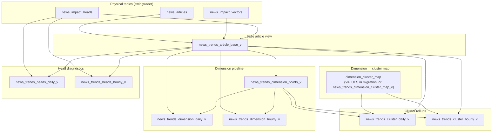
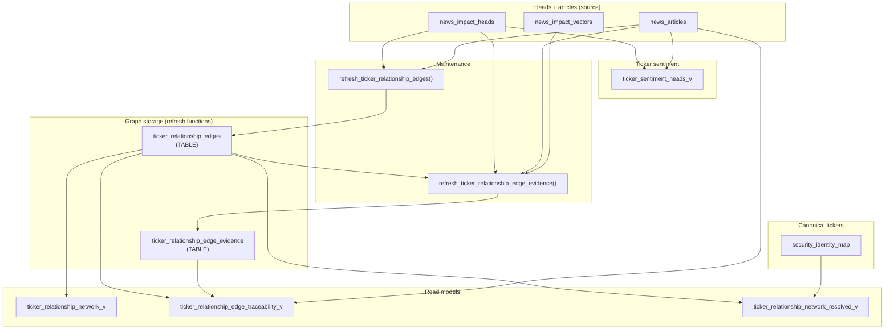

# Supabase analytics migrations

SQL under `migrations/` targets the `swingtrader` schema (see individual migration headers).

This document covers **News Trends** pre-aggregates and **ticker** sentiment / relationship views (plus related tables and refresh functions).

## News Trends aggregate views

Pre-aggregated views for the News Trends UI. Primary migration: `migrations/20260414100000_news_trends_aggregate_views.sql`.

Goals:

- Avoid scanning every raw row on chart loads.
- Split **impact scores** (from parsed vector dimensions) from **head-level diagnostics** (raw `news_impact_heads` counts).

### View dependency graph

Edges reflect how views are built (`information_schema.view_table_usage` matches this shape). **Cluster** rollups join dimension points to a **dimension → `cluster_id`** map (inline `VALUES` CTE in the migration; some deployments expose the same map as `news_trends_dimension_cluster_map_v` instead—semantics are unchanged).

### Reference: what each view reads

| View | Upstream objects |
|------|-------------------|
| `news_trends_article_base_v` | `news_articles`, `news_impact_vectors`, `news_impact_heads` (per-article confidence mean) |
| `news_trends_dimension_points_v` | `news_trends_article_base_v` |
| `news_trends_dimension_daily_v` | `news_trends_article_base_v`, `news_trends_dimension_points_v` |
| `news_trends_dimension_hourly_v` | same as daily |
| `news_trends_cluster_daily_v` | `news_trends_dimension_points_v`, `news_trends_article_base_v`, dimension→cluster map |
| `news_trends_cluster_hourly_v` | same as cluster daily |
| `news_trends_heads_daily_v` | `news_impact_heads`, `news_trends_article_base_v` (bucket article counts) |
| `news_trends_heads_hourly_v` | same as heads daily |

### Output columns and calculations

Time bucketing differs by pipeline: **dimension and cluster** series use `bucket_day` / `bucket_hour` from **`news_trends_article_base_v`** (article publication time, falling back to vector `created_at`). **Heads** series use **`date_trunc` on `news_impact_heads.created_at`** (when the head row was created).

Weights use **`confidence_mean`** from heads when present; the expression `GREATEST(COALESCE(confidence_mean, 1), 0)` treats missing confidence as weight `1` and clamps negative weights to `0`.

Each table below has a **What it indicates** column: what you can read from the number when comparing buckets, dimensions, or clusters (not a causal claim about markets).

---

#### `news_trends_article_base_v`

One row per **`news_impact_vectors`** row (typically one vector per article), enriched with article metadata and per-article head confidence.

| Column | Calculation / source | What it indicates |
|--------|----------------------|-------------------|
| `article_id` | `niv.article_id` | Which article this vector and scoring row belongs to. |
| `published_at` | `COALESCE(na.published_at, niv.created_at)` | When the story is treated as “live” for trends: real publish time when known, otherwise when the vector was stored. |
| `bucket_day` / `bucket_hour` | `date_trunc` on `published_at` | Which calendar day or hour the **impact series** assigns this article to (the time axis for dimension and cluster charts). |
| `impact_jsonb` | `niv.impact_json::jsonb` | The full structured impact scores for that article (factor dimensions as JSON). |
| `confidence_mean` | **`AVG(nih.confidence)`** over heads for the article (`LEFT JOIN` → nullable) | Typical model certainty for that article’s headline-level extractions; higher suggests the pipeline was more sure across its heads. |
| `id`, `title`, `url`, `source`, `slug`, `image_url` | From `news_articles` | Editorial metadata for linking or display; `source` hints at outlet mix in a bucket when joined downstream. |
| `article_created_at` | `na.created_at` | When the article record was first ingested (distinct from news-time `published_at`). |

---

#### `news_trends_dimension_points_v`

Explodes each article’s impact JSON into numeric dimension samples. Filter: root JSON must be an **object**; each key/value pair becomes a row if the value is non-empty after `NULLIF`.

| Column | Calculation / source | What it indicates |
|--------|----------------------|-------------------|
| `article_id`, `published_at`, `bucket_day`, `bucket_hour`, `confidence_mean` | From `news_trends_article_base_v` | Carries article identity, time placement for aggregation, and the weight used later for weighted averages. |
| `dimension_key` | JSON key from `jsonb_each_text(impact_jsonb)` | Which factor dimension this row is (e.g. a sector or macro sensitivity field). |
| `dimension_value` | `NULLIF(value, '')::double precision` | The model’s score for that dimension on that article (direction and magnitude depend on your scoring convention). |

---

#### `news_trends_dimension_daily_v` / `news_trends_dimension_hourly_v`

Grouped by **`(bucket_day or bucket_hour), dimension_key`**.

| Column | Calculation | What it indicates |
|--------|-------------|-------------------|
| `bucket_day` / `bucket_hour` | From dimension points | The period you are comparing (one day or one clock hour of article-time). |
| `dimension_key` | From dimension points | Which factor dimension the row summarizes. |
| `bucket_article_count` | Distinct articles in **`news_trends_article_base_v`** in that bucket | **Denominator context**: how much news volume sat in that time bucket in total, including articles missing this dimension. |
| `sample_count` | **`COUNT(*)`** in the group | How many dimension readings contributed (multiple vectors per article would inflate this versus `article_count`). |
| `article_count` | Distinct articles with this **`dimension_key`** in the bucket | **Breadth**: how many different stories actually carried a value for this dimension in that period. |
| `dimension_avg` | **`AVG(dimension_value)`** | **Typical raw level** of that dimension across contributing articles, treating each sample equally. |
| `dimension_weighted_avg` | Confidence-weighted mean (fallback to avg) | **Central tendency tilted toward higher-confidence articles** — useful when you care more about scores the model was surer about. |

Hourly view is the same formulas with `bucket_hour` instead of `bucket_day`.

---

#### `news_trends_cluster_daily_v` / `news_trends_cluster_hourly_v`

Two-stage rollup (matches UI): (1) per article and cluster, average mapped dimensions; (2) across articles in the bucket, mean and confidence-weighted mean.

**Stage A — `article_cluster_scores` CTE**

| Intermediate | Calculation | What it indicates |
|--------------|-------------|-------------------|
| `article_cluster_score` | **`AVG(dimension_value)`** over dimensions in that **`cluster_id`** for that article and bucket | **Single-article stance on that theme** (e.g. macro sensitivity bundle): how strongly that story loads across the dimensions grouped under the cluster, before mixing with other articles. |
| `confidence_mean` | **`MAX(p.confidence_mean)`** for those rows | Article-level confidence carried into stage B for weighting (same semantic as base view). |

**Stage B — final SELECT** (grouped by **`bucket_*`, `cluster_id`**)

| Column | Calculation | What it indicates |
|--------|-------------|-------------------|
| `bucket_day` / `bucket_hour` | From article cluster scores | Article-time period for this thematic rollup. |
| `cluster_id` | From static map (e.g. `MACRO_SENSITIVITY`) | **Which theme bundle** the row describes (macro, sectors, growth, etc.), not a raw DB column from heads. |
| `bucket_article_count` | Distinct articles in base view for that bucket | Same as dimension aggregates: total article volume in the bucket for context. |
| `article_count` | Count of **`article_cluster_scores`** rows in the group | How many stories had **at least one mapped dimension** in that cluster for that period — breadth of theme coverage. |
| `cluster_avg` | **`AVG(article_cluster_score)`** | **Average thematic intensity** in the bucket if every contributing article counts the same. |
| `cluster_weighted_avg` | Confidence-weighted mean of `article_cluster_score` | **Thematic intensity emphasizing articles with stronger average head confidence** — closer to “what high-certainty coverage looked like” in that bucket. |

Hourly view uses `bucket_hour` throughout.

---

#### `news_trends_heads_daily_v` / `news_trends_heads_hourly_v`

Aggregates **raw head rows** (not vector dimensions). Bucket is **head creation time**.

| Column | Calculation | What it indicates |
|--------|-------------|-------------------|
| `bucket_day` / `bucket_hour` | **`date_trunc` on `nih.created_at`** | **Pipeline activity time**: when heads were written, which can lag publication and differs from article-time dimension charts. |
| `cluster` | **`nih.cluster`** | How the model **labeled each headline-level unit** for diagnostics; may align with themes but is not the same object as `cluster_id` in cluster views. |
| `bucket_article_count` | From **`news_trends_article_base_v`** for the same calendar bucket | Article-time volume in that calendar period (for overlaying “how much news that day” next to “how many heads fired that day”). |
| `head_count` | **`COUNT(*)`** | **How busy extraction was** for that head cluster and time slice — volume of individual headline-level results. |
| `article_count` | **`COUNT(DISTINCT nih.article_id)`** | How many distinct articles produced those heads — distinguishes one huge story from many small ones. |
| `confidence_avg` | **`AVG(nih.confidence)`** | **Typical certainty on those specific heads** in the bucket and cluster (not the same as article-level `confidence_mean` in the vector path). |

Hourly view uses `bucket_hour` and `date_trunc('hour', ...)`.

---

### How to read the three paths

1. **Article base** — one row per article with `impact_json`, publication time buckets, and aggregated head confidence.
2. **Dimensions** — explode JSON keys into `(dimension_key, dimension_value)` then daily/hourly weighted and unweighted averages.
3. **Clusters** — map dimensions to thematic `cluster_id`, average dimensions per article per cluster, then aggregate across articles (matches UI: mean within cluster, then bucket-level weighted mean).
4. **Heads** — independent counts by `news_impact_heads.cluster` and head `created_at` bucket; used for overlays/diagnostics, not to build cluster scores.

Supporting indexes for these views are created in the same migration file.

---

## Ticker views and relationship surfaces

Ticker-related SQL lives in several migrations:

| Migration | What it defines |
|-----------|-----------------|
| `migrations/20260414150000_ticker_sentiment_view.sql` | `ticker_sentiment_heads_v` |
| `migrations/20260414123000_ticker_relationship_network.sql` | `ticker_relationship_edges` (table), `refresh_ticker_relationship_edges`, `ticker_relationship_network_v` |
| `migrations/20260414133000_ticker_relationship_edge_traceability.sql` | `ticker_relationship_edge_evidence` (table), `refresh_ticker_relationship_edge_evidence`, `ticker_relationship_edge_traceability_v` |
| `migrations/20260414130000_security_identity_map_graph_integration.sql` | `security_identity_map`, `resolve_canonical_ticker`, `ticker_relationship_network_resolved_v` |

**Important:** The **relationship graph** is stored in **`ticker_relationship_edges`** and refreshed by **`swingtrader.refresh_ticker_relationship_edges`**, not computed inside `ticker_relationship_network_v` (that view only selects from the table). Evidence rows are maintained similarly by **`refresh_ticker_relationship_edge_evidence`**.

### View and table dependency graph

### Reference: objects and upstream data

| Object | Type | Reads / fed by |
|--------|------|------------------|
| `ticker_sentiment_heads_v` | View | `news_impact_heads` (`cluster = 'TICKER_SENTIMENT'`), `news_articles` |
| `ticker_relationship_edges` | Table | Upsert output of **`refresh_ticker_relationship_edges`** from heads + articles (`cluster = 'TICKER_RELATIONSHIPS'`) |
| `ticker_relationship_network_v` | View | `ticker_relationship_edges` only |
| `ticker_relationship_edge_evidence` | Table | Upsert output of **`refresh_ticker_relationship_edge_evidence`** (heads, articles, vectors, joined to existing edges) |
| `ticker_relationship_edge_traceability_v` | View | `ticker_relationship_edges`, `ticker_relationship_edge_evidence`, `news_articles` |
| `ticker_relationship_network_resolved_v` | View | `ticker_relationship_edges` + **`resolve_canonical_ticker`** (uses **`security_identity_map`**) |

---

### Output columns and calculations — ticker sentiment

**`ticker_sentiment_heads_v`** — one row per **(head, ticker)** where the head is in cluster **`TICKER_SENTIMENT`**, **`scores_json`** is exploded with **`jsonb_each_text`**, and the score parses as a finite number in **[-1, 1]** after clamp.

| Column | Calculation / source | What it indicates |
|--------|----------------------|-------------------|
| `head_id` | `h.id` | Which `news_impact_heads` row produced this row. |
| `article_id` | `h.article_id` | Which story the sentiment belongs to. |
| `ticker` | **`UPPER(BTRIM(kv.key))`** from `scores_json` | Normalized symbol (or key string) the model attached a sentiment score to. |
| `sentiment_score` | Numeric parse of `kv.value`, else null; clamped **`LEAST(1, GREATEST(-1, value))`** | **Directional sentiment** for that ticker on that head: bearish ↔ bullish on your [-1, 1] scale. |
| `reasoning_text` | `reasoning_json::jsonb ->> kv.key` when `reasoning_json` is an object | Short model rationale for that ticker key, if present. |
| `confidence`, `model`, `latency_ms` | From `h` | Extraction certainty, which model ran, and runtime for that head. |
| `scored_at` | `h.created_at` | When the head was scored (pipeline time). |
| `article_ts` | **`COALESCE(a.published_at, a.created_at)`** | When the article is treated as published for aligning sentiment with news flow. |
| `published_at` | `a.published_at` | Raw publish time from CMS when present. |
| `article_source`, `article_publisher`, `article_title`, `article_url` | From `news_articles` | Outlet and link context for the story. |

**Filters:** rows require **`ticker <> ''`** and **`sentiment_score IS NOT NULL`** (non-numeric score keys are dropped).

---

### Output columns and calculations — relationship graph (aggregated edge table)

**`ticker_relationship_network_v`** projects **`ticker_relationship_edges`**. Edge metrics are produced inside **`refresh_ticker_relationship_edges`**: it reads **`TICKER_RELATIONSHIPS`** heads, parses keys as **`FROM__TO__rel_type`** (three segments separated by `__`), clamps strength to **[0, 1]**, excludes self-loops and invalid keys, then **groups by `(from_ticker, to_ticker, rel_type)`**.

| Column | Calculation (in refresh aggregate) | What it indicates |
|--------|-----------------------------------|---------------------|
| `from_ticker` / `to_ticker` | Uppercased trimmed parts of the relationship key | **Directed endpoints** of a relationship claim (e.g. supplier → customer). |
| `rel_type` | Lowercased third segment | **Relationship category** the model used (depends on your prompt taxonomy). |
| `strength_avg` | **`AVG(strength)`** over qualifying mentions in the refresh window | **Typical reported strength** for that directed typed edge across head-level mentions. |
| `strength_max` | **`MAX(strength)`** | **Strongest single mention** seen for that edge in aggregated history (useful for “did anything ever read as very strong?”). |
| `mention_count` | **`COUNT(*)`** parsed head-key rows contributing | **Volume of relationship extractions** (multiple heads or keys per article increase this). |
| `article_count` | **`COUNT(DISTINCT article_id)`** | **Breadth**: how many distinct stories supported this edge. |
| `first_seen_at` / `last_seen_at` | **`MIN` / `MAX`** of `COALESCE(a.published_at, a.created_at, h.created_at)` | **Recency span** of evidence for ranking decay or “new vs stale” links. |

The view adds no columns beyond the table.

---

### Output columns and calculations — edge traceability

**`ticker_relationship_edge_traceability_v`** joins each **aggregated edge** to **per-article evidence** rows (and article metadata). Evidence is built in **`refresh_ticker_relationship_edge_evidence`**: same head parsing as the graph refresh, matched to **`ticker_relationship_edges`** by **`(from_ticker, to_ticker, rel_type)`**, and stores optional **`news_impact_vectors`** snapshots for that article.

| Column | Calculation / source | What it indicates |
|--------|----------------------|-------------------|
| `edge_id` | `e.id` | Stable identifier for the aggregated edge. |
| `from_ticker`, `to_ticker`, `rel_type` | From `ticker_relationship_edges` | Canonical edge identity in the graph store. |
| `strength_avg`, `mention_count` | From `e` | Rolled-up edge strength and mention volume (same semantics as network view). |
| `article_id` | From evidence | Which story supports this edge in this row. |
| `article_title`, `article_url` | From `news_articles` | Human-readable drill-down into the source article. |
| `published_at` | From evidence (`COALESCE` article / head time in refresh) | When that evidence article sits on a timeline. |
| `pair_strength` | Parsed strength for that key on that head | **This article’s** strength for the pair (not the rolled-up average). |
| `head_confidence` | `h.confidence` for that extraction | How sure the model was about **this** relationship mention. |
| `reasoning_text` | `reasoning_json ->> kv.key` | Model explanation text for that specific pair key. |
| `top_dimensions_snapshot` | `v.top_dimensions` from joined vector | Optional **structured context** from the impact vector row at refresh time. |
| `impact_json_snapshot` | `v.impact_json` | Optional **full impact vector JSON** snapshot for auditing or UI. |

**What the view is for:** explain **why** an edge exists and **which articles** contributed, with optional vector context—without re-parsing all history in the app.

---

### Output columns and calculations — resolved (canonical) network

**`ticker_relationship_network_resolved_v`** maps both endpoints through **`swingtrader.resolve_canonical_ticker(..., 'ticker')`**, which prefers **`security_identity_map`** (verified + confidence ordering) and otherwise falls back to **`UPPER(BTRIM(alias))`**. Rows with empty or self canonical pairs are dropped, then **multiple raw edges that collapse to the same `(from_ticker, to_ticker, rel_type)` are merged**.

| Column | Calculation | What it indicates |
|--------|-------------|-------------------|
| `from_ticker` / `to_ticker` | Resolved canonical symbols | **Ticker space normalized for graph traversal** (e.g. ADR vs ordinary share aliases folded when mapped). |
| `rel_type` | Unchanged through collapse | Same relationship category as in the raw graph. |
| `strength_avg` | **`SUM(strength_avg × GREATEST(mention_count, 1)) / SUM(GREATEST(mention_count, 1))`** across collapsed rows | **Mention-weighted blend** of prior `strength_avg` values when several alias-level edges merge. |
| `strength_max` | **`MAX(strength_max)`** across collapsed rows | Strongest peak strength among merged contributors. |
| `mention_count` | **`SUM(mention_count)`** | Total relationship mentions after merge (adds volume across alias-level edges). |
| `article_count` | **`SUM(article_count)`** | Sum of distinct-article counts from merged rows — **can exceed the true count of unique articles** if the same article appeared on multiple alias edges that merged; treat as a **volume-oriented** metric unless you dedupe downstream. |
| `first_seen_at` / `last_seen_at` | **`MIN` / `MAX`** across collapsed rows | Earliest and latest evidence timestamps after canonicalization. |

**What it tells you overall:** the same economic graph as **`ticker_relationship_network_v`**, but in **canonical ticker space** for multi-hop queries and dashboards, with merged metrics that favor edges supported by more mentions.

---

## REST v1 (Next.js `code/ui`)

Bearer user API keys (`Authorization: Bearer …`). Implementations live under `code/ui/app/api/v1/` and `code/ui/lib/api-v1/`.

### News trends (scope `news:read`)

| Method | Path | Backing view(s) |
|--------|------|------------------|
| GET | `/api/v1/news/trends/articles` | `news_trends_article_base_v` |
| GET | `/api/v1/news/trends/dimensions` | `news_trends_dimension_daily_v` / `news_trends_dimension_hourly_v` |
| GET | `/api/v1/news/trends/clusters` | `news_trends_cluster_daily_v` / `news_trends_cluster_hourly_v` |
| GET | `/api/v1/news/trends/heads` | `news_trends_heads_daily_v` / `news_trends_heads_hourly_v` |

**Common query params:** `from`, `to` (ISO 8601, filter bucket or `published_at`), `limit` (default 500, max 5000), `offset`. **Articles only:** optional `ticker` (uses `news_article_tickers` to restrict `article_id`). **Dimensions:** `granularity=daily|hourly` (default `daily`), optional `dimension_key`. **Clusters:** `granularity`, optional `cluster_id`. **Heads overlay:** `granularity`, optional `cluster` (head cluster label).

The **News Trends** page (`code/ui/app/protected/news-trends`) loads these views on the server, pivots them in the client, and uses **UTC bucket keys** (`bucket_day` / `bucket_hour`) for the chart series; tick labels and filters use **local calendar** on top of those instants. Moving averages and cumulative mode still run in the browser. Embedded `NewsTrendsUI` without aggregate props falls back to the previous local-bucket rollup from articles only (e.g. screenings).

### Ticker relationships (scope `relationships:read`)

| Method | Path | Backing view(s) |
|--------|------|------------------|
| GET | `/api/v1/relationships/edges` | `ticker_relationship_network_resolved_v` (default) or `ticker_relationship_network_v` |
| GET | `/api/v1/relationships/edges/evidence` | `ticker_relationship_edge_traceability_v` |

**Edges:** `resolved=true|false` (default `true`), optional `touching=TICKER` (either endpoint), `rel_type`, `min_strength_avg` (0–1), `sort` / `-sort` on `last_seen_at`, `first_seen_at`, `strength_avg`, `strength_max`, `mention_count`, `article_count`; `limit` (default 100, max 500), `offset`. **Evidence:** required `from_ticker`, `to_ticker`; optional `rel_type`; `limit` (default 50, max 200), `offset`.

The in-app **multi-hop neighborhood** still uses the **`get_relationship_neighborhood`** RPC; these routes expose the **same underlying graph and evidence views** for custom traversal or exports.
